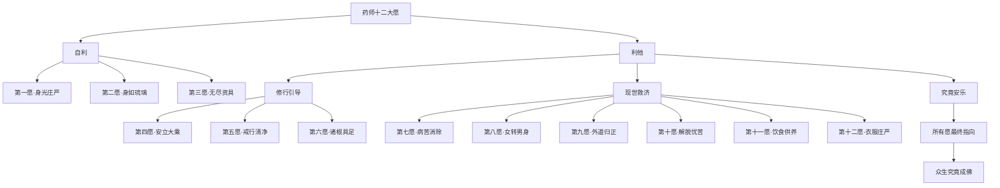
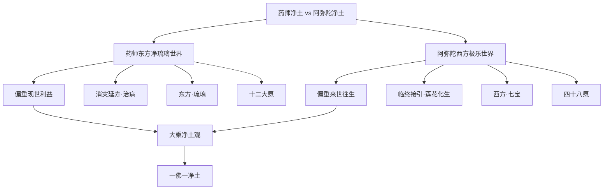
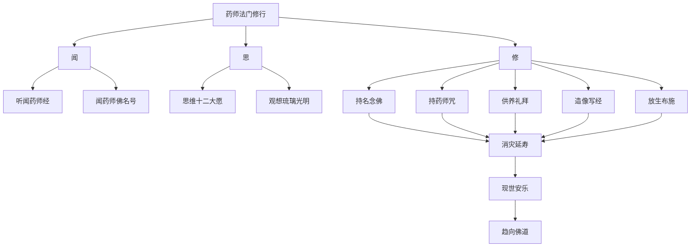
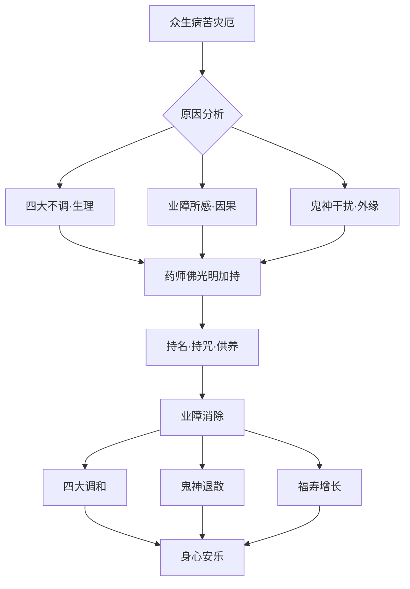
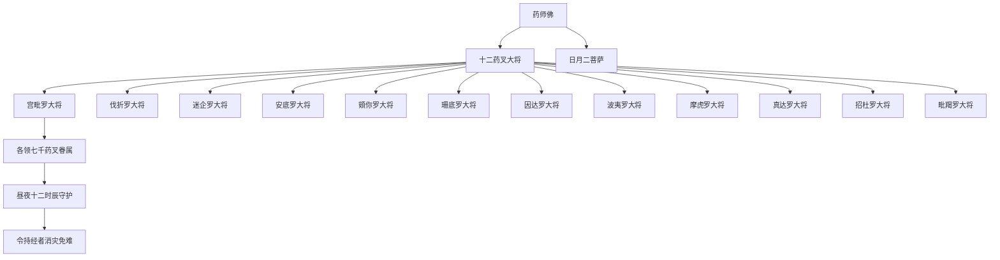
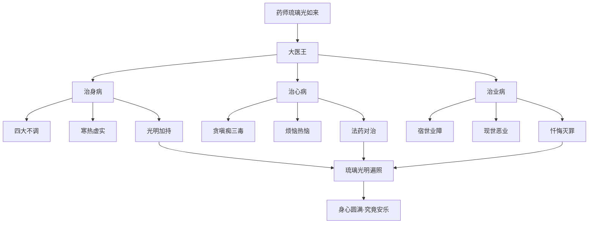

# 药师琉璃光如来本愿功德经

## 经文概要

| 项目 | 内容 |
|------|------|
| 经名 | 药师琉璃光如来本愿功德经 |
| 梵名 | Bhaiṣajyaguru Vaiḍūrya Prabhāsa Pūrvapraṇidhāna Sūtra |
| 译者 | 玄奘 |
| 译年 | 650 CE |
| 卷数 | 一卷 |
| 宗派 | 大乘·药师信仰 |
| 大正藏 | T.450 |

## 核心思想

1. **药师十二大愿**：药师佛因地修行时所发十二大愿，以济世利人为本
2. **东方净琉璃世界**：药师佛的净土——净琉璃世界，以琉璃为地，城阙宫殿皆七宝成
3. **消灾延寿**：闻药师佛名号可消灾除厄、延年益寿
4. **现世利益**：不同于西方净土的来世往生，药师法门偏重现世安乐
5. **灭罪除障**：药师琉璃光如来名号功德可灭无量罪障
6. **十二药叉大将**：十二大愿化现的护法神将，昼夜守护行者
7. **药师咒**：药师灌顶真言，为汉传佛教常用咒语

## 翻译与传入历史

- **译者**：玄奘（602-664），洛州缑氏人，四大译经家之一
- **译出时间**：650年，于长安大慈恩寺译出
- **背景**：唐太宗、高宗时期，玄奘主持国家译场
- **其他译本**：达摩笈多译《佛说药师如来本愿经》（T.449）、义净译《药师琉璃光七佛本愿功德经》（T.451）
- **梵文原本**：敦煌、新疆发现有梵文残本
- **藏译**：藏文大藏经中有完整译本
- **日本影响**：药师信仰在日本极盛，药师寺即以此经得名
- **韩国影响**：韩国药师佛信仰广泛，佛国寺药师如来为国宝

## 注疏传统

| 注疏 | 作者 | 朝代 | 要点 |
|------|------|------|------|
| 药师经疏 | 窥基 | 唐 | 唯识宗立场释经 |
| 药师经疏 | 靖迈 | 唐 | 天台教义注释 |
| 药师经疏钞 | 灌顶 | 唐 | 详释药师法门 |
| 药师经析疑 | 智旭 | 明 | 蕅益大师疑义辨析 |
| 药师经讲记 | 演培 | 近代 | 现代弘法讲义 |
| 药师经讲记 | 太虚 | 民国 | 人间佛教立场释经 |

## 核心经文选录

> **原文**：「第一大愿：愿我来世得阿耨多罗三藐三菩提时，自身光明炽然，照耀无量无数无边世界，以三十二大丈夫相、八十随形好庄严其身，令一切有情如我无异。」

**白话释义**：药师佛第一大愿——当我将来成就无上正等正觉时，我的身光遍照无量世界，以三十二相八十种好庄严自身，并令一切众生都和我一样光明庄严。这是药师佛"自他平等"的根本愿力，体现大乘"众生平等"的核心理念。

> **原文**：「第十二大愿：愿我来世得菩提时，若诸有情，贫无衣服，蚊虻寒热，昼夜逼恼。若闻我名，专念受持，如其所好即得种种上妙衣服，亦得一切宝庄严具，华鬘涂香，鼓乐众伎，随心所玩，皆令满足。」

**白话释义**：药师佛第十二大愿——如果众生贫苦无衣，被蚊虫寒暑所逼迫，只要听闻我的名号并专心持念，就能得到上好衣服和种种庄严具，随心满足。此愿特别关注物质层面的匮乏，体现大乘佛教对现实苦难的深切关怀。

## 实修关联

- **药师忏法**：依据本经制定的忏悔法门，消灾延寿、祈福保安
- **药师咒持诵**：持念"药师灌顶真言"（Tadyathā...）为日常功课
- **药师七佛法会**：药师七佛消灾法会，通常设于佛寺消灾坛
- **消灾祈福**：汉传佛教中为消灾延寿最常用的经忏法门
- **药师灯**：以灯供养药师佛，象征琉璃光明，照破黑暗
- **十二药叉供**：供养十二药叉大将，求昼夜平安
- **浴佛法会**：农历四月初八浴佛节与药师法门有关联

## 认知科学映射

- **现世关怀 vs 超越关怀**：药师法门偏重现世利益，与阿弥陀经偏重来世往生构成认知张力——对应马斯洛需求层次理论中"安全需求"与"自我实现"的张力
- **身心医学认知**：药师佛以"大医王"形象出现，经文中的身心治疗思想与心身医学（psychosomatic medicine）高度呼应
- **光明意象**：琉璃光明的认知隐喻——光作为认知透明性的象征
- **称名治疗**：药师名号治病的信仰机制——与安慰剂效应及积极心理暗示的关联
- **十二愿的系统性**：十二大愿覆盖色身、衣食、疾病、贫苦等全方位需求——体现系统认知（systems thinking）
- 参见：[心境关系](../concepts/cognitive-theory/mind-world.md)、[转识成智](../concepts/cognitive-theory/consciousness-transformation.md)

## 药师十二大愿结构图

## 东西方净土对比图

## 药师法门修行图

## 消灾延寿因果图

## 十二药叉大将守护图

## 药师佛与大医王图

## 教义框架

### 药师法门的三重利益

| 利益层 | 内容 | 经文依据 |
|--------|------|----------|
| 现世利益 | 消灾延寿、治病免难、衣食充足 | 十二大愿 |
| 来世利益 | 往生净琉璃世界、不退转 | 经文后半部 |
| 究竟利益 | 成就无上菩提 | 十二大愿之根本指向 |

### 判教位置

本经属大乘方等部。太虚大师判为"人天乘"之基础，实则十二大愿贯摄人天、声闻、菩萨三乘，终归一佛乘。药师法门可视为大乘佛教对现实关怀的典范表达。

## 跨经关联

- **[无量寿经](./amitayus-sutra.md)**：药师东方净土与弥陀西方净土的对照——现世关怀 vs 来世安乐
- **[阿弥陀经](./amitabha-sutra.md)**：药师消灾延寿与弥陀临终往生的互补
- **[法华经](./lotus-sutra.md)**：药王菩萨本事品与药师佛的药王形象关联
- **[华严经](./avatamsaka-sutra.md)**：净琉璃世界在华严世界海中的位置
- **[楞严经](surangama-sutra.md)**：药师咒与楞严咒的持咒法门关联
- **[地藏经](./ksitigarbha-sutra.md)**：消业障、灭罪障的共同主题
- 认知理论关联：[心境关系](../concepts/cognitive-theory/mind-world.md)、[转识成智](../concepts/cognitive-theory/consciousness-transformation.md)

## 思想遗产

1. **现世关怀典范**：药师法门是大乘佛教"人间关怀"精神的最佳体现
2. **大医王思想**：以佛为大医王的隐喻影响了东亚医学文化与身心观
3. **东西方净土互补**：药师（东）与弥陀（西）构成完整的净土体系
4. **消灾文化**：药师忏法成为汉传佛教消灾法事的核心
5. **跨文化传播**：药师信仰在日本、韩国、东南亚均有广泛影响
6. **现代价值**：身心医学时代，药师法门的"大医王"思想具有新的时代意义

---

## Cognitive Architecture

《药师经》以"大医王"为核心隐喻，构建了佛教中独特的现世认知疗愈架构：

- **药师佛（Bhaiṣajyaguru）作为认知疗愈师**：佛为大医王——不仅治身病，更治心病（贪嗔痴三毒）与业病（宿世业障），体现身心一体的认知疗愈观
- **十二大愿的系统性认知覆盖**：从身光庄严（认知透明性）到衣食充足（物质基础），十二愿覆盖从身体到心灵、从物质到精神的完整认知需求层次
- **琉璃光明（vaiḍūrya-prabhā）作为认知透明性象征**：药师佛身如琉璃、内外明彻——光明代表认知的清晰、透明与无遮蔽状态
- **现世关怀的认知取向**：不同于西方净土的来世导向，药师法门偏重现世安乐——消灾延寿、治病除障，关注当下认知状态的改善
- **称名持咒的身心整合操作**：药师名号与药师咒的持诵——音声振动与意义认知的整合，达到身心同步疗愈

跨域链接：心身医学（psychosomatic medicine）的身心互动理论与药师佛"大医王"的身心一体治疗观高度吻合；积极心理学"安慰剂效应"与称名治病的信仰机制在认知层面相互印证。
