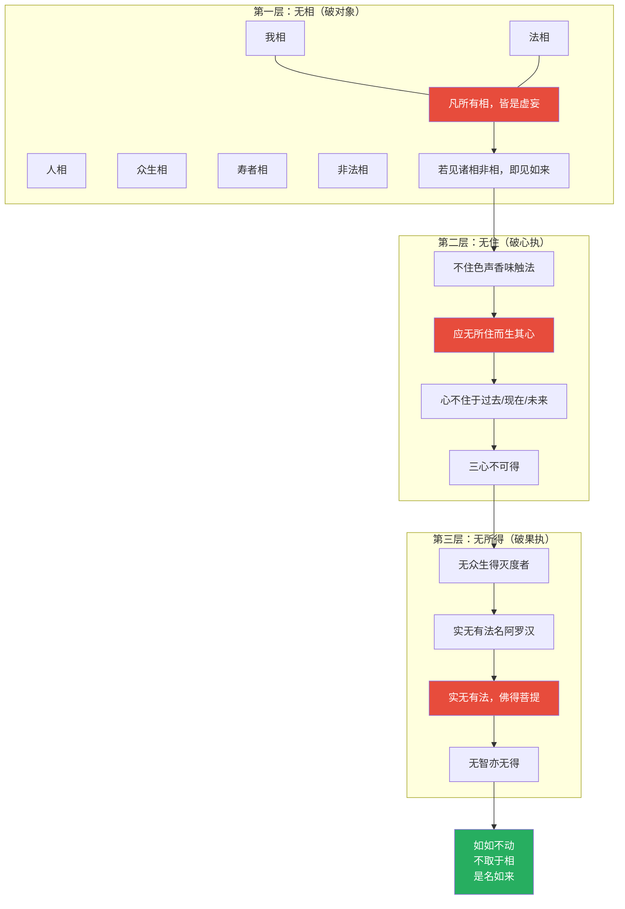
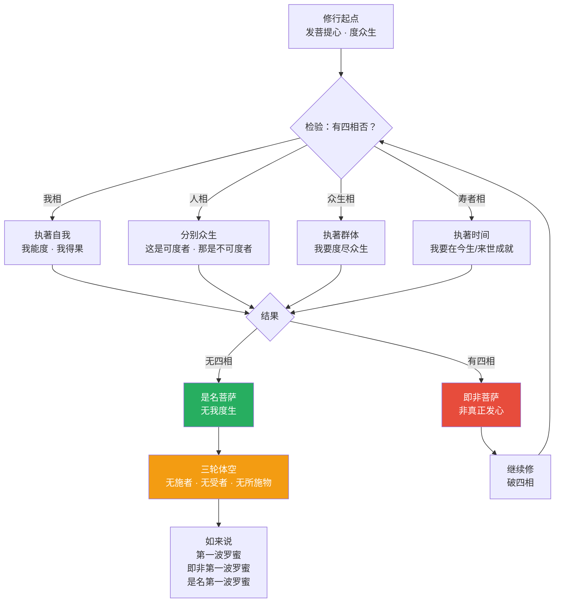
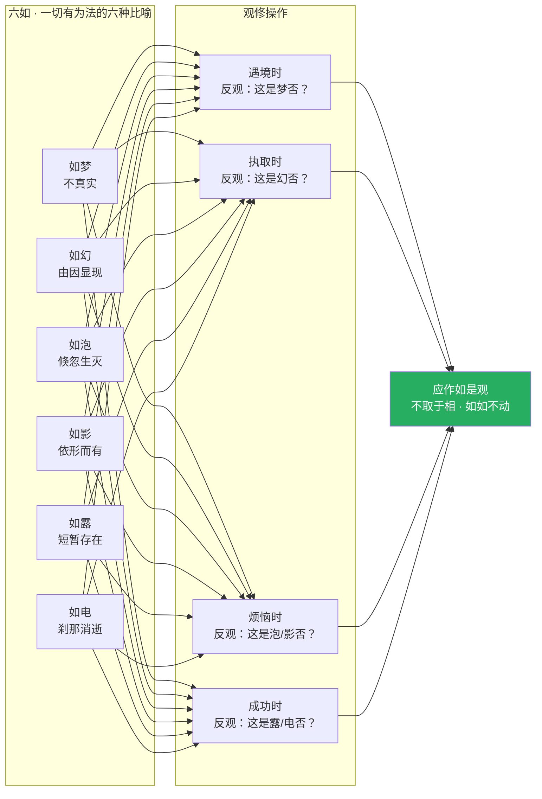
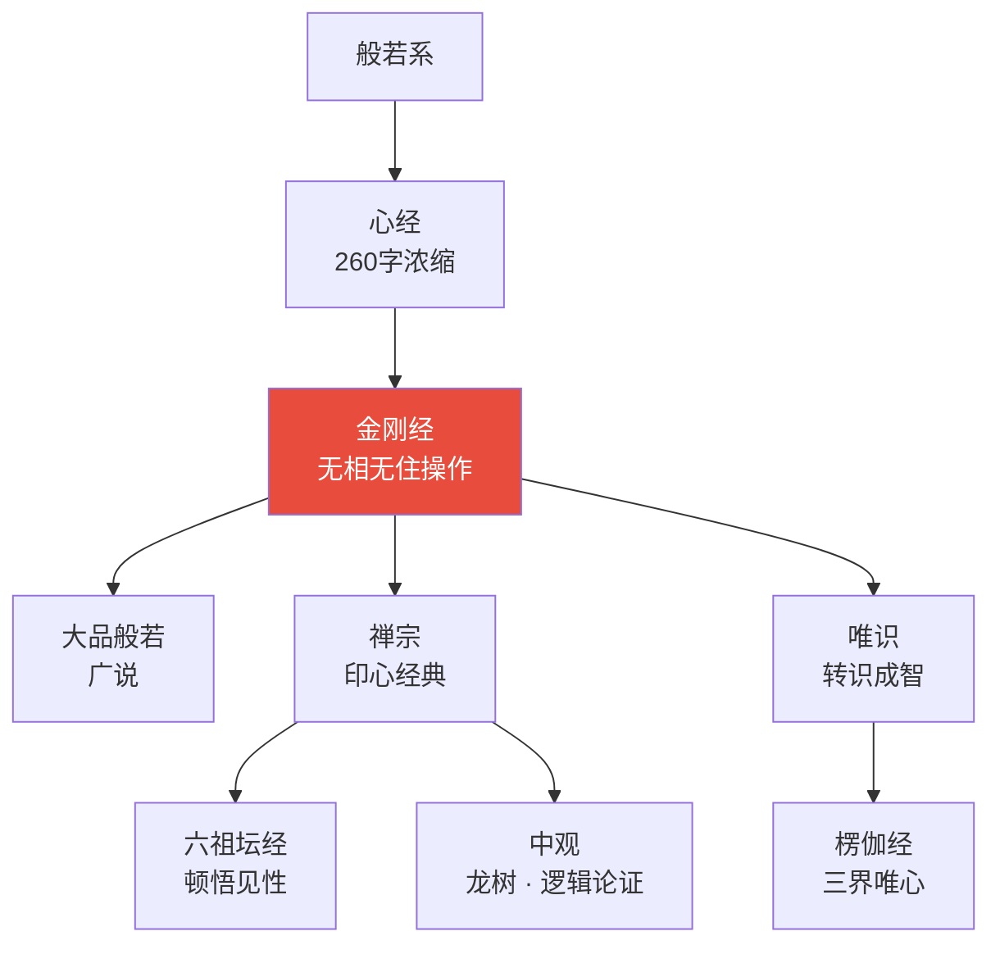
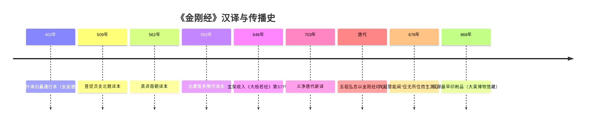
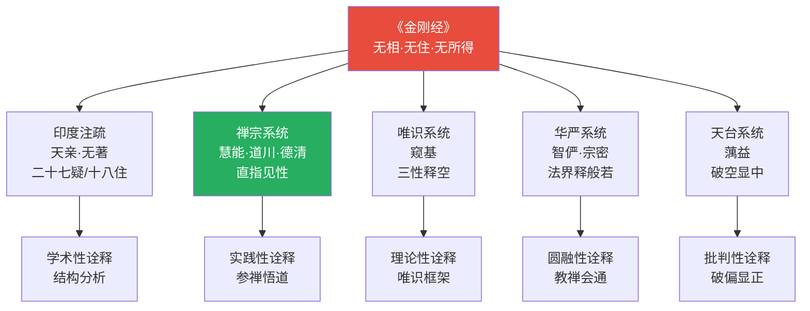
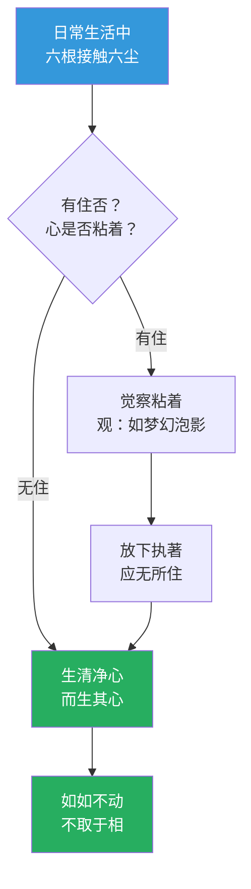
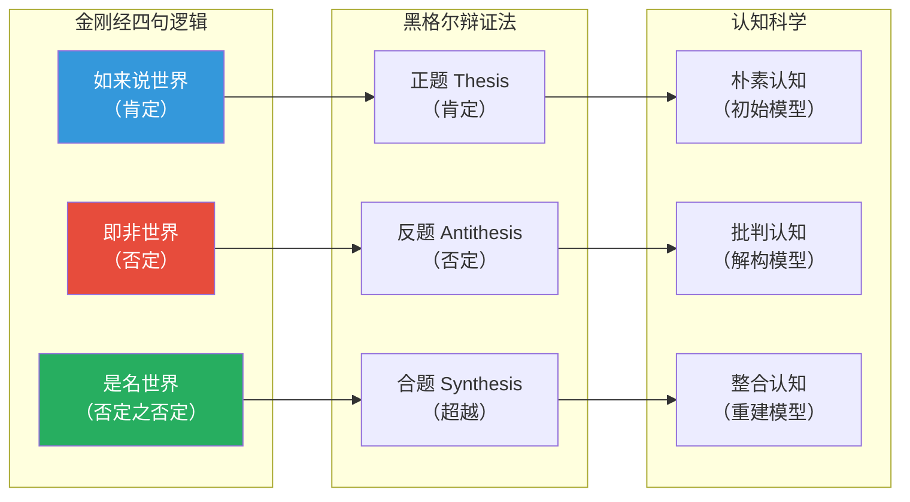

# 金刚般若波罗蜜经 · Diamond Sutra

## 一句话定义

《金刚经》以"金刚"喻般若智慧能断一切烦恼而不被烦恼所断——核心操作是"无相、无住、无所得"，于一切处不执著，于一切时不滞留，最终"应无所住而生其心"。

## 基本信息

| 项目 | 内容 |
|------|------|
| 全称 | 金刚般若波罗蜜经 |
| 译者 | 鸠摩罗什（最通行）、玄奘、义净等六译 |
| 篇幅 | 约5,000字，32品 |
| 归属 | 大乘般若系，约公元前5世纪佛陀在世所说 |
| 核心对话 | 佛陀 × 须菩提（解空第一） |
| 对中国影响 | 禅宗印心经典；六祖慧能因闻此经开悟 |

---

## 一、整体结构：三十二品纲要

```mermaid
graph TD
    A["《金刚经》<br/>32品 · 约5000字"] --> B["第一序分<br/>法会因由分第一<br/>如是我闻 · 舍卫城 · 祇树给孤独园"]
    
    B --> C1["第一波：发菩提心<br/>善现启请分第二~大乘正宗分第三"]
    C1 --> C2["应云何住？云何降伏其心？<br/>→ 灭度无量众生，实无众生得灭度者"]
    
    C2 --> D1["第二波：无相修行<br/>妙行无住分第四~如理实见分第五"]
    D1 --> D2["不应住色生心<br/>不应住声香味触法生心<br/>应无所住而生其心"]
    
    D2 --> E1["第三波：正信与福德<br/>正信希有分第六~无得无说分第七"]
    E1 --> E2["信心清净，则生实相<br/>一切诸佛及诸佛阿耨多罗三藐三菩提法，皆从此经出"]
    
    E2 --> F1["第四波：小乘破斥<br/>依法出生分第八~一相无相分第九"]
    F1 --> F2["须陀洹/斯陀含/阿那含/阿罗汉<br/>不作是念：我得……<br/>实无有法名阿罗汉"]
    
    F2 --> G1["第五波：庄严佛土与法身<br/>庄严净土分第十~如法受持分第十三"]
    G1 --> G2["若菩萨有我相/人相/众生相/寿者相<br/>即非菩萨<br/>如来说三十二相，即是非相"]
    
    G2 --> H1["第六波：法空与离相<br/>离相寂灭分第十四~能净业障分第十六"]
    H1 --> H2["若人言：如来有所说法，即为谤佛<br/>无法可说，是名说法<br/>过去心/现在心/未来心不可得"]
    
    H2 --> I1["第七波：究竟无所得<br/>究竟无我分第十七~法界通化分第十九"]
    I1 --> I2["如来者，即诸法如义<br/>实无有法，佛得阿耨多罗三藐三菩提<br/>是法平等，无有高下"]
    
    I2 --> J1["第八波：非相与离相<br/>离色离相分第二十~化无所化分第二十五"]
    J1 --> J2["若以色见我，以音声求我<br/>是人行邪道，不能见如来<br/>佛非色相身，是法身"]
    
    J2 --> K1["第九波：法布施与法身<br/>法身非相分第二十六~知见不生分第三十一"]
    K1 --> K2["一切有为法，如梦幻泡影<br/>如露亦如电，应作如是观"]
    
    K2 --> L["流通分<br/>应化非真分第三十二<br/>不取于相，如如不动"]
    
    style A fill:#2c3e50,color:#fff
    style C2 fill:#e74c3c,color:#fff
    style D2 fill:#e74c3c,color:#fff
    style K2 fill:#27ae60,color:#fff
    style L fill:#27ae60,color:#fff
```

---

## 二、核心教义拆解：无相·无住·无所得 三层递进

---

## 三、四相破斥的逻辑推演

---

## 四、六如偈的完整操作

---

## 五、三十二品核心问题链

---

## 六、核心概念速查表

| 概念 | 原文 | 含义 | 误读 |
|------|------|------|------|
| **金刚** | vajra | 能断一切烦恼，不被烦恼断 | 不是坚硬不变，是不被烦恼腐蚀 |
| **般若** | prajñā | 超越二元对立的智慧 | 不是世间聪明 |
| **波罗蜜** | pāramitā | 到彼岸——从生死此岸到涅槃彼岸 | 不是到达某个地方 |
| **无相** | animitta | 不执著于任何相状 | 不是否定现象 |
| **无住** | apratiṣṭhita | 心不滞于任何处 | 不是什么都不做 |
| **无所得** | anupalabdhi | 没有一个"我"在得到 | 不是消极无为 |
| **四相** | catur-saṃjñā | 我/人/众生/寿者——四种自我执著 | 寿者相容易被忽略 |
| **三轮体空** | tri-maṇḍala-śūnyatā | 施者/受者/物皆空 | 布施的最高境界 |
| **如如** | tathatā | 如其本来，不加造作 | 不是如如不动=僵化 |
| **六如** | ṣaḍ-dṛṣṭānta | 梦/幻/泡/影/露/电 | 形容有为法无常 |

---

## 七、在十三经中的位置

- **上游**：《心经》的浓缩展开；《大品般若经》的精华
- **下游**：《六祖坛经》——慧能因闻"应无所住而生其心"开悟；禅宗日常持诵经典
- **平行**：《中论》——龙树以逻辑论证"无所得"，《金刚经》以对话展示"无所得"

---

## 八、认知应用

### 操作一：四相觉察

在人际互动中，觉察自己是否落入四相：
- 我说话时，是否有"我相"？（强调自我）
- 评价他人时，是否有"人相"？（分别优劣）
- 关心群体时，是否有"众生相"？（执著数量）
- 期待结果时，是否有"寿者相"？（执著时间）

### 操作二：无住决策

做决策时：
1. 信息收集——不住于已有信息（开放）
2. 方案选择——不住于偏好（客观）
3. 执行过程——不住于预期（灵活）
4. 结果评估——不住于成败（成长）

→ "应无所住而生其心"——心是活泼的，不是死寂的

---

## Cognitive Architecture

《金刚经》以"金刚"喻般若，构建了最彻底的认知不执著架构：

- **无相·无住·无得三元认知架构**：无相（animitta）破对象的实有性；无住（apratiṣṭhita）破心的滞留性；无得（anupalabdhi）破果位的执取——三者构成完整的不执著认知体系，参见[金刚经无住](../concepts/cognitive-theory/diamond-sutra-non-attachment.md)
- **"应无所住而生其心"作为认知姿态**：心不粘着于任何对象（六尘），但保持活泼的觉知——"无所住"是认知的自由，"生其心"是认知的活力，二者同时成立
- **三轮体空（tri-maṇḍala-śūnyatā）**：布施时观施者·受者·施物皆空，将认知解构应用于一切行为——参见[中观](../concepts/cognitive-theory/madhyamaka.md)
- **四句逻辑（如来说X，即非X，是名X）**：肯定→否定→超越的认知辩证法，与黑格尔辩证法形成对照
- **三心不可得**：过去·现在·未来心皆不可得，彻底解构认知的时间实体化

跨域链接：威廉·詹姆斯"意识流"理论与"三心不可得"高度呼应；维特根斯坦"对不可说者保持沉默"与"凡所有相皆是虚妄"形成哲学对话。

---

## 进阶阅读

- 原典：《金刚般若波罗蜜经》（鸠摩罗什译）
- 注释：六祖慧能《金刚经口诀》；傅大士《金刚经颂》
- 现代解读：南怀瑾《金刚经说什么》；圣严法师《金刚经》

---

## 翻译与传入历史

《金刚经》是汉译佛经中译本最多的经典之一，先后有六个主要译本：

| 译者 | 年代 | 译本名称 | 特点 |
|------|------|----------|------|
| **鸠摩罗什** | **402年** | **《金刚般若波罗蜜经》** | **最通行本，32品，文辞优美，禅宗所依** |
| 菩提流支 | 509年 | 《金刚般若波罗蜜经》 | 北魏译，较忠实梵文 |
| 真谛 | 562年 | 《金刚般若波罗蜜经》 | 南朝陈译，含天亲菩萨释论 |
| 达摩笈多 | 592年 | 《金刚能断般若波罗蜜经》 | 隋代译，直译风格 |
| **玄奘** | **648年** | **《能断金刚般若波罗蜜多经》** | **收入《大般若经》第577卷，最忠实原典** |
| 义净 | 703年 | 《能断金刚般若波罗蜜多经》 | 唐代译，参照最新梵本 |

**鸠摩罗什译本背景**：弘始四年（402年），鸠摩罗什于长安逍遥园译出此经。罗什的翻译以"达意"为主，不拘泥原文结构，故文辞流畅，深受中土欢迎。禅宗五祖弘忍、六祖慧能皆以此译本为印心经典。

**六祖慧能因之开悟**：《坛经》记载，慧能于市中闻客诵《金刚经》"应无所住而生其心"一句，当下大悟，遂往黄梅参礼五祖。此经因此成为禅宗传法心印。

**世界最早的印刷书籍之一**：现存最早的雕版印刷品即为唐咸通九年（868年）王玠出资刊印的《金刚经》，现藏大英图书馆。此经在中国印刷史上具有里程碑意义。

---

## 注疏传统

《金刚经》注疏极丰，各宗各派皆有阐释：

| 注疏者 | 著作 | 宗派立场 | 核心特色 |
|--------|------|----------|----------|
| **六祖慧能** | 《金刚经口诀》 | 禅宗 | 以心传心，直指见性，不落文字 |
| 天亲菩萨 | 《金刚般若波罗蜜经论》 | 印度·唯识 | 以二十七疑释经，最早系统论著 |
| 无著菩萨 | 《金刚般若波罗蜜经论》 | 印度·唯识 | 以十八住处释修行次第 |
| **窥基** | 《金刚般若经赞述》 | 唯识宗 | 以唯识学释无相无住 |
| 智俨 | 《金刚般若略疏》 | 华严宗 | 以法界缘起释金刚般若 |
| **宗密** | 《金刚般若经疏论纂要》 | 华严·禅 | 会通教禅，兼采诸家 |
| 宋·道川 | 《金刚经注》 | 临济禅 | 颂古形式，禅味浓厚 |
| 明·蕅益智旭 | 《金刚经破空论》 | 天台·净土 | 破断灭空，显中道义 |
| 明·憨山德清 | 《金刚经决疑》 | 禅宗 | 以疑情贯穿全经 |

**禅宗解读特色**：慧能以"无住"为金刚经核心，"应无所住而生其心"是全经之眼。禅宗后发展出"参话头"修法，即受金刚经破相思维的影响。

---

## 核心经文选录

### 1. 四句偈（最著名）

> **原文**：一切有为法，如梦幻泡影，如露亦如电，应作如是观。
>
> **梵文**：tārakā timirāmbudhi phena budbuda marīci svapna ca avidyā maya
>
> **现代解读**：一切因条件而生的事物，都像梦、像幻术、像水泡、像影子、像露水、像闪电——短暂、不实、依缘而起、刹那即逝。这不是悲观，而是如实观察。佛说若人以此四句偈受持读诵，功德无量。

### 2. 应无所住而生其心

> **原文**：是故须菩提，诸菩萨摩诃萨应如是生清净心，不应住色生心，不应住声香味触法生心，应无所住而生其心。
>
> **现代解读**：不要因为看到美丽的事物而心生执著，不要因为听到悦耳的声音而心生贪恋——心应该是活泼的、清净的、无所粘着的。"无所住"不是心死了，而是心活了——不被任何对象绑住，但依然在觉知、在回应。六祖慧能闻此句开悟。

### 3. 凡所有相皆是虚妄

> **原文**：凡所有相，皆是虚妄。若见诸相非相，即见如来。
>
> **现代解读**：你所看到的一切现象，都不是它们看起来的那样。如果你能在看到现象的同时，知道它们的虚妄性，你就见到了真实（如来）。这不是否定现象，而是超越对现象的执著。

### 4. 四句否定

> **原文**：若以色见我，以音声求我，是人行邪道，不能见如来。如来所说三千大千世界，即非世界，是名世界。
>
> **现代解读**：不要以为佛是一个可以看见的形象或听到的声音。佛的真身（法身）超越一切形相。同理，"世界"这个概念也不是实在的——它是因缘和合的假名，但并不因此就不存在。

### 5. 三心不可得

> **原文**：过去心不可得，现在心不可得，未来心不可得。
>
> **现代解读**：过去的心念已经消逝，抓不住；现在的心念刹那生灭，停不住；未来的心念尚未生起，找不到。心不是一个实体，而是流动的过程——这与现代心理学对意识流的描述高度一致。

---

## 实修关联

### 无住禅

《金刚经》的"应无所住而生其心"是禅宗核心修法之一：

1. **六根门头放光**：在日常生活中，眼见色、耳闻声时，保持觉知但不粘着——看见好看的东西，知道好看，但不执取；听见难听的声音，知道难听，但不排斥
2. **三心不可得参究**：反观"心在哪里"——过去心不可得、现在心不可得、未来心不可得，能观之心也了不可得
3. **四句偈观修**：遇到任何执着的对象，以"如梦幻泡影如露亦如电"观之，培养如幻三昧

### 参话头（禅宗修法）

禅宗的"参话头"修法直接受金刚经影响：
- 参"念佛是谁"——破除"我相"
- 参"万法归一，一归何处"——破除"法相"
- 参"父母未生前本来面目"——破除"寿者相"

### 金刚经持诵

禅宗丛林中，《金刚经》是日常持诵的核心经典：
- 六祖以前，五祖弘忍以金刚经印心
- 许多禅者日诵金刚经一部
- 持诵时以"无住心"诵之，不求功德福报

---

## 认知科学映射 ⭐

### 无住 ↔ 非执著认知

《金刚经》的"无住"思想与现代认知科学的多个概念对应：

| 金刚经概念 | 认知科学对应 | 说明 |
|-----------|-------------|------|
| 应无所住而生其心 | 元认知觉察 | 觉知自己的认知过程而不被其裹挟 |
| 凡所有相皆是虚妄 | 认知建构论 | 我们看到的"现实"是大脑建构的模型 |
| 三心不可得 | 意识流理论 | 意识是流动的过程，非固定实体 |
| 无我相人相众生相寿者相 | 去中心化 | 自我是叙事建构，非固定实体 |
| 如梦幻泡影 | 贝叶斯大脑假说 | 大脑对世界的感知是概率性预测 |
| 不取于相如如不动 | 认知灵活性 | 心理弹性——对刺激保持开放但不固着 |

### 四句否定 ↔ 辩证逻辑

### 认知理论交叉引用

- [八识论](../../concepts/cognitive-theory/eight-consciousness.md)："三心不可得"涉及意识的刹那生灭，与八识论中前六识的生灭机制相应
- [中观](../../concepts/cognitive-theory/madhyamaka.md)：金刚经的四句否定"如来说X，即非X，是名X"是中观辩证法的经典表达
- [转识成智](../../concepts/cognitive-theory/consciousness-transformation.md)："应无所住而生其心"是从第六识的执著模式转为妙观察智的操作
- [心境关系](../../concepts/cognitive-theory/mind-world.md)："不应住色生心"揭示了心与境的非执取关系
- [六根六尘](../../concepts/cognitive-theory/six-constituents.md)："不住色声香味触法"直接对应六根六尘的认知框架
- [起信论](../../concepts/cognitive-theory/qichu-zhengxin.md)："若见诸相非相即见如来"与起信论"心真如"相通
ENDOFDIAMOND
