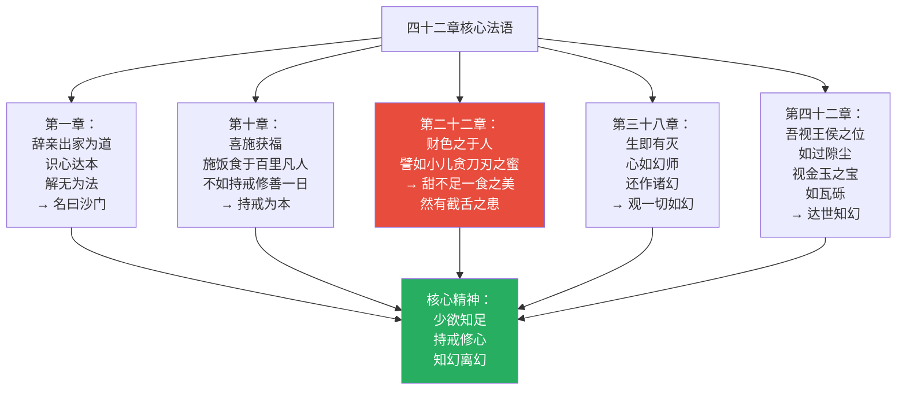
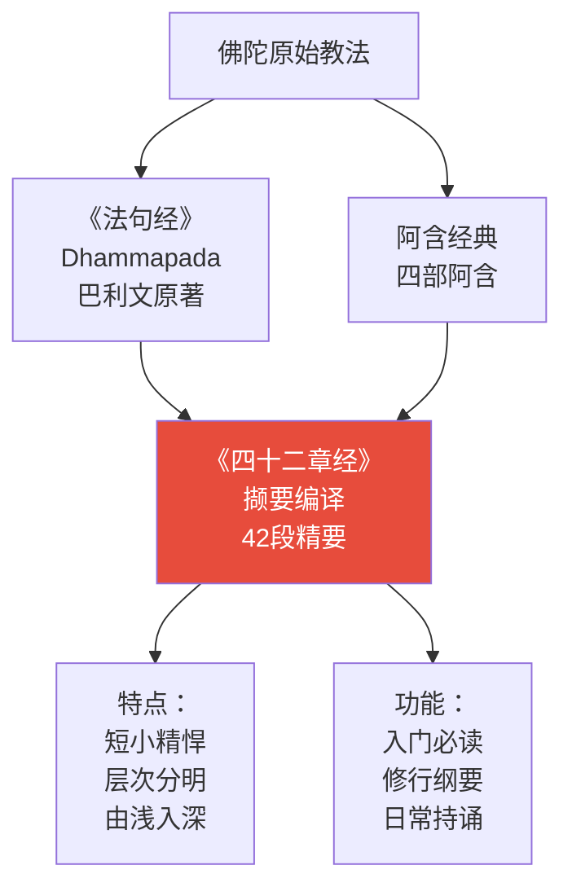
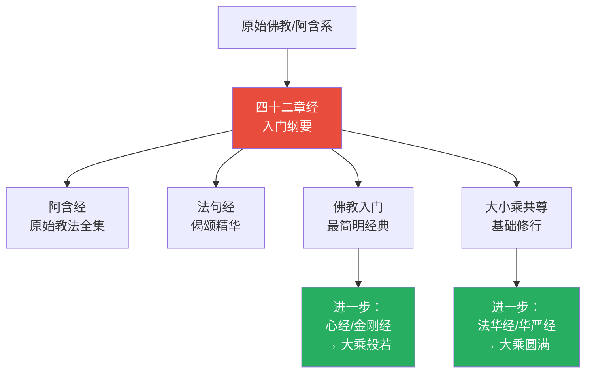
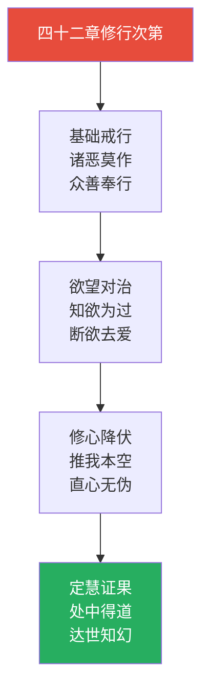

# 四十二章经 · Sutra of Forty-two Sections

## 一句话定义

《四十二章经》是佛教传入中国后的第一部译经——以四十二段精要开示，从"出家修道"到"证阿罗汉果"，层层递进，是佛教最简明扼要的入门指南。

## 基本信息

| 项目 | 内容 |
|------|------|
| 全称 | 佛说四十二章经 |
| 译者 | 迦叶摩腾、竺法兰（东汉明帝永平十年，67年） |
| 篇幅 | 一卷，四十二章 |
| 归属 | 小乘/大乘共尊；阿含类经典辑要 |
| 历史地位 | 中国第一部佛经；佛教东传的标志 |
| 内容来源 | 从《法句经》等阿含经典中撷要编译 |

---

## 一、整体结构：四十二章纲要

```mermaid
graph TD
    A["《四十二章经》<br/>42章 · 修行次第"] --> B["序分<br/>世尊成道已<br/>思惟说法度人<br/>梵王劝请"]
    
    B --> C1["第一板块：出家求道<br/>第1~5章<br/>出家 · 断欲 · 降心"]
    C1 --> C1a["1. 出家证果<br/>2. 断欲去爱<br/>3. 多欲多忧<br/>4. 善恶并明<br/>5. 重意轻财"]
    
    C1a --> C2["第二板块：修心止恶<br/>第6~15章<br/>善恶报应 · 持戒修善"]
    C2 --> C2a["6. 忍恶无嗔<br/>7. 恶还本身<br/>8. 尘唾自污<br/>9. 返本会道<br/>10. 喜施获福<br/>11. 举田较胜<br/>12. 尊亲最胜<br/>13. 欲火远离<br/>14. 念戒近道<br/>15. 行道在心"]
    
    C2a --> C3["第三板块：精进断惑<br/>第16~25章<br/>精进 · 定慧 · 断惑"]
    C3 --> C3a["16. 善恶并明<br/>17. 戒力消业<br/>18. 念等本净<br/>19. 假真并观<br/>20. 推我本空<br/>21. 名声丧本<br/>22. 财色招苦<br/>23. 妻子甚狱<br/>24. 色欲障道<br/>25. 欲火烧身"]
    
    C3a --> C4["第四板块：证果解脱<br/>第26~35章<br/>阿罗汉道 · 断结 · 证果"]
    C4 --> C4a["26. 天魔娆佛<br/>27. 无著得道<br/>28. 意不可染<br/>29. 正观敌色<br/>30. 欲火远离<br/>31. 心寂欲除<br/>32. 谨慎无放逸<br/>33. 智者明照<br/>34. 处中得道<br/>35. 垢尽明存"]
    
    C4a --> C5["第五板块：究竟圆满<br/>第36~42章<br/>大乘心 · 圆满道"]
    C5 --> C5a["36. 辗转获胜<br/>37. 念戒近道<br/>38. 生即有灭<br/>39. 教诲无差<br/>40. 行道在心<br/>41. 直心出欲<br/>42. 达世知幻"]
    
    C5a --> L["流通分<br/>诸天赞叹<br/>信受奉行"]
    
    style A fill:#2c3e50,color:#fff
    style C1 fill:#e74c3c,color:#fff
    style C2 fill:#f39c12,color:#fff
    style C4 fill:#3498db,color:#fff
    style C5 fill:#27ae60,color:#fff
```

---

## 二、核心教义拆解：四十二章的五层修行

---

## 三、核心法语图解

---

## 四、与《法句经》的关系

---

## 五、核心概念速查表

| 概念 | 章次 | 含义 | 操作意义 |
|------|------|------|----------|
| **出家** | 第1章 | 辞亲割爱，修道为本 | 放下世间执著 |
| **断欲** | 第2~5章 | 多欲多忧，寡欲少忧 | 减少欲望，心灵自由 |
| **持戒** | 第10~15章 | 戒为无上善 | 行为底线 |
| **忍辱** | 第6~8章 | 忍恶无嗔，恶还本身 | 不回应恶意 |
| **精进** | 第16~25章 | 修道如牛行，步步踏实 | 持续用功 |
| **修心** | 第20章 | 推我本空 | 观无我 |
| **定慧** | 第34~35章 | 处中得道，垢尽明存 | 中道修行 |
| **知幻** | 第42章 | 达世知幻 | 看透世间虚幻 |
| **直心** | 第41章 | 直心即道场 | 真诚不虚伪 |
| **无著** | 第27章 | 无著得道 | 不粘着一切 |

---

## 六、在十三经中的位置

- **独特贡献**：最简明的佛教入门书；中国第一译经的历史意义
- **与《心经》关系**：同讲"照见"，《四十二》重次第，《心经》重顿悟
- **与《金刚经》关系**：同讲"离相"，《四十二》重持戒离欲，《金刚》重无相无住

---

## 七、认知应用

### 操作一：欲望管理

当欲望升起时（第2~5章）：
1. 知：多欲多忧
2. 观：这个欲望带给我什么？
3. 断：如小儿贪刀刃之蜜
4. 转：将欲望的能量转向修行

### 操作二：日常持戒检核

每日检查（第10~15章）：
- 是否诸恶莫作？
- 是否众善奉行？
- 是否自净其意？
→ 诸佛所教，不过如此

### 操作三：知幻离幻

面对世间诱惑时（第42章）：
1. 观王侯之位如过隙尘
2. 观金玉之宝如瓦砾
3. 观美色之身如皮囊
4. 知一切如幻，不作实想

---

## Cognitive Architecture

《四十二章经》作为佛教传入中国的第一部经典，呈现了最简明的认知纪律架构：

- **沙门行（śramaṇa-caryā）作为认知简化操作**："辞亲出家，识心达本，解无为法"——从外在执著中抽离，回归认知的本源，是最基础的认知减负
- **断欲去爱的冲动控制训练**："爱欲之人犹如执炬逆风而行"——欲望管理作为认知自律的起点，参见[阿毗达磨心所](../concepts/cognitive-theory/abhidharma-mind.md)
- **持戒修心作为认知行为管理**："诸恶莫作，众善奉行，自净其意"——身口意三业的认知行为框架
- **推我本空（anātman）的自我解构**：观照"我"的不可得——早期佛教最直接的认知去中心化操作
- **达世知幻的认知去自动化**："视王侯之位如过隙尘，视金玉之宝如瓦砾"——看透世间认知的自动化建构过程
- **处中得道的认知平衡**：不急不缓、不紧不松的中道认知策略——如琴弦不紧不松方能出声

跨域链接：斯多亚学派"欲望管理"哲学与四十二章经的断欲思想形成东西方古典对话；行为主义心理学的"刺激-反应"调控与持戒的认知纪律机制相互印证。

---

## 进阶阅读

- 原典：《佛说四十二章经》
- 注释：守遂《四十二章经注》；藕益智旭《四十二章经解》
- 现代解读：圣严法师《四十二章经讲记》；南怀瑾《四十二章经》

---

## 八、翻译与传入历史

《四十二章经》是佛教传入中国的标志——永平求法的故事：

| 事件 | 时间 | 说明 |
|------|------|------|
| **汉明帝感梦** | 67 CE | 梦见金人飞来，遣使西域求法 |
| **迦叶摩腾/竺法兰来华** | 67 CE | 白马驮经，驻锡白马寺 |
| **译出《四十二章经》** | 67 CE | 从阿含经典中撷要编译 |

> 此经并非一部完整的独立经典，而是从《法句经》《阿含经》等早期经典中撷取精华、编译而成的入门读本。

---

## 九、注疏传统

| 注疏家 | 朝代 | 代表作 | 核心立场 |
|--------|------|--------|----------|
| **守遂** | 宋 | 《四十二章经注》 | 流传最广的注本 |
| **藕益智旭** | 明 | 《四十二章经解》 | 天台/净土视角解读 |
| **真可** | 明 | 《四十二章经题辞》 | 紫柏真可，禅宗视角 |

> 历代注疏较少，因本经文字浅白、以行为为主，多作为入门读物直接诵读，不须深注。

---

## 十、核心经文选录

### 选录一：出家证果

> **原文**：「辞亲出家，识心达本，解无为法，名曰沙门。」
>
> **白话**：辞别亲人出家修道，认识自心、通达本源、理解无为法理，才叫做真正的出家人。
>
> **要点**：出家不只是形式上的离开家庭，更是心灵上的出离执着。

### 选录二：断欲去爱

> **原文**：「爱欲之人，犹如执炬逆风而行，必有烧手之患。」
>
> **白话**：执着于情爱欲望的人，就像逆风举火把行走，一定会烧到自己的手。
>
> **要点**：欲望本身带来的苦，远大于它带来的短暂快乐。

### 选录三：恶还本身

> **原文**：「恶人害贤者，犹仰天而唾，唾不至天，还从己堕。」
>
> **白话**：恶人伤害好人，就像仰天吐口水——口水到不了天上，反而落到自己身上。
>
> **要点**：恶意最终伤害的是发出恶意的人自己。

### 选录四：心若灭罪亦灭

> **原文**：「心若灭时罪亦亡，心亡罪灭两俱空。」
>
> **白话**：当妄心息灭时罪业也消亡，妄心与罪业两者皆空。
>
> **要点**：罪的本质是妄心——不是外在的惩罚，而是内在的执着。

---

## 十一、实修关联

**日常修法**：
- 基础戒行：每日检视身口意三业——诸恶莫作、众善奉行
- 欲望对治：欲望升起时，观"如小儿贪刀刃之蜜"——甜不足一餐，有截舌之患
- 心念观照：于睡前回顾一日心行，有恶则忏、有善则喜

---

## 十二、认知科学映射

| 佛学概念 | 认知科学对应 | 说明 |
|----------|-------------|------|
| **断欲去爱** | 延迟满足/冲动控制 | 前额叶皮层对欲望的调控训练 |
| **恶还本身** | 认知回旋镖效应 | 恶意念头首先影响发出者自身的认知状态 |
| **推我本空** | 自我参照消解 | 降低默认模式网络（DMN）的自我中心活动 |
| **达世知幻** | 认知去自动化 | 看透日常认知的自动化建构过程 |
| **出家证果** | 认知注意力重定向 | 从外在目标转向内在觉察的注意力模式转换 |

> 此经是中国最早接触佛教认知论的入口——与儒家"克己复礼"、道家"少私寡欲"形成认知论的最初对话。
>
> 交叉参考：[注意力与觉察](../concepts/attention-awareness.md) · [自我认知](../../concepts/cognitive-theory/self-cognition.md)
