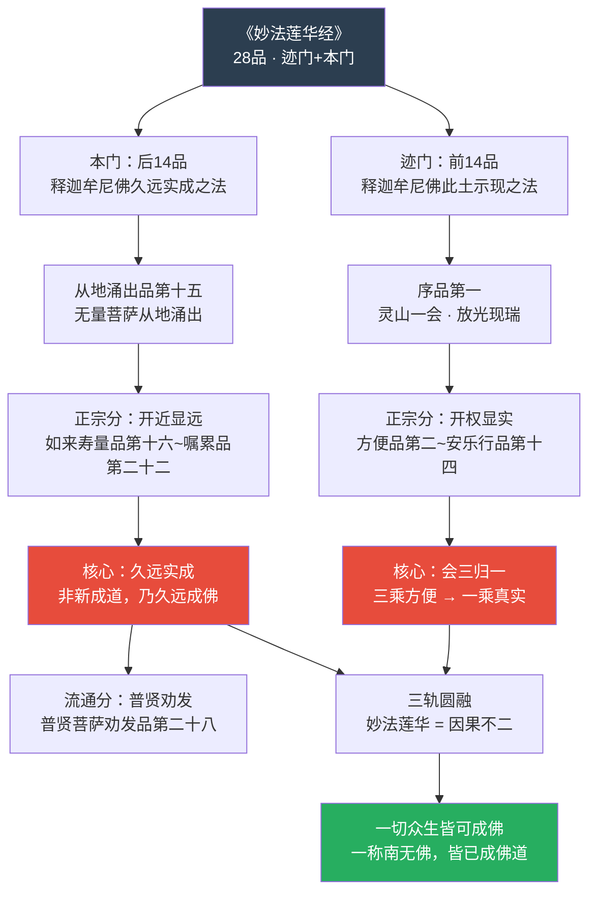
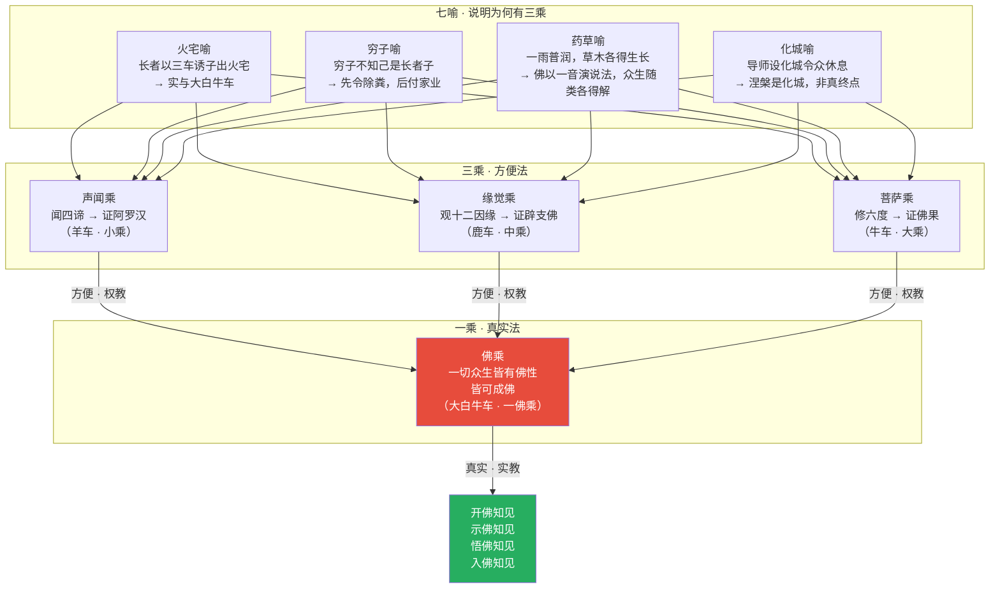
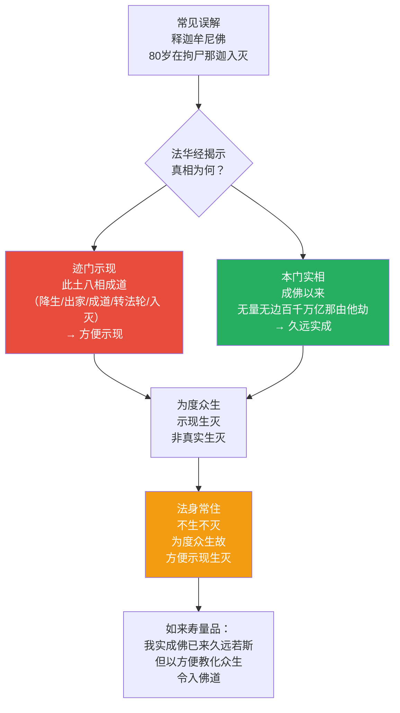
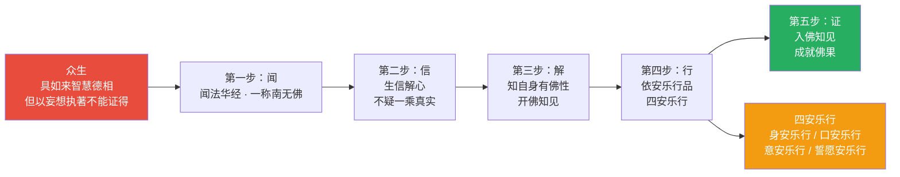
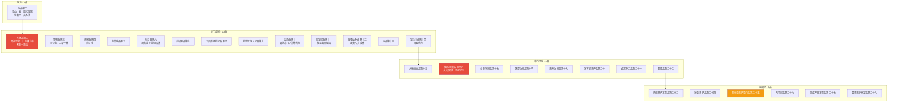
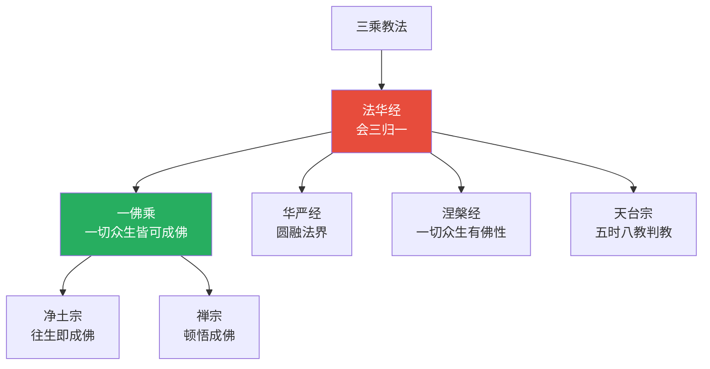
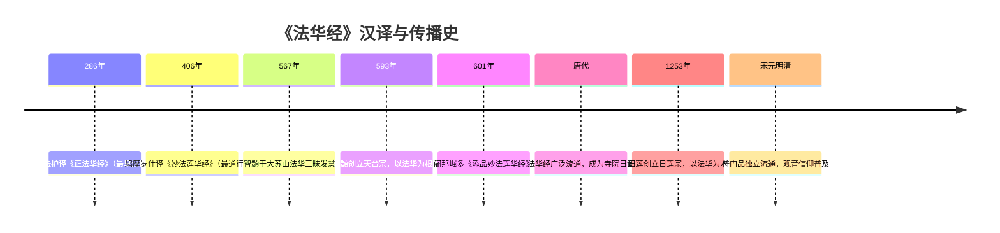
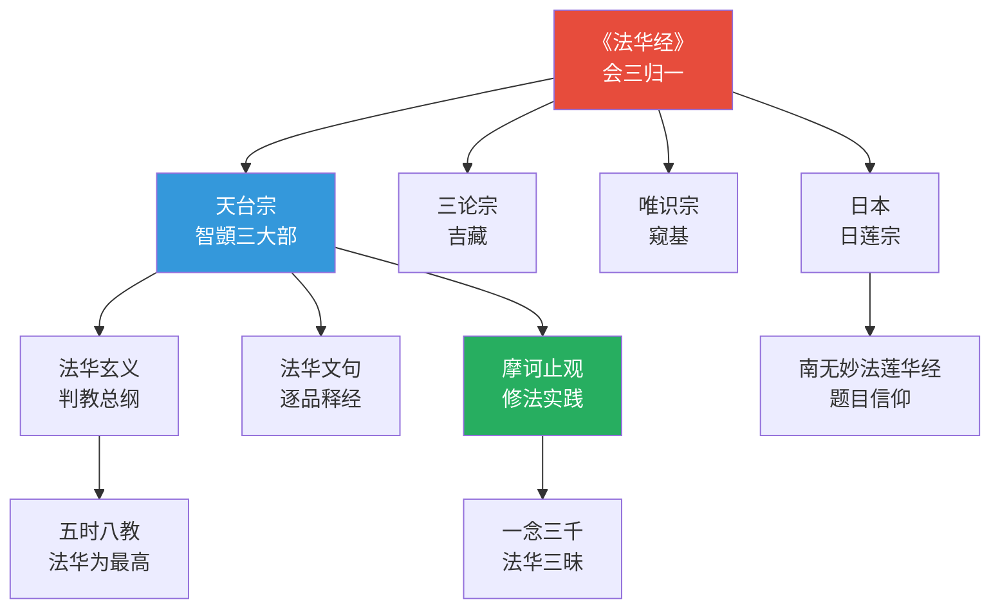
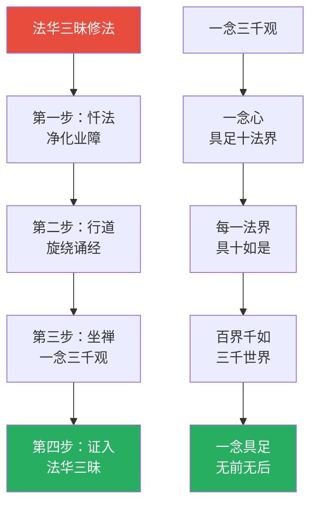
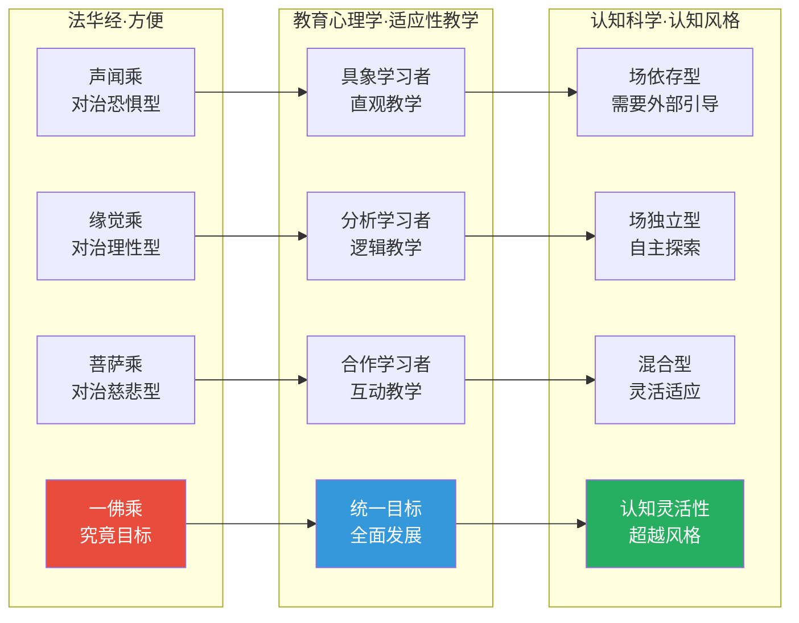

# 妙法莲华经 · Lotus Sutra

## 一句话定义

《法华经》是大乘佛教的"经王"——以"会三归一"重新统合佛教所有教法，揭示佛陀出世的本怀是令一切众生"开佛知见、示佛知见、悟佛知见、入佛知见"，最终皆能成佛。

## 基本信息

| 项目 | 内容 |
|------|------|
| 全称 | 妙法莲华经 |
| 译者 | 鸠摩罗什（406年译出，七卷二十八品） |
| 归属 | 大乘法华部，"经王" |
| 核心思想 | 一乘真实 / 诸法实相 / 久远实成 |
| 对中国影响 | 天台宗根本经典；日本日莲宗所依 |
| 著名比喻 | 火宅喻 / 穷子喻 / 药草喻 / 化城喻 / 系珠喻 / 髻珠喻 / 医师喻 |

---

## 一、整体结构：迹门与本地

---

## 二、核心教义拆解：会三归一

---

## 三、久远实成的法身观

---

## 四、修行次第：从听闻至成佛

---

## 五、二十八品核心教义分布

---

## 六、核心概念速查表

| 概念 | 含义 | 操作意义 |
|------|------|----------|
| **会三归一** | 三乘归于一佛乘 | 不轻视任何法门，知道最终都通向佛果 |
| **开权显实** | 展开方便，显示真实 | 理解不同教法的层次性 |
| **开近显远** | 展开近事，显示久远 | 佛的法身超越时空 |
| **诸法实相** | 十如是：相/性/体/力/作/因/缘/果/报/本末究竟等 | 认识万法的完整结构 |
| **十如是** | 每一法具足十种维度 | 全息认知的框架 |
| **四一** | 教一/行一/人一/理一 | 法华经的四重统一 |
| **四安乐行** | 身/口/意/誓愿的安乐修行 | 日常可操作的行为准则 |
| **龙女成佛** | 八岁龙女献珠即成佛 | 顿悟的可能——佛性不待修行累积 |
| **常不轻** | 常不轻菩萨礼拜众生 | 视一切众生为佛的操作 |

---

## 七、在十三经中的位置

- **上游**：小乘四谛/十二因缘；大乘般若空观；唯识法相
- **核心贡献**：统一所有教法为一佛乘；提出"十如是"诸法实相论
- **下游**：天台宗（智顗）；日本日莲宗；中国净土宗"往生即成佛"

---

## 八、认知应用

### 操作一：会三归一的整合思维

面对多元观点/方法时：
1. 识别"三乘"——不同的路径和方法
2. 追问"一乘"——它们共同指向的究竟是什么？
3. 操作"开权显实"——不否定任何路径，但知道它们都是方便

### 操作二：十如是的全息观察

观察任何现象时，检查十个维度：
1. 相（外在表象） 2. 性（内在性质） 3. 体（实体/本体）
4. 力（功能/能力） 5. 作（作用/行为） 6. 因（直接原因）
7. 缘（辅助条件） 8. 果（直接结果） 9. 报（长远果报）
10. 本末究竟等（从始至终的完整性）

→ 避免片面认知，培养全息视角

---

## Cognitive Architecture

《法华经》以"一乘真实、三乘方便"为核心，构建了佛教最具包容性的认知适应架构：

- **善巧方便（upāya-kauśalya）作为认知适应策略**：佛陀根据众生不同根器施设不同教法——火宅喻中三车诱出、药草喻中一雨普润，体现教学对认知水平的精准适配
- **一佛乘（eka-yāna）作为认知统一目标**：声闻·缘觉·菩萨三乘终归一佛乘——所有认知路径最终指向同一觉醒，参见[转识成智](../concepts/cognitive-theory/consciousness-transformation.md)
- **开权显实的认知升级操作**：不是否定方便法，而是揭示其背后的真实意趣——"开示悟入"佛知见的四步认知发展
- **十如是（daśa-tathatā）的全维度认知框架**：相·性·体·力·作·因·缘·果·报·本末究竟——观察任何现象的十个维度，避免认知片面性
- **常不轻菩萨的无条件积极关注**："我不敢轻于汝等，汝等皆当作佛"——对一切众生认知潜能的无条件确认

跨域链接：教育心理学"适应性教学"（adaptive instruction）与法华经"方便品"的教学策略高度一致；人本主义心理学罗杰斯"无条件积极关注"与常不轻菩萨的修行直接对应。

---

## 进阶阅读

- 原典：《妙法莲华经》（鸠摩罗什译）
- 注释：智顗《法华玄义》《法华文句》《摩诃止观》；吉藏《法华义疏》
- 现代解读：印顺法师《法华经讲记》；圣严法师《法华经讲要》

---

## 翻译与传入历史

《法华经》是大乘佛教传入中国最重要的经典之一，有三个主要汉译本：

| 译者 | 年代 | 译本名称 | 卷数 | 特点 |
|------|------|----------|------|------|
| **鸠摩罗什** | **406年** | **《妙法莲华经》** | **七卷二十八品** | **最通行本，文辞优美，天台宗所依** |
| 竺法护 | 286年 | 《正法华经》 | 十卷 | 最早汉译本，篇幅较罗什本长 |
| 阇那崛多与达摩笈多 | 601年 | 《添品妙法莲华经》 | 七卷 | 隋代新译，增补罗什所缺部分 |

**鸠摩罗什译本背景**：弘始八年（406年），鸠摩罗什于长安大寺译出此经。罗什弟子僧叡在《法华经后序》中说："此经……诸佛之秘藏，众经之实体也。"罗什的翻译使此经在中土迅速流通，成为汉传佛教影响力最大的经典之一。

**对中国佛教的深远影响**：
- 天台宗以此经为根本所依，智顗据此建立"五时八教"判教体系
- 日本日莲宗以"南无妙法莲华经"七字为修行核心
- 中国民间信仰中，观音信仰（《普门品》）即出于此经

---

## 注疏传统

《法华经》注疏以天台宗最为核心，形成了"法华三大部"：

| 注疏者 | 著作 | 宗派立场 | 核心特色 |
|--------|------|----------|----------|
| **智顗** | 《法华玄义》 | 天台宗 | 以五重玄义释经，判教总纲 |
| **智顗** | 《法华文句》 | 天台宗 | 逐品逐句释经，文字训诂 |
| **智顗** | 《摩诃止观》 | 天台宗 | 法华三昧修法，一念三千 |
| **吉藏** | 《法华义疏》 | 三论宗 | 以中观学释法华 |
| **窥基** | 《法华玄赞》 | 唯识宗 | 以唯识学释法华 |
| 嘉祥大师 | 《法华统略》 | 三论宗 | 统摄诸品大意 |
| 唐·湛然 | 《法华玄义释签》 | 天台宗 | 发挥智顗玄义 |
| 宋·知礼 | 《法华文句记》 | 天台宗 | 四明知礼，中兴天台 |
| 明·蕅益智旭 | 《法华经会义》 | 天台·净土 | 会通诸家，兼弘净土 |

**天台宗解读核心**：
- **五时八教**：法华经是第五时"法华涅槃时"的最高教法
- **会三归一**：声闻、缘觉、菩萨三乘归于一佛乘
- **一念三千**：一念心中具足三千世界，是天台止观的核心

---

## 核心经文选录

### 1. 一乘法（方便品）

> **原文**：十方佛土中，唯有一乘法，无二亦无三，除佛方便说。
>
> **现代解读**：在所有佛的世界里，只有一种成佛的道路——没有第二种，也没有第三种。所谓二乘（声闻、缘觉）和三乘（加上菩萨），都是佛陀根据众生不同根器而说的方便法门，最终都归于一佛乘。

### 2. 火宅喻（譬喻品）

> **原文**：三界无安，犹如火宅，众苦充满，甚可怖畏。……长者即作是念：此舍已为大火所烧，我及诸子若不时出，必为所焚。我今当设方便，令诸子等得免斯害。……以种种车，先以游戏，引出火宅。
>
> **现代解读**：三界（欲界、色界、无色界）就像着了火的房子，没有真正的安全。佛就像那位父亲，知道危险，但孩子们还在里面玩耍不肯出来。于是他用羊车、鹿车、牛车（比喻三乘）引诱孩子出火宅，出来后给每个人一辆大白牛车（一佛乘）。

### 3. 佛之本怀（方便品）

> **原文**：诸佛世尊，唯以一大事因缘故，出现于世。舍利弗，云何名诸佛世尊唯以一大事因缘故出现于世？诸佛世尊，欲令众生开佛知见，使得清净故，出现于世；欲示众生佛之知见故，出现于世；欲令众生悟佛知见故，出现于世；欲令众生入佛知见道故，出现于世。
>
> **现代解读**：佛陀来到这个世界的唯一目的，就是让众生开启、显示、领悟、进入佛的智慧。这不是说佛教是唯一的宗教，而是说佛陀出世的本怀是令一切众生都能觉醒。

### 4. 常不轻菩萨（常不轻菩萨品）

> **原文**：我不敢轻于汝等，汝等皆当作佛。
>
> **现代解读**：常不轻菩萨见到任何人都礼拜赞叹，说："我不敢轻视你们，你们将来都会成佛。"即使被人打骂也不改初衷。这是法华经"一切众生皆有佛性"思想的最直接实践。

### 5. 观世音菩萨普门品

> **原文**：若有无量百千万亿众生，受诸苦恼，闻是观世音菩萨，一心称名，观世音菩萨即时观其音声，皆得解脱。
>
> **现代解读**：这是中国民间最广泛流传的佛经段落之一。观音信仰的核心是"寻声救苦"——众生有苦难时，只要真诚呼唤，观音菩萨就会回应。从认知角度看，这是"信念"与"依止"的力量。

---

## 实修关联

### 法华三昧

法华三昧是天台宗最核心的修行方法之一，由智顗依《法华经》建立：

1. **忏法**：先修法华忏法，净化业障
2. **行道**：旋绕经行，口诵法华经
3. **坐禅**：于一念心中观三千世界
4. **证入**：证一念三千，入法华三昧

智顗于大苏山依慧思禅师修法华三昧，诵《药王品》至"是真精进，是名真法供养如来"时，豁然大悟，入法华三昧前方便。

### 一念三千观

天台宗核心观法，依《法华经》"十如是"建立：
- 观当下一念心，具足十法界（地狱、饿鬼、畜生、修罗、人、天、声闻、缘觉、菩萨、佛）
- 每一法界具足十如是（相、性、体、力、作、因、缘、果、报、本末究竟等）
- 十法界互具 = 百界，百界×十如是 = 千如是，配合三世间 = 三千世界
- 三千世界在一念心中具足，无前无后

### 四安乐行

依《安乐行品》修行，适合日常操作：
1. **身安乐行**：不亲近权贵、外道、凶险场所
2. **口安乐行**：不说他人过恶、不轻慢他人
3. **意安乐行**：不嫉妒、不谄诳、不轻蔑
4. **誓愿安乐行**：发大誓愿度一切众生

---

## 认知科学映射 ⭐

### 一乘 ↔ 认知统一论

| 法华经概念 | 认知科学对应 | 说明 |
|-----------|-------------|------|
| 会三归一 | 认知统合 | 多重认知模式最终指向统一的觉醒 |
| 开示悟入 | 认知发展四阶段 | 开启→展示→领悟→内化 |
| 十如是 | 多维度分析框架 | 认知任何事物的十个维度 |
| 火宅喻 | 认知惰性 | 人倾向于在熟悉的"火宅"中不愿离开 |
| 方便 | 认知适应策略 | 根据对方的认知水平调整教学方式 |
| 常不轻 | 无条件积极关注 | 罗杰斯人本主义的核心概念 |

### 方便 ↔ 认知适应策略

### 认知理论交叉引用

- [八识论](../concepts/cognitive-theory/eight-consciousness.md)：法华经的"开佛知见"涉及第八识阿赖耶识的转化，从染污识转为清净智
- [中观](../concepts/cognitive-theory/madhyamaka.md)："诸法实相"的十如是框架兼具空假中三谛
- [转识成智](../concepts/cognitive-theory/consciousness-transformation.md)："会三归一"是从三种认知模式统一为一佛智的过程
- [心境关系](../concepts/cognitive-theory/mind-world.md)："心净则佛土净"揭示了心与世界的建构关系
- [起信论](../concepts/cognitive-theory/qichu-zhengxin.md)："一切众生皆有佛性"与起信论"本觉"思想相通
- [六根六尘](../concepts/cognitive-theory/six-constituents.md)：普门品的"寻声救苦"涉及耳根与声尘的认知机制
