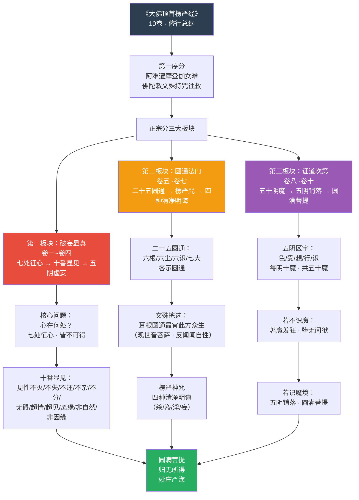
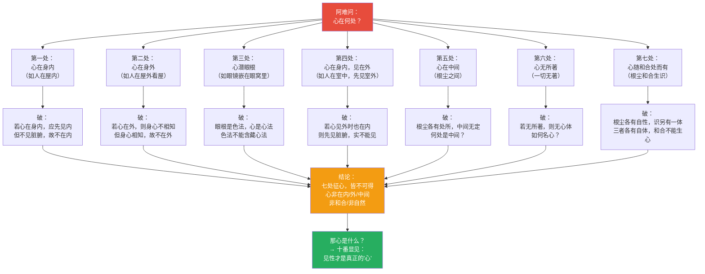
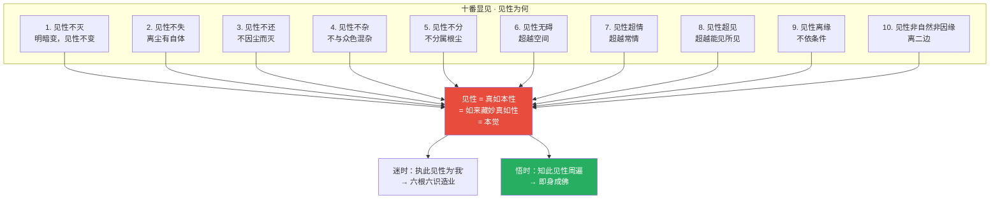
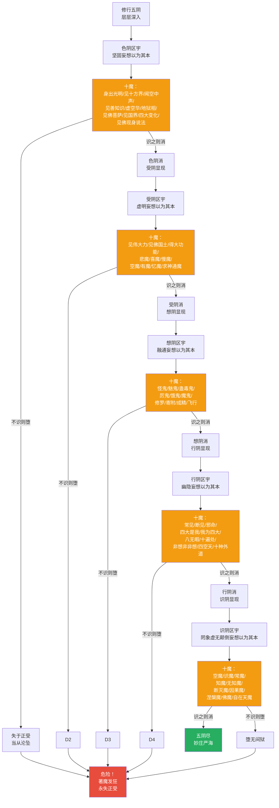
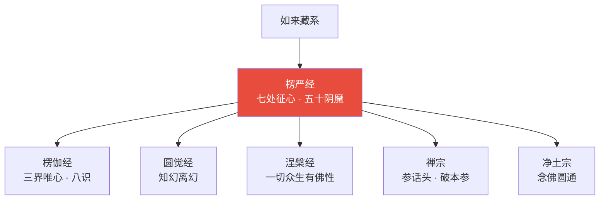
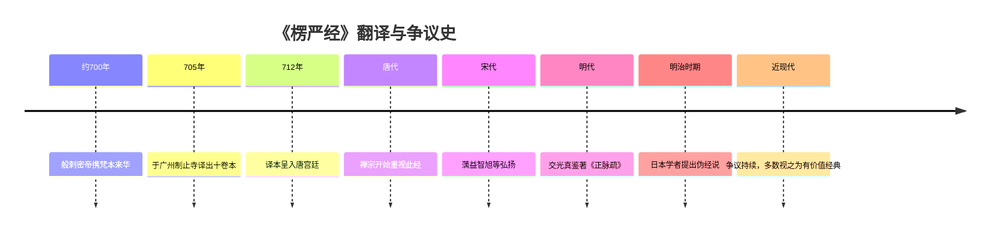
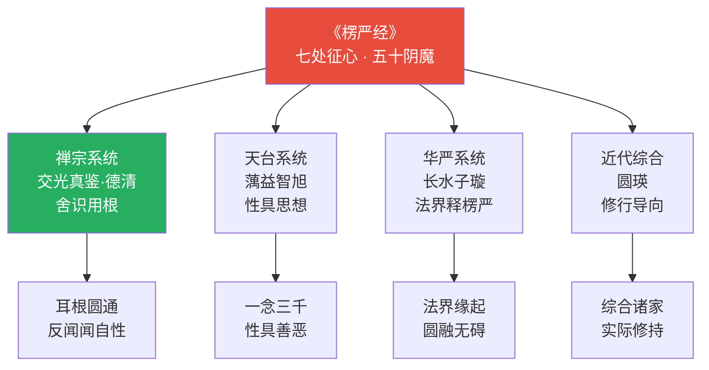
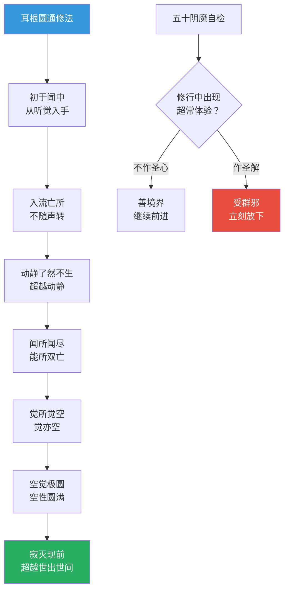
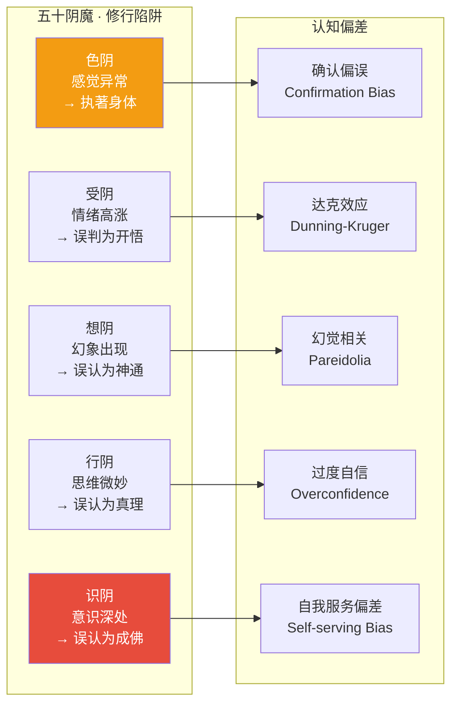

# 大佛顶首楞严经 · Śūraṅgama Sutra

## 一句话定义

《楞严经》是佛教"修行百科"——从"七处征心"破妄显真开始，经"二十五圆通"展示各门入道，终以"五十阴魔"详列修行路上每一阶段可能遭遇的魔境，是修行者从入门到成就最完整的地图。

## 基本信息

| 项目 | 内容 |
|------|------|
| 全称 | 大佛顶如来密因修证了义诸菩萨万行首楞严经 |
| 译者 | 般剌密帝（705年于广州译出） |
| 篇幅 | 十卷 |
| 归属 | 大乘如来藏系；禅宗/净土宗/密宗皆重视 |
| 核心人物 | 阿难（多闻第一）为当机者 |
| 对中国影响 | "自从一读楞严后，不看人间糟粕书"；禅宗重要参考 |

---

## 一、整体结构：十卷纲要

---

## 二、核心教义拆解：七处征心

---

## 三、十番显见：见性的十个特征

---

## 四、二十五圆通：入道门径全景

```mermaid
graph TB
    A["二十五圆通<br/>二十五位菩萨/阿罗汉<br/>各述悟道因缘"] --> B1["六根圆通 · 6"]
    A --> B2["六尘圆通 · 6"]
    A --> B3["六识圆通 · 6"]
    A --> B4["七大圆通 · 7"]
    
    B1 --> C1["憍陈如：声尘<br/>优波尼沙陀：色尘<br/>香严童子：香尘<br/>药王药上：味尘<br/>跋陀婆罗：触尘<br/>摩诃迦叶：法尘"]
    
    B2 --> C2["那律：眼根<br/>周利槃特迦：鼻根<br/>憍梵波提：舌根<br/>毕陵伽婆蹉：身根<br/>须菩提：意根<br/>（此处需校正：六尘是外境）"]
    
    B3 --> C3["舍利弗：眼识<br/>普贤：耳识<br/>孙陀罗：鼻识<br/>富楼那：舌识<br/>优波离：身识<br/>目犍连：意识"]
    
    B4 --> C4["火头：火大<br/>持地：地大<br/>月光水大<br/>琉璃光：风大<br/>虚空藏：空大
    弥勒：识大<br/>大势至：根大"]
    
    C1 & C2 & C3 & C4 --> D["文殊拣选：<br/>此方真教体，清净在音闻<br/>→ 耳根圆通<br/>（观世音菩萨 · 反闻闻自性）"]
    
    D --> E["反闻闻自性<br/>性成无上道<br/>→ 不从耳根入<br/>而从闻性入"]
    
    style D fill:#e74c3c,color:#fff
    style E fill:#27ae60,color:#fff
```

---

## 五、五十阴魔：修行安全地图

---

## 六、核心概念速查表

| 概念 | 含义 | 操作意义 |
|------|------|----------|
| **七处征心** | 心在七处皆不可得 | 破除对"心"的实体执著 |
| **十番显见** | 见性有十个不可破坏的特征 | 认识真正的自己 |
| **二十五圆通** | 二十五位圣者各述悟道门径 | 选择适合自己的修行方法 |
| **耳根圆通** | 反闻闻自性 | 最适此方众生的修法 |
| **四种清净明诲** | 断杀/盗/淫/妄 | 修行的基础戒律 |
| **五阴** | 色/受/想/行/识 | 修行的五个层次 |
| **五十阴魔** | 每阴十种魔境，共五十 | 修行安全地图 |
| **想阴十魔** | 最具欺骗性的魔境 | 修行者最常遭遇 |
| **识阴魔** | 最微细的魔境 | 连认为自己成佛都是魔 |
| **楞严咒** | 佛顶光明化现 | 护修行、破魔障 |
| **大佛顶** | 佛的最上顶相 | 最高智慧的象征 |

---

## 七、在十三经中的位置

- **独特贡献**：最完整的修行地图；五十阴魔的安全警示系统
- **与《圆觉经》关系**：同讲知幻离幻，但《楞严》更偏次第修行
- **与《楞伽经》关系**：同讲如来藏，但《楞严》更偏破妄显真

---

## 八、认知应用

### 操作一：七处征心的日常版

当产生"我认为……"的念头时：
1. 这个"认为"在身内吗？（若在内，应能见内脏）
2. 这个"认为"在身外吗？（若在外，身心如何相连？）
3. 这个"认为"在中间吗？（中间在哪里？）
4. → 追到最后，发现"认为"本身不可定位

### 操作二：五十阴魔的自检

在修行/深度工作中，检查：
- **色阴**：是否出现身体异常感受就认为是境界？
- **受阴**：是否因情绪高涨就认为是开悟？
- **想阴**：是否出现幻象就以为是佛菩萨？
- **行阴**：是否认为自己掌握了终极真理？
- **识阴**：是否认为自己已经成佛？

→ 每一层都有"识魔"的关键：不执著、不追求、不确认

---

## 进阶阅读

- 原典：《大佛顶首楞严经》
- 注释：长水子璇《楞严经疏》；交光真鉴《楞严经正脉疏》
- 现代解读：成观法师《楞严经义贯》；南怀瑾《楞严大义今释》

---

## 翻译与传入历史

《楞严经》的翻译史颇具传奇色彩，且存在真伪之争：

| 事件 | 年代 | 详情 |
|------|------|------|
| **般剌密帝译出** | **705年** | **于广州制止寺译出，房融笔受** |
| 般剌密帝来华 | 约700年 | 印度僧人，携梵本经海路来华 |
| 笔受者房融 | 705年 | 唐代宰相，因政治斗争流放广州，参与译经 |
| 传入宫廷 | 712年 | 译本经神秀弟子呈入宫廷 |
| 真伪争议 | 始于唐代 | 部分学者疑为中国人撰述 |

**翻译背景**：般剌密帝为印度僧人，据说他在印度求取此经梵本时，因经文被禁止出境，遂将经文写在白绢上，割开臂肉藏入其中，带到中国。在广州制止寺，由般剌密帝口译，房融笔受润色，译成十卷。

**真伪争议**：此经自唐代起即有学者质疑其为伪经（中国人撰述而非印度传来）。主要疑点包括：
- 梵文本在印度从未发现
- 经文中有些表述更符合中国人的思维习惯
- 翻译经过（割臂藏经）过于传奇
- 日本明治时期学者望月信亨等力主伪经说

**辩护意见**：
- 经义与印度大乘佛教一致
- 般剌密帝的翻译经过可以理解
- 蕅益智旭等历代大师皆视之为真经
- 现代学者多数视之为"有争议但有价值的经典"

---

## 注疏传统

《楞严经》注疏以禅宗和天台宗为主：

| 注疏者 | 著作 | 宗派立场 | 核心特色 |
|--------|------|----------|----------|
| **蕅益智旭** | 《楞严经文句》 | 天台·净土 | 最权威的注疏之一，兼弘净土 |
| **交光真鉴** | 《楞严经正脉疏》 | 禅宗 | 以"舍识用根"为核心，强调耳根圆通 |
| **圆瑛** | 《楞严经讲义》 | 近代·禅宗 | 现代最通行的楞严经注解 |
| 宋·长水子璇 | 《楞严经疏》 | 贤首宗 | 华严立场释楞严 |
| 宋·咸辉 | 《楞严经义海》 | 综合 | 汇集诸家注疏 |
| 明·憨山德清 | 《楞严经悬镜》 | 禅宗 | 简明扼要，禅味浓厚 |
| 清·续法 | 《楞严经灌顶疏》 | 华严宗 | 以华严法界观释楞严 |

**关键解读分歧**：
- **交光真鉴**（舍识用根）：修行应舍弃意识分别，直接用根性（见性、闻性）来修
- **蕅益智旭**（性具思想）：以天台"一念三千"释楞严，强调性具善恶
- **圆瑛**（综合折中）：兼采诸家，以实际修行为导向

---

## 核心经文选录

### 1. 七处征心（卷一）

> **原文**：佛告阿难："如汝所说，真所爱乐，因于心目。若不识知心目所在，则不能得降伏尘劳。……心不在内，亦不在外，亦不在中间。"
>
> **现代解读**：阿难说他的心因为看到佛陀的美好相貌而生起爱慕。佛追问："你说的心，在哪里？"经过七处征问——心在身内？在身外？在根尘之间？——每一处都不可得。这不是否定心的存在，而是破除对"心"的实体化认知。

### 2. 十番显见（卷二）

> **原文**："见见之时，见非是见。见犹离见，见不能及。"
>
> **现代解读**：当你去"看"那个能看的功能时，能看的功能不是被看的对象。"见性"本身超越了能见与所见的二元对立。这是《楞严经》最深奥的开示之一——真正的"心"不在任何能所对立中。

### 3. 耳根圆通（卷六·观世音菩萨自述）

> **原文**："初于闻中，入流亡所。所入既寂，动静二相了然不生。如是渐增，闻所闻尽。尽闻不住，觉所觉空。空觉极圆，空所空灭。生灭既灭，寂灭现前。忽然超越世出世间，十方圆明，获二殊胜。"
>
> **现代解读**：观世音菩萨描述了耳根圆通的修行次第：从听觉入手→声音消失→动静对立消失→能听与所听消失→觉知与对象消失→空性本身消失→生灭彻底止息→寂灭显现→超越世间与出世间。这是最详细的禅修次第描述之一。

### 4. 五十阴魔警语（卷九）

> **原文**："不作圣心，名善境界。若作圣解，即受群邪。"
>
> **现代解读**：修行中出现任何超常体验（光明、神通、见佛等），如果不认为自己证果了，那就是好的境界；如果认为"我开悟了""我成佛了"，立刻就会被邪魔侵入。这十六个字是修行安全的最高准则。

### 5. 楞严咒心

> **原文**：「唵。阿那隶。毗舍提。鞞啰跋阇啰陀唎。槃陀槃陀你。跋阇啰谤尼泮。虎𤙖都嚧瓮泮。莎婆诃。」
>
> **现代解读**：楞严咒是汉传佛教中最长的咒语之一（约2000余字），此为咒心。楞严咒被用于修行保护、消业除障。寺院早课中必诵楞严咒。

---

## 实修关联

### 耳根圆通（观音法门）

这是《楞严经》中最重要的修行方法，由文殊菩萨拣选为最适此方众生的修法：

1. **初于闻中**：从听觉入手，注意声音
2. **入流亡所**：不随声音流转，声音渐渐消失
3. **动静二相了然不生**：动（有声）与静（无声）的对立消失
4. **闻所闻尽**：能听与所听都消失
5. **觉所觉空**：觉知本身也空
6. **空觉极圆**：空性达到圆满
7. **空所空灭**：连空性的概念也消失
8. **寂灭现前**：真正的寂灭显现

**操作要点**：不是用耳朵去"听"，而是"反闻闻自性"——回到能听的功能本身，而非追逐声音。

### 楞严咒持诵

- 寺院早课首要功课
- 持诵前需先诵四种清净明诲（断杀盗淫妄）
- 持诵时以清净心、恭敬心诵之
- 被认为有护修行、破魔障的功效

### 五十阴魔自检

修行到一定程度时的自我检查系统：
- **色阴**：身体出现异常？不要执著
- **受阴**：情绪异常高涨或低落？不要认为是境界
- **想阴**：出现幻象、听到声音？不要认为是佛菩萨
- **行阴**：觉得掌握了宇宙真理？这是最常见的陷阱
- **识阴**：觉得自己已经成佛？这是最微细的魔境

---

## 认知科学映射 ⭐

### 七处征心 ↔ 心的认知定位问题

《楞严经》的"七处征心"与现代认知科学对"意识定位"的探索高度相似：

| 楞严经概念 | 认知科学对应 | 说明 |
|-----------|-------------|------|
| 心不在内 | 意识非局限在大脑 | 分布式认知、具身认知 |
| 心不在外 | 意识非纯粹客观 | 建构主义认知论 |
| 心不在中间 | 意识非在主客之间 | 超越主客二元 |
| 七处征心皆不可得 | 意识的难问题 | 查尔默斯"hard problem of consciousness" |
| 见性不灭 | 纯粹觉知 | 正念传统中的"觉知背景" |
| 五十阴魔 | 认知偏差/修行陷阱 | 元认知监控的重要性 |

### 五十阴魔 ↔ 认知偏差/修行陷阱

### 认知理论交叉引用

- [八识论](../concepts/cognitive-theory/eight-consciousness.md)：七处征心涉及八识的运作机制，尤其第七末那识的执著功能
- [中观](../concepts/cognitive-theory/madhyamaka.md)："见性非自然非因缘"的中道立场与龙树中观一致
- [六根六尘](../concepts/cognitive-theory/six-constituents.md)：二十五圆通直接以六根六尘六识为修行入手处
- [转识成智](../concepts/cognitive-theory/consciousness-transformation.md)："舍识用根"是从意识执著模式转为根性觉知的操作
- [心境关系](../concepts/cognitive-theory/mind-world.md)："七处征心"彻底解构了心与境的实体化关系
- [起信论](../concepts/cognitive-theory/qichu-zhengxin.md)：见性十义与起信论"本觉"思想高度一致
