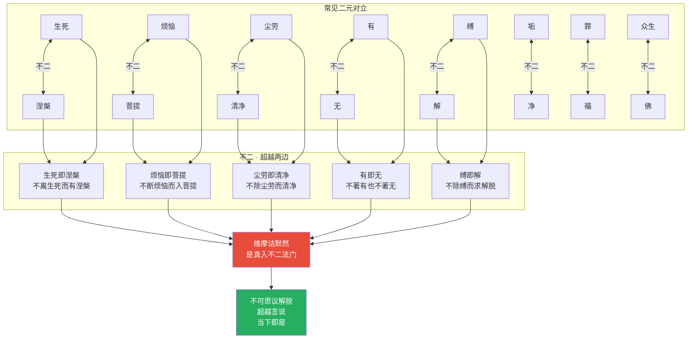
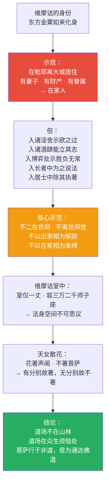
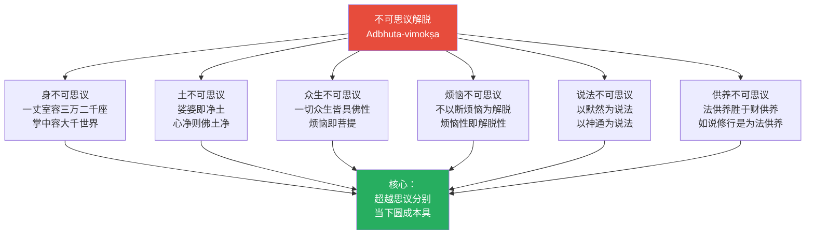
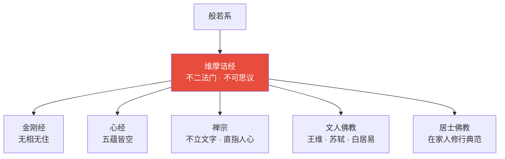
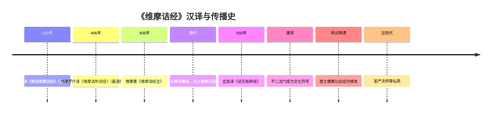
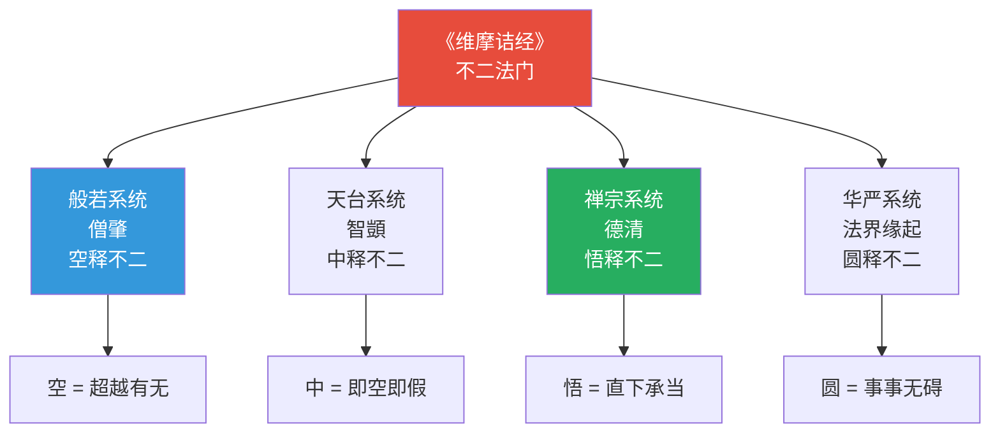
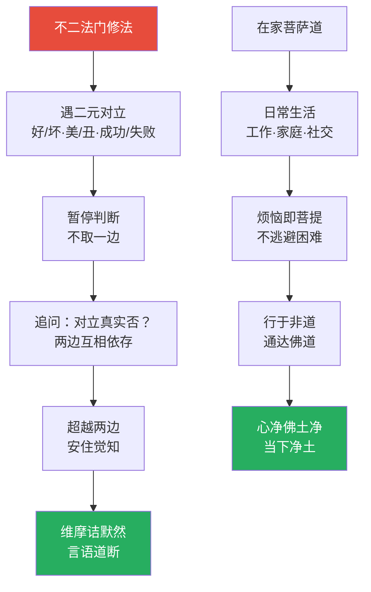
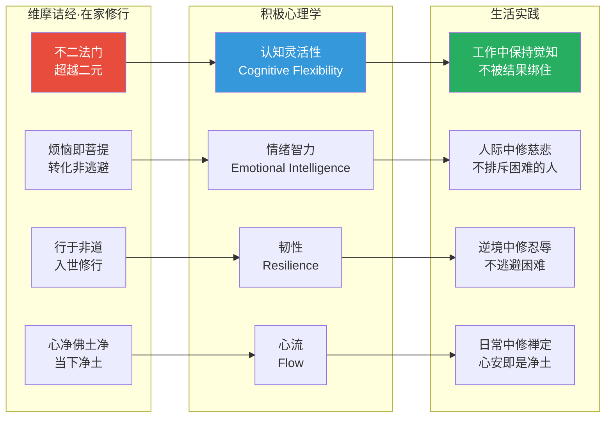

# 维摩诘所说经 · Vimalakīrti Nirdeśa Sutra

## 一句话定义

《维摩诘经》是"居士佛教的宣言"——以维摩诘大士（在家修行者）示现"不二法门"，揭示"烦恼即菩提，生死即涅槃"的究竟实相，打破出家/在家、世间/出世间、生死/涅槃的一切二元对立。

## 基本信息

| 项目 | 内容 |
|------|------|
| 全称 | 维摩诘所说经 |
| 译者 | 鸠摩罗什（最通行，三卷）；玄奘（六卷，名《说无垢称经》） |
| 篇幅 | 三卷十四品 |
| 归属 | 大乘般若系；与《般若经》思想相通 |
| 核心人物 | 维摩诘居士（东方金粟如来化身） |
| 对中国影响 | 王维字摩诘，取自此经；文人佛教的重要经典 |

---

## 一、整体结构：十四品纲要

```mermaid
graph TD
    A["《维摩诘所说经》<br/>14品 · 不二法门"] --> B["序分<br/>佛国品第一<br/>宝积菩萨说净土因果<br/>→ 净土在众生心净"]
    
    B --> C1["第一板块：示现生病<br/>方便品第二~弟子品第三"]
    C1 --> C1a["维摩诘现病<br/>文殊菩萨率众问疾<br/>诸大弟子皆辞以不能胜任"]
    
    C1a --> C2["第二板块：空室论法<br/>菩萨品第四~文殊师利问疾品第五"]
    C2 --> C2a["维摩诘室中空空<br/>但以神力化座<br/>八千菩萨/五百声闻入其室"]
    C2a --> C2b["问疾：云何慰喻有疾菩萨？<br/>→ 说身无常 · 说身苦 · 说身无我<br/>→ 说疾从何起：从痴有爱，则我病生"]
    
    C2b --> D1["第三板块：不可思议<br/>不思议品第六~观众生品第七"]
    D1 --> D1a["维摩诘示一丈室<br/>容三万二千师子座<br/>→ 不二法身的空间"]
    D1a --> D1b["天女散花<br/>花著声闻身而不著菩萨身<br/>→ 分别心故著，无分别故不著"]
    
    D1b --> E1["第四板块：不二法门<br/>佛道品第八~入不二法门品第九"]
    E1 --> E1a["三十一位菩萨各说不二法门<br/>→ 文殊说：一切法无言无说<br/>→ 维摩诘默然无言<br/>→ 文殊赞叹：是真入不二法门"]
    
    E1a --> F1["第五板块：菩萨行<br/>香积佛品第十~菩萨行品第十一"]
    F1 --> F1a["从香积佛国取香饭<br/>→ 若以禅悦为食，无需段食<br/>→ 示现方便波罗蜜"]
    
    F1a --> G1["第六板块：法供养<br/>见阿閦佛品第十二~嘱累品第十四"]
    G1 --> G1a["维摩诘现神通<br/>将大众置右掌中<br/>往诣东方阿閦佛国"]
    G1a --> G1b["佛说：若人受持此经<br/>是则为奉法供养<br/>→ 法供养胜于财供养"]
    
    G1b --> L["流通分<br/>法供养品·嘱累品"]
    
    style A fill:#2c3e50,color:#fff
    style E1a fill:#e74c3c,color:#fff
    style D1a fill:#f39c12,color:#fff
    style L fill:#27ae60,color:#fff
```

---

## 二、核心教义拆解：不二法门

---

## 三、维摩诘的示范：在家即出家

---

## 四、三十一位菩萨论不二

---

## 五、不可思议解脱的六个面向

---

## 六、核心概念速查表

| 概念 | 含义 | 操作意义 |
|------|------|----------|
| **不二法门** | 超越一切二元对立 | 遇对立时不取一边 |
| **不可思议** | 超越思议分别 | 不用概念去框定实相 |
| **烦恼即菩提** | 不断烦恼而入菩提 | 转化而非压抑 |
| **生死即涅槃** | 不离生死而有涅槃 | 在当下觅解脱 |
| **心净佛土净** | 净土在自心 | 净化自心即净土 |
| **尘劳之俦为如来种** | 烦恼是成佛的种子 | 不逃避困难 |
| **无住为本** | 以无住为本立一切法 | 心不滞留 |
| **法供养** | 如说修行，自利利他 | 最好的供养是实践 |
| **一丈室** | 维摩诘的居所 | 有限即无限的象征 |
| **天女散花** | 花著声闻不著菩萨 | 分别心是执著的根 |

---

## 七、在十三经中的位置

- **独特贡献**：打破出家/在家的界限；"不二"思想的经典表达
- **与《金刚经》关系**：同讲无住，《维摩》更偏不二，《金刚》更偏无相
- **与《六祖坛经》关系**：同讲在家修行；慧能受《维摩》影响深远

---

## 八、认知应用

### 操作一：不二觉察

当陷入二元对立时（好/坏、成功/失败、喜欢/讨厌）：
1. 暂停判断
2. 追问：这个对立是真实的吗？
3. 观照：两边互相依存，不可分离
4. 安住：超越两边，不取不舍

### 操作二：烦恼转化

当烦恼升起时：
1. 不排斥："烦恼即菩提"——它是修行的材料
2. 不沉溺："知幻即离"——知道它是如幻的
3. 不转化：不用力转化它——观察它的自性即是空性

→ "行于非道，通达佛道"

---

## Cognitive Architecture

《维摩诘经》以"不二"为核心方法，构建了超越一切二元对立的认知架构：

- **不二法门（advaya-dharmamukha）的认知层级**：三十一位菩萨以概念说不二→文殊以"无言无说"否定概念→维摩诘以沉默直接体现——概念表述→否定概念→超越概念的认知三级跃迁
- **维摩一默（tūṣṇīṃ-bhāva）作为认知极限表达**：沉默不是无话可说，而是认知到达语言边界后的直接呈现——"言语道断，心行处灭"
- **烦恼即菩提的认知转化操作**：不压抑不逃避，直观烦恼自性即空——"行于非道，通达佛道"是在最复杂环境中保持觉知的认知训练
- **居士认知模式**：打破出家/在家、世间/出世间的认知边界——在工作、家庭、社交中实践不二法门
- **心净佛土净（citta-śuddhi-buddhakṣetra-śuddhi）**：认知框架决定所感知的世界——净化自心即是净化世界

跨域链接：维特根斯坦"对不可说者保持沉默"与维摩一默形成跨文化的哲学对话；积极心理学"心流"与"行于非道通达佛道"在入世觉知层面呼应。

---

## 进阶阅读

- 原典：《维摩诘所说经》（鸠摩罗什译）
- 注释：僧肇《维摩诘经注》；智者大师《维摩经玄疏》
- 现代解读：圣严法师《维摩诘经讲记》；吴言生《维摩诘经评注》

---

## 翻译与传入历史

《维摩诘经》有三个主要汉译本：

| 译者 | 年代 | 译本名称 | 卷数 | 特点 |
|------|------|----------|------|------|
| **支谦** | **223年** | **《佛说维摩诘经》** | **二卷** | **最早汉译本，三国吴译** |
| **鸠摩罗什** | **406年** | **《维摩诘所说经》** | **三卷十四品** | **最通行本，文辞典雅** |
| **玄奘** | **650年** | **《说无垢称经》** | **六卷** | **最忠实原典，唐代译出** |

**鸠摩罗什译本背景**：弘始八年（406年），鸠摩罗什于长安译出此经。罗什的翻译使此经在中土广泛流通，尤其受到文人士大夫的喜爱。罗什弟子僧肇为此经作注，成为最早的系统注疏。

**对中国文化的深远影响**：
- 王维（701-761）字"摩诘"，取自维摩诘居士之名
- 苏轼、白居易等文人皆深受此经影响
- "不二法门"成为中国文化中的常用成语
- "一默如雷""天女散花"等典故广为人知
- 居士佛教以此经为根本经典

---

## 注疏传统

《维摩诘经》注疏以僧肇和智顗最为重要：

| 注疏者 | 著作 | 宗派立场 | 核心特色 |
|--------|------|----------|----------|
| **僧肇** | 《维摩诘经注》 | 关河·般若 | 最早的系统注疏，罗什弟子 |
| **智顗** | 《维摩经玄疏》 | 天台宗 | 以天台教观释维摩 |
| **智顗** | 《维摩经文疏》 | 天台宗 | 逐品释经 |
| 吉藏 | 《维摩经义疏》 | 三论宗 | 以中观学释不二 |
| 湛然 | 《维摩经疏记》 | 天台宗 | 发挥智顗之说 |
| 明·憨山德清 | 《维摩经直疏》 | 禅宗 | 简明直解 |
| 明·通润 | 《维摩经释》 | 禅宗 | 以参禅释维摩 |

**僧肇注的独特价值**：
- 僧肇是鸠摩罗什最出色的弟子
- 他的注解直接反映了罗什的理解
- 僧肇本人也是中国佛教哲学的开创者之一
- 《肇论》中的思想与此经注解相互印证

**各宗解读差异**：
- **般若系**（僧肇）：以般若空宗释不二，强调"空"
- **天台宗**（智顗）：以一念三千释不可思议，强调"中"
- **禅宗**（德清）：以直指人心释维摩默然，强调"悟"
- **华严宗**：以法界缘起释一丈室容三万座，强调"圆"

---

## 核心经文选录

### 1. 不可思议解脱法门（不思议品）

> **原文**：若菩萨住是解脱者，以须弥之高广，内芥子中，无所增减，须弥山王本相如故。……又以四大海水入一毛孔，不娆鱼鳖鼋鼍水性之属，而彼大海本相如故。
>
> **现代解读**：住于不可思议解脱的菩萨，能将须弥山（最高的山）放入芥子中，芥子不增大，须弥山不缩小。又能让四大海水流入一个毛孔，海中的生物不受干扰。这不是物理操作，而是法身智慧的境界——有限与无限的不二。

### 2. 天女散花（观众生品）

> **原文**：时天女以天花散诸菩萨大弟子上。花至诸菩萨即皆堕落，至大弟子便著不堕。……结习未尽，花著身耳。结习尽者，花不著也。
>
> **现代解读**：天女散花，花落在菩萨身上就掉下来，落在声闻弟子身上就粘住了。因为声闻弟子还有"分别心"——觉得花是好的、身体是需要保护的、花落在身上是不好的。菩萨没有这些分别，所以花不住。

### 3. 一默如雷（入不二法门品）

> **原文**：于是文殊师利问维摩诘："我等各自说已，仁者当说何等是菩萨入不二法门？"时维摩诘默然无言。文殊师利叹曰："善哉善哉！乃至无有文字语言，是真入不二法门。"
>
> **现代解读**：三十一位菩萨各说了自己的不二法门，文殊说"无言无说是入不二法门"，维摩诘则直接沉默。沉默不是无话可说，而是超越了语言所能表达的——因为不二法门不是概念，而是直接的体验。

### 4. 菩萨病（文殊师利问疾品）

> **原文**：以一切众生病，是故我病。若一切众生得不病者，则我病灭。……菩萨疾者，以大悲起。
>
> **现代解读**：文殊问维摩诘为什么生病，维摩诘说：因为一切众生都在病苦中，所以我也病了。如果一切众生都不再痛苦，我的病就好了。菩萨的"病"不是身体的病，而是大悲心——对众生苦难的深切回应。

### 5. 行于非道通达佛道（佛道品）

> **原文**：若菩萨行于非道，是为通达佛道。……示行贪欲，离诸染著。示行嗔恚，于诸众生无有恚碍。示行愚痴，而以智慧调伏其心。……入诸淫舍，示欲之过。入诸酒肆，能立其志。
>
> **现代解读**：真正的菩萨不回避世间，而是在世间最复杂的地方修行。进入淫舍是为了示范欲望的过患，进入酒肆是为了展示意志的力量。不是说菩萨去做坏事，而是说菩萨不以逃避为修行——在最困难的环境中保持觉知。

---

## 实修关联

### 不二法门

维摩诘经最核心的修行方法：

1. **遇对立时暂停**：当产生好/坏、美/丑、成功/失败等二元判断时，暂停
2. **追问对立的真实性**：这个对立是真实的吗？两边是否互相依存？
3. **超越两边**：不取一边，不排斥另一边，安住于超越二元的觉知
4. **维摩诘默然**：在概念无法到达的地方，直接安住

### 在家菩萨道

维摩诘经为在家人提供了独特的修行框架：
- 不以出家相为修行前提
- 在日常生活中修不二法门
- 在工作、家庭、社交中实践菩萨行
- "烦恼即菩提"——不是逃避烦恼，而是转化烦恼

### 烦恼转化法

当烦恼升起时：
1. **不排斥**：烦恼即菩提——它是修行的材料
2. **不沉溺**：知道它是如幻的
3. **不转化**：不用力转化——观察它的自性即是空性
4. **行于非道**：在烦恼中保持觉知，即是通达佛道

---

## 认知科学映射 ⭐

### 不二 ↔ 超越二元认知

| 维摩诘经概念 | 认知科学对应 | 说明 |
|-------------|-------------|------|
| 不二法门 | 认知去二元化 | 超越非此即彼的二元思维模式 |
| 一默如雷 | 非言语认知 | 有些认知无法用语言表达，只能直接体验 |
| 天女散花 | 认知执著的可视化 | 分别心是"粘着"的根源 |
| 烦恼即菩提 | 情绪转化 | 情绪不是需要消除的，而是可以转化的能量 |
| 行于非道 | 认知灵活性 | 在复杂环境中保持觉知 |
| 心净佛土净 | 认知建构论 | 我们感知的世界由内心状态建构 |
| 不可思议解脱 | 超越认知框架 | 有些体验超越了常规认知范畴 |

### 居士修行 ↔ 认知整合的生活实践

### 认知理论交叉引用

- [八识论](../../concepts/cognitive-theory/eight-consciousness.md)：不二法门涉及超越第七末那识的二元执著
- [中观](../../concepts/cognitive-theory/madhyamaka.md)："不二"与中观的"中道"——超越有无、常断二边
- [转识成智](../../concepts/cognitive-theory/consciousness-transformation.md)：烦恼即菩提是从烦恼识转为菩提智的操作
- [心境关系](../../concepts/cognitive-theory/mind-world.md)："心净佛土净"是心境关系的最精炼表达
- [六根六尘](../../concepts/cognitive-theory/six-constituents.md)："天女散花"涉及色尘与身根的认知执著
- [起信论](../../concepts/cognitive-theory/qichu-zhengxin.md)："行于非道通达佛道"与起信论"生灭门即真如门"相通
