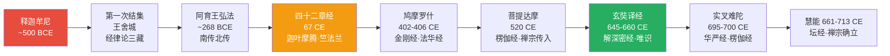
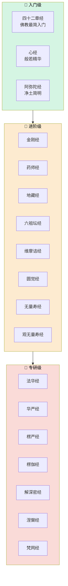
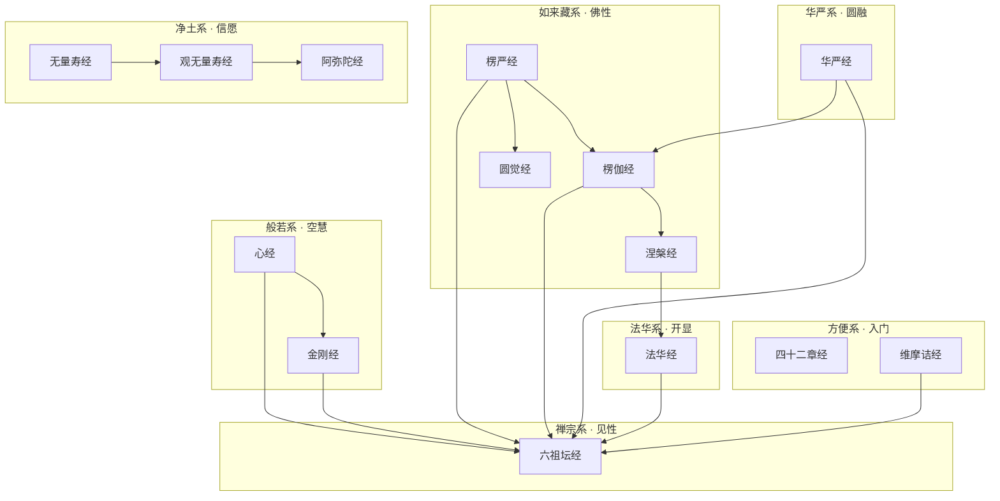

# 佛教经典图谱集 · 全然理解

> "经者，径也。" —— 通往觉悟的路径，以 Mermaid 图谱全然拆解。

**收录：18部经典** | 涵盖般若、如来藏、华严、法华、净土、禅宗六大系统

---

## 目录

| 序号 | 经名 | 核心路径 | 难度 | 文件 |
|------|------|----------|------|------|
| 1 | 《般若波罗蜜多心经》 | 五蕴皆空 → 度一切苦厄 | 入门 | [heart-sutra.md](heart-sutra.md) |
| 2 | 《金刚般若波罗蜜经》 | 无相 → 无住 → 无所得 | 进阶 | [diamond-sutra.md](diamond-sutra.md) |
| 3 | 《妙法莲华经》 | 会三归一 → 开佛知见 | 专研 | [妙法莲华经.md](妙法莲华经.md) |
| 4 | 《大佛顶首楞严经》 | 七处征心 → 五阴魔境 | 专研 | [surangama-sutra.md](surangama-sutra.md) |
| 5 | 《大方广佛华严经》 | 法界缘起 → 事事无碍 | 专研 | [华严经.md](华严经.md) |
| 6 | 《大方广圆觉修多罗了义经》 | 知幻 → 离幻 → 圆觉 | 进阶 | [perfect-enlightenment-sutra.md](perfect-enlightenment-sutra.md) |
| 7 | 《维摩诘所说经》 | 不二法门 → 烦恼即菩提 | 进阶 | [vimalakirti-sutra.md](vimalakirti-sutra.md) |
| 8 | 《大般涅槃经》 | 一切众生有佛性 → 常乐我净 | 专研 | [mahaparinirvana-sutra.md](mahaparinirvana-sutra.md) |
| 9 | 《楞伽阿跋多罗宝经》 | 三界唯心 → 八识 → 转识成智 | 专研 | [lankavatara-sutra.md](lankavatara-sutra.md) |
| 10 | 《四十二章经》 | 出家 → 断欲 → 证果 | 入门 | [forty-two-sections.md](forty-two-sections.md) |
| 11 | 《佛说无量寿经》 | 发愿 → 念佛 → 往生净土 | 进阶 | [amitayus-sutra.md](amitayus-sutra.md) |
| 12 | 《观无量寿佛经》 | 日观 → 佛菩萨观 → 九品往生 | 进阶 | [contemplation-sutra.md](contemplation-sutra.md) |
| 13 | 《六祖坛经》 | 见性 → 无念为宗 → 定慧等学 | 进阶 | [platform-sutra.md](platform-sutra.md) |

---

## 佛经传入时间线

---

## 难度分级推荐路径

---

## 对比矩阵：18部经核心教义横向对比

| 经名 | 所属宗派 | 核心教义 | 关键词 | 认知映射 |
|------|----------|----------|--------|----------|
| **心经** | 般若系 | 五蕴皆空，色即是空 | 空·般若·无所得 | 去执/概念消解 |
| **金刚经** | 般若系 | 无相无住，应无所住而生其心 | 无相·无住·无我 | 认知灵活性 |
| **法华经** | 法华系 | 会三归一，一切众生皆可成佛 | 开权显实·一乘 | 认知整合 |
| **华严经** | 华严系 | 法界缘起，事事无碍 | 一即一切·圆融 | 系统认知论 |
| **楞严经** | 如来藏系 | 七处征心，破妄显真 | 常住真心·耳根圆通 | 认知溯源 |
| **楞伽经** | 唯识/如来藏 | 三界唯心，八识，转识成智 | 唯识·如来藏·五法 | 认知建构论 |
| **涅槃经** | 如来藏系 | 一切众生有佛性，常乐我净 | 佛性·一阐提·五种行 | 先验认知潜能 |
| **圆觉经** | 如来藏系 | 知幻离幻，圆觉妙心 | 圆觉·幻·清净 | 认知去自动化 |
| **维摩诘经** | 方等系 | 不二法门，烦恼即菩提 | 不二·默然·在家人修行 | 认知二元消解 |
| **解深密经** | 唯识系 | 三性三无性，阿赖耶识 | 唯识·三性·转依 | 认知层次理论 |
| **四十二章经** | 阿含/入门 | 出家断欲，次第修行 | 戒行·欲望对治 | 延迟满足训练 |
| **无量寿经** | 净土系 | 四十八愿，信愿行 | 他力·念佛·往生 | 认知承诺模型 |
| **观无量寿经** | 净土系 | 十六观门，九品往生 | 观想·系念·三福 | 意象认知训练 |
| **阿弥陀经** | 净土系 | 简略劝信，执持名号 | 信·持名·极乐 | 信念建立模型 |
| **药师经** | 药师系 | 十二大愿，消灾延寿 | 现世利益·七佛 | 认知健康模型 |
| **地藏经** | 地藏系 | 孝道，因果报应 | 地狱·孝道·超度 | 认知伦理框架 |
| **坛经** | 禅宗系 | 顿悟见性，无念无相无住 | 顿悟·自性·定慧等学 | 认知范式转换 |
| **梵网经** | 戒律系 | 菩萨戒，十重四十八轻 | 戒律·菩萨行 | 认知行为规范 |

---

## 认知科学映射索引

各经的认知科学分析详见经文末尾的"认知科学映射"章节，主要交叉引用如下：

| 认知科学主题 | 相关经文 | 交叉引用 |
|-------------|----------|----------|
| **八识论** | 楞伽经、楞严经 | [八识论](../../concepts/cognitive-theory/八识体系.md) |
| **认知建构论** | 楞伽经、坛经、金刚经 | [建构论](../../concepts/cognitive-theory/constructivism.md) |
| **注意力与觉察** | 观无量寿经、无量寿经 | [注意力](../../concepts/cognitive-theory/attention-awareness.md) |
| **元认知** | 楞伽经、坛经 | [元认知](../../concepts/cognitive-theory/metacognition.md) |
| **认知范式转换** | 坛经（顿悟） | [范式转换](../../concepts/cognitive-theory/paradigm-shift.md) |
| **自我认知** | 四十二章经、金刚经 | [自我认知](../../concepts/cognitive-theory/self-cognition.md) |
| **意象认知** | 观无量寿经（十六观） | [意象认知](../../concepts/cognitive-theory/mental-imagery.md) |
| **认知承诺** | 无量寿经（四十八愿） | [认知承诺](../../concepts/cognitive-theory/cognitive-commitment.md) |
| **先验认知潜能** | 涅槃经（佛性论） | [八识论](../../concepts/cognitive-theory/八识体系.md) |
| **正念觉察** | 坛经、圆觉经 | [正念](../../concepts/cognitive-theory/正念.md) |

---

## 经典系统关系图

---

## 使用指南

- 每部经独立成篇，含**整体结构图**、**核心教义拆解图**、**修行次第图**等多张 Mermaid 图谱
- 图谱采用 `graph TD/LR/TB` 布局，按教义逻辑层级排列
- 节点使用 `[]` 矩形表示概念、`{}` 菱形表示抉择、`()` 圆角表示实践
- 颜色通过 style 区分：红色=核心教义、橙色=关键转折、蓝色=修行方法、绿色=成果/境界

## 设计原则

1. **全然理解**：从结构、逻辑、实践三个维度完整呈现
2. **认知可操作**：提取可直接用于认知升级的框架
3. **中立学术**：从宗教学/认知科学角度呈现，不传教
4. **图谱驱动**：以 Mermaid 图谱为核心，文字为辅助
5. **跨域映射**：每部经末尾提供与认知科学的交叉参考

---

## 统计

- **收录经典**：18部
- **涵盖宗派**：般若·如来藏·华严·法华·净土·禅宗·唯识·戒律·阿含
- **时间跨度**：约500 BCE — 713 CE
- **每部经结构**：基本信息 → 整体结构图 → 核心教义 → 修行路径 → 概念速查 → 认知映射
