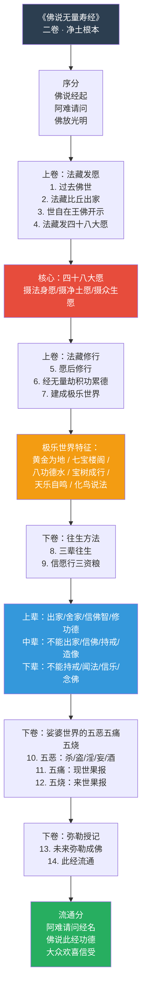
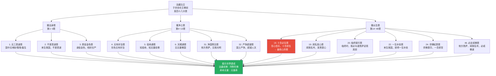
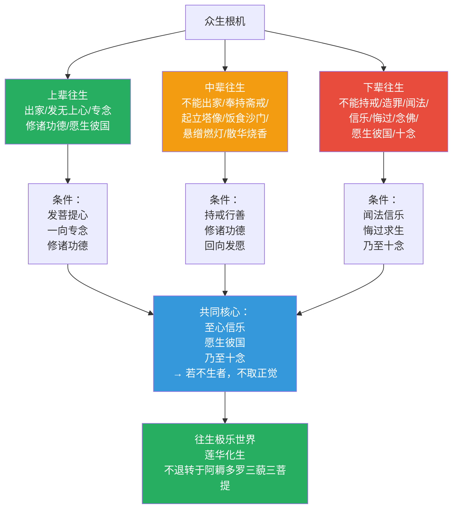
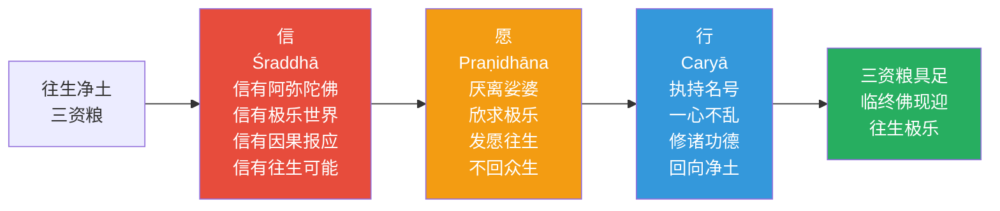
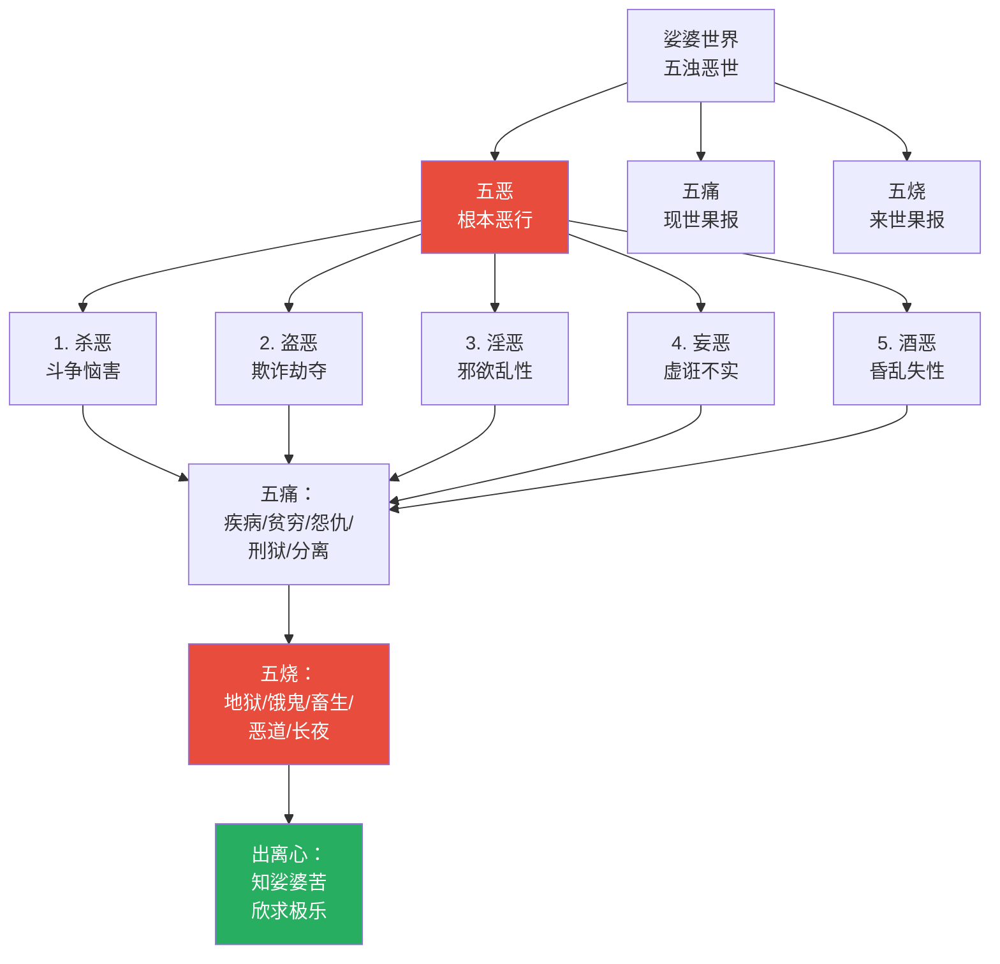
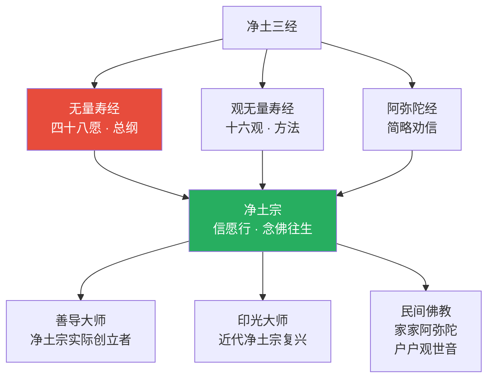
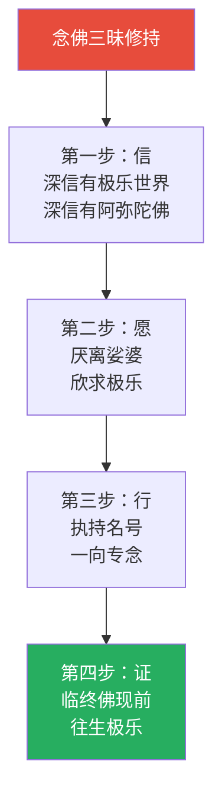

# 佛说无量寿经 · Sukhāvatīvyūha Sutra (Larger)

## 一句话定义

《无量寿经》是净土宗的根本经典——完整记载阿弥陀佛在因地为法藏比丘时发四十八大愿、修菩萨道、建成西方极乐世界的全过程，以及众生如何通过"信愿行"三资粮往生净土的完整路径。

## 基本信息

| 项目 | 内容 |
|------|------|
| 全称 | 佛说无量寿经 |
| 译者 | 康僧铠（曹魏时期，二卷）；另有十二译，存五译 |
| 篇幅 | 二卷（最通行）/ 大宝积经无量寿如来会 |
| 归属 | 大乘净土部；净土宗根本三经之一 |
| 核心思想 | 四十八大愿 / 信愿行三资粮 / 念佛往生 |
| 对中国影响 | 净土宗根本经典；善导大师《观经疏》多引此经 |

---

## 一、整体结构：二卷纲要

---

## 二、核心教义拆解：四十八大愿

---

## 三、三辈往生：根机与路径

---

## 四、信愿行三资粮

---

## 五、五恶五痛五烧：娑婆警示

---

## 六、核心概念速查表

| 概念 | 含义 | 操作意义 |
|------|------|----------|
| **阿弥陀佛** | 无量寿/无量光 | 忆念名号，感通佛力 |
| **四十八大愿** | 法藏比丘的誓愿 | 了解佛的承诺，增强信心 |
| **十念必生** | 第18愿，乃至十念 | 最简便的往生方法 |
| **信愿行** | 往生的三个条件 | 缺一不可 |
| **三辈往生** | 上/中/下三辈 | 不同根机，同一目标 |
| **极乐世界** | 阿弥陀佛的净土 | 理想的修行环境 |
| **莲华化生** | 往生后从莲华出生 | 无胎生之苦 |
| **不退转** | 必至成佛 | 最大的保障 |
| **五恶五痛五烧** | 娑婆的苦因苦果 | 生起厌离心 |
| **法藏比丘** | 阿弥陀佛的因地 | 学习发愿与修行 |
| **回向** | 将功德转向净土 | 必修的功课 |

---

## 七、在十三经中的位置

- **独特贡献**：最完整的净土理论；四十八大愿的具体承诺
- **与《观无量寿经》关系**：同讲净土，《无量寿》重发愿，《观经》重观法
- **与《阿弥陀经》关系**：同讲净土，《无量寿》详，《阿弥陀》略

---

## 八、认知应用

### 操作一：十念法

当焦虑/恐惧时：
1. 深呼吸
2. 念"南无阿弥陀佛"十声
3. 每一声都专注在佛号上
4. 念毕，观照心念的变化

### 操作二：信愿行自检

- **信**：我真的相信有极乐世界吗？还是只是希望？
- **愿**：我真的愿意离开娑婆吗？还是留恋？
- **行**：我每天有念佛/修行吗？还是只是想想？

### 操作三：厌离与欣求的平衡

- 不过度厌世：厌离的是娑婆的苦因，不是生命本身
- 不过度期待：极乐是修行的环境，不是逃避的场所
- 中道：在此土修行，发愿往生

---

## Cognitive Architecture

《无量寿经》以四十八大愿为缘起，构建了净土宗最完整的认知承诺与修行架构：

- **四十八大愿（catuḥṣaṣṭhi-praṇidhāna）作为认知承诺模型**：法藏比丘以成佛为担保，为众生设定系统性的认知转化条件——第18愿"十念必生"是最核心的承诺，参见[起信论](../概念/cognitive-theory/七处征心.md)
- **十念必生作为注意力聚焦临界点**：持续专注念佛达到认知转换的临界——重复性注意力训练触发深层意识转化
- **三辈往生的认知准备度分级**：上辈·中辈·下辈对应不同认知基础，同一目标——个性化修行路径
- **信愿行（śraddhā-praṇidhāna-caryā）认知三元结构**：信念（认知基础）→愿力（动机驱动）→行持（认知操作），缺一不可
- **五恶五痛五烧的因果认知警示**：展示娑婆世界的因果链条，激发认知转变的动机——厌离心与欣求心的平衡

跨域链接：目标设定理论（Locke & Latham）与四十八愿的系统性目标架构形成对应；自我效能感（Bandura）理论中的"信念→行为→结果"链与信愿行三元结构高度一致。

---

## 进阶阅读

- 原典：《佛说无量寿经》（康僧铠译）
- 注释：善导大师《观无量寿佛经疏》；昙鸾《往生论注》
- 现代解读：印光大师《印光法师文钞》；圣严法师《净土在人间》

---

## 九、翻译与传入历史

《无量寿经》汉译次数众多，版本最为复杂：

| 版本 | 译者 | 时间 | 特点 |
|------|------|------|------|
| **康僧铠本** | 康僧铠 | 252 CE（曹魏） | 最通行，二卷 |
| **菩提流支本** | 菩提流支 | 529 CE（北魏） | 收入《大宝积经》 |
| **夏莲居会集本** | 夏莲居 | 1930年代 | 民国会集诸译而成 |

> 此经共有十二种汉译，现存五种——在所有佛经中翻译次数最多，反映了净土信仰的持久影响力。

---

## 十、注疏传统

| 注疏家 | 朝代 | 代表作 | 核心立场 |
|--------|------|--------|----------|
| **善导** | 唐 | 《观经疏》（四帖疏） | 净土宗实际创立者，强调他力 |
| **昙鸾** | 南北朝 | 《往生论注》 | 难行道/易行道之判 |
| **印光** | 近代 | 《印光法师文钞》 | 净土复兴，敦伦尽分 |
| **莲池** | 明 | 《阿弥陀经疏钞》 | 禅净合一 |

> 善导大师的《观经疏》被日本净土宗奉为圣典——影响远超中国，波及整个东亚佛教。

---

## 十一、核心经文选录

### 选录一：法藏比丘四十八愿

> **原文**：「设我得佛，十方众生，至心信乐，欲生我国，乃至十念，若不生者，不取正觉。」（第十八愿）
>
> **白话**：如果我成佛，十方世界的众生，以真诚心信乐欢喜，想要往生我的国土，哪怕只念十声佛号，如果不能往生，我就不成佛。
>
> **要点**：这是四十八愿的核心——阿弥陀佛以自己的成佛作为担保。

### 选录二：三辈往生

> **原文**：「其上辈者，舍家弃欲而作沙门，发菩提心，一向专念无量寿佛。」
>
> **白话**：上品往生的人，出家修行，发菩提心，一心专念阿弥陀佛。
>
> **要点**：三辈往生对应不同根机，但核心都是"信愿行"三资粮。

### 选录三：极乐世界庄严

> **原文**：「其佛国土，自然七宝……黄金为地，宝树罗列，宝网覆上。」
>
> **白话**：阿弥陀佛的国土以七宝自然成就，黄金铺地，宝树成行，宝网覆盖。
>
> **要点**：极乐世界的庄严不是想象，而是法藏比丘累劫修行功德的显现。

---

## 十二、实修关联

**核心修法**：
- 十念法：每日清晨，合掌念佛十声，每一声都专注在佛号上
- 念佛三昧：长时间一心念佛，不杂余念，直至心境一如
- 临终助念：为临终者助念，帮助其正念分明、蒙佛接引

---

## 十三、认知科学映射

| 佛学概念 | 认知科学对应 | 说明 |
|----------|-------------|------|
| **信仰认知** | 他力认知模型 | 信任外部力量（佛力）作为认知转变的触发器 |
| **四十八愿** | 认知承诺模型 | 发愿 = 设定深层认知目标，持续影响行为 |
| **十念必生** | 注意力聚焦训练 | 重复专注同一对象达到认知临界点 |
| **三辈往生** | 认知准备度分级 | 不同认知基础对应不同的修持路径 |
| **信愿行** | 信念-动机-行为三元模型 | 认知科学中"信念→意图→行动"的经典结构 |

> 交叉参考：[注意力与觉察](../concepts/attention-awareness.md) · [认知承诺](../../concepts/cognitive-theory/cognitive-commitment.md)
