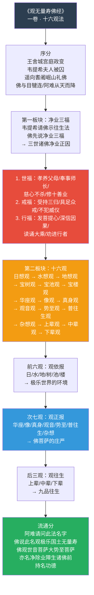
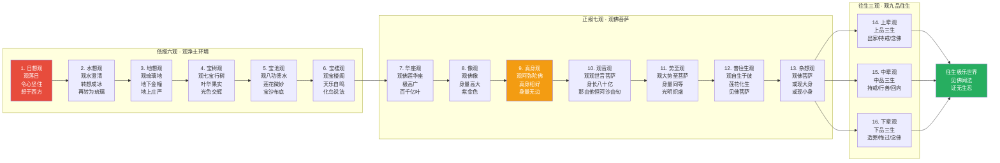
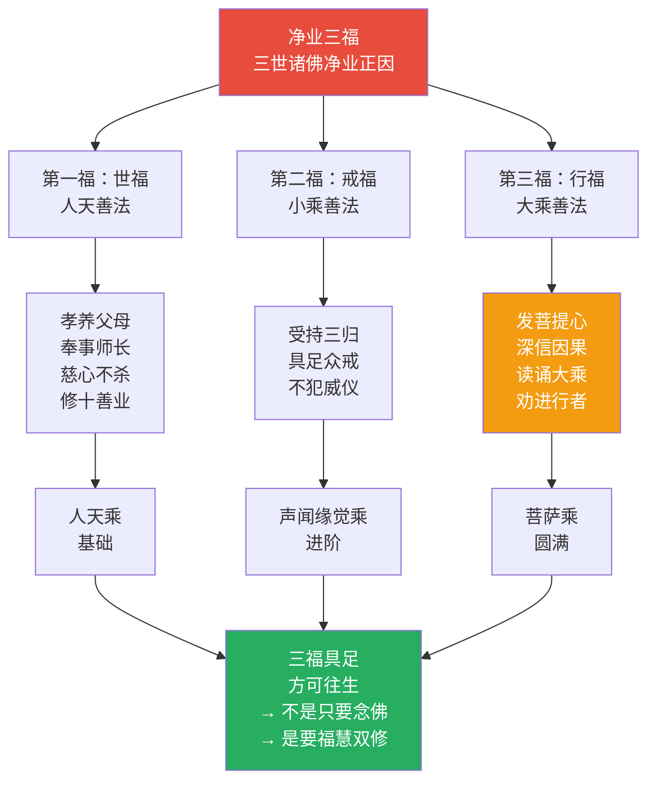
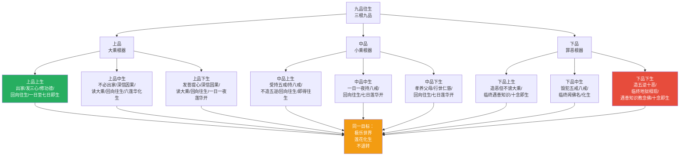
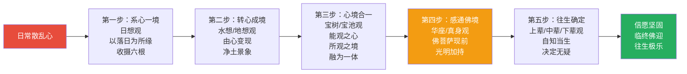
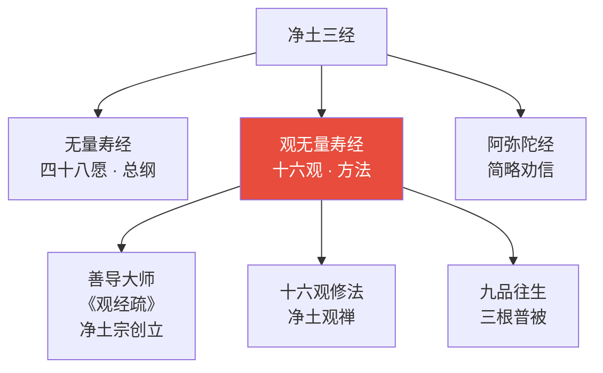
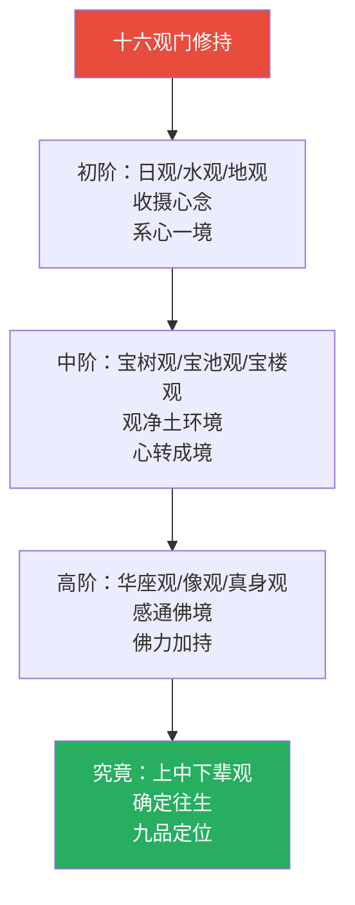

# 佛说观无量寿佛经 · Amitāyurdhyāna Sutra

## 一句话定义

《观无量寿佛经》是净土宗的实践手册——以"日想观"到"杂想观"十六种观法，系统引导修行者从观想落日开始，层层深入，最终观见阿弥陀佛及极乐净土的庄严，建立往生的确定信心。

## 基本信息

| 项目 | 内容 |
|------|------|
| 全称 | 佛说观无量寿佛经 |
| 译者 | 畺良耶舍（刘宋时期译出） |
| 篇幅 | 一卷 |
| 归属 | 大乘净土部；净土宗根本三经之一 |
| 核心思想 | 十六观 / 净业三福 / 九品往生 |
| 对中国影响 | 善导大师专依此经创立净土宗；十六观是净土观修的完整方法 |

---

## 一、整体结构：十六观纲要

---

## 二、十六观完整路径

---

## 三、净业三福：修行基础

---

## 四、九品往生：根机与果位

---

## 五、十六观的认知机制

---

## 六、核心概念速查表

| 概念 | 含义 | 操作意义 |
|------|------|----------|
| **十六观** | 十六种观想方法 | 从日到佛，层层深入 |
| **净业三福** | 世福/戒福/行福 | 修行的基础 |
| **九品往生** | 上中下三品，每品三生 | 不同根机皆可往生 |
| **日想观** | 观落日 | 收心第一法 |
| **真身观** | 观阿弥陀佛真身 | 感通佛力 |
| **莲花化生** | 往生后从莲花出生 | 无胎生之苦 |
| **三心** | 至诚心/深心/回向发愿心 | 往生的关键心态 |
| **十念** | 临终十声佛号 | 下品也能往生 |
| **五逆** | 杀父/杀母/杀阿罗汉/出佛身血/破和合僧 | 最重的罪 |
| **韦提希** | 摩竭陀国王后 | 此经的当机者 |

---

## 七、在十三经中的位置

- **独特贡献**：最系统的净土观修方法；九品往生的完整框架
- **与《无量寿经》关系**：同讲净土，《观经》重方法，《无量寿》重愿力
- **与《阿弥陀经》关系**：同讲净土，《观经》详，《阿弥陀》略

---

## 八、认知应用

### 操作一：日想观（日常版）

当心烦意乱时：
1. 找一安静处，面向西方
2. 闭目观想落日：红、圆、温暖、下沉
3. 让心随着落日沉落，一切杂念随之落下
4. 心定于落日之境

### 操作二：净业三福自检

每周检查：
- **世福**：是否孝养父母？是否修善？
- **戒福**：是否持戒清净？
- **行福**：是否发菩提心？是否读诵大乘？

### 操作三：九品定位

诚实面对自己的根机：
- 我是哪一品？不需要妄自菲薄，也不需要自大
- 下品下生也能往生——这是佛的慈悲
- 但应努力向上品提升

---

## Cognitive Architecture

《观无量寿经》以十六观法为核心，构建了从简单感知到深层认知的系统化观修架构：

- **十六观（ṣoḍaśa-bhāvanā）作为结构化认知训练**：日想→水想→地想→宝树→宝池→宝楼→华座→像观→真身→观音→势至→普往生→杂想→上辈→中辈→下辈，从简单感知到复杂意象的渐进式认知阶梯
- **日想观（sūrya-saṃjñā）作为注意力锚定**：以落日为所缘境，收摄散乱心念——认知训练的第一步是"系心一境"，参见[六根六尘](../concepts/cognitive-theory/six-constituents.md)
- **观（vipaśyanā）的认知机制**：能观之心与所观之境逐渐合一——心境不二，主客对立消融于认知统一中
- **九品往生作为认知成熟度评估**：上品（大乘根器）·中品（小乘根器）·下品（罪恶根器）九级分类——不同认知成熟度对应不同最优训练方案
- **净业三福作为认知准备条件**：世福·戒福·行福——基础伦理行为是高阶认知训练的前提

跨域链接：心理意象训练（mental imagery training）与十六观的主动意象构建高度对应；认知发展阶段理论（Piaget）与十六观的渐进式认知深化形成参照。

---

## 进阶阅读

- 原典：《佛说观无量寿佛经》
- 注释：善导大师《观无量寿佛经疏》（《四帖疏》）；智者大师《观无量寿佛经疏》
- 现代解读：圣严法师《观无量寿佛经讲记》；释净空《观经讲记》

---

## 九、翻译与传入历史

《观无量寿经》只有一个主要汉译版本：

| 项目 | 说明 |
|------|------|
| **译者** | 畺良耶舍（Kālayaśas） |
| **时间** | 424 CE（刘宋元嘉元年） |
| **篇幅** | 一卷 |
| **来源** | 梵文本，具体传入路径不详 |

> 虽然只有单一译本，但此经的影响力极为深远——善导大师依此经创立净土宗，使念佛成为中国佛教最普及的修行方式。

---

## 十、注疏传统

| 注疏家 | 朝代 | 代表作 | 核心立场 |
|--------|------|--------|----------|
| **善导** | 唐 | 《观无量寿佛经疏》（四帖疏） | 净土宗根本论书，强调他力本愿 |
| **智顗** | 隋 | 《观无量寿佛经疏》 | 天台宗止观体系融入十六观 |
| **净影慧远** | 隋 | 《观无量寿佛经义疏》 | 地论宗视角，重义理分析 |
| **知礼** | 宋 | 《观无量寿佛经疏妙宗钞》 | 天台山家派，约心观佛 |

> 善导《四帖疏》与智顗《观经疏》代表了净土与天台两大诠释传统——前者重信愿，后者重观想。

---

## 十一、核心经文选录

### 选录一：十六观门

> **原文**：「佛告韦提希：汝及众生，应当专心，系念一处，想于西方。」
>
> **白话**：佛告诉韦提希夫人：你和一切众生，应当专心致志，把注意力集中在一处，观想西方极乐世界。
>
> **要点**：十六观的起点是"系心一境"——从最简单的日落观开始。

### 选录二：韦提希夫人请法

> **原文**：「唯愿世尊，教我思惟，教我正受。」
>
> **白话**：只愿世尊教导我如何思维观想，如何进入正定。
>
> **要点**：韦提希在极度痛苦中（儿子囚禁父亲、欲杀母亲）求法——苦难成为求道的契机。

### 选录三：九品往生

> **原文**：「下品下生者，或有众生，作不善业……如此愚人，临命终时，遇善知识……称南无阿弥陀佛。」
>
> **白话**：下品下生的人，一生造恶，临终遇到善知识教导念佛，也能往生。
>
> **要点**：这是净土法门最彻底的慈悲——即使一生造恶，临终十念也能往生。

---

## 十二、实修关联

**日常修法**：
- 日想观：黄昏时分观落日，收摄散乱心念
- 持名念佛：配合十六观，持名与观想并行
- 净业三福：以三福为基础，福慧双修

---

## 十三、认知科学映射

| 佛学概念 | 认知科学对应 | 说明 |
|----------|-------------|------|
| **观想** | 意象认知训练 | 主动构建心理意象以改变认知结构 |
| **十六层次** | 认知深化阶梯 | 从简单感知到复杂想象的渐进式训练 |
| **净业三福** | 认知准备条件 | 基础伦理行为是高阶认知训练的前提 |
| **系心一境** | 专注力训练/正念 | 注意力的单点聚焦，降低认知散乱 |
| **九品往生** | 认知能力分级评估 | 不同认知基础对应不同的最佳训练方案 |

> 交叉参考：[意象认知](../../concepts/cognitive-theory/mental-imagery.md) · [注意力与觉察](../concepts/attention-awareness.md) · [认知发展阶段](../../concepts/cognitive-theory/developmental-stages.md)
