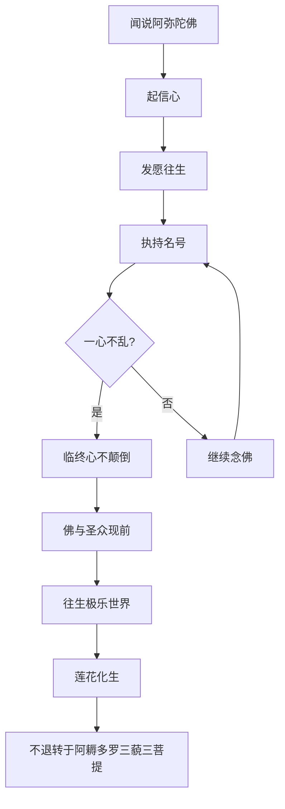
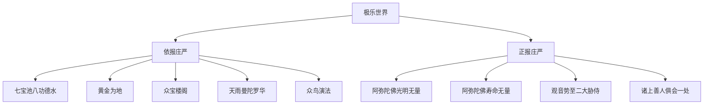
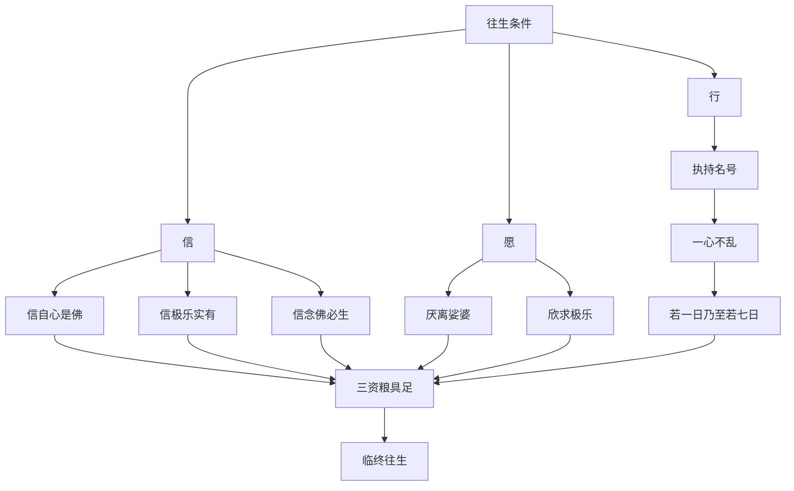
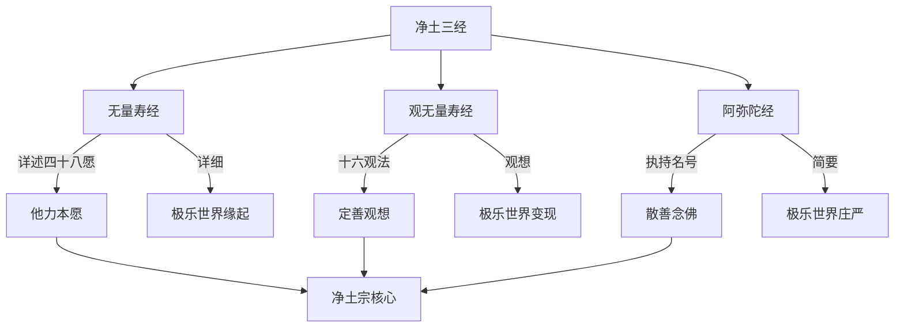
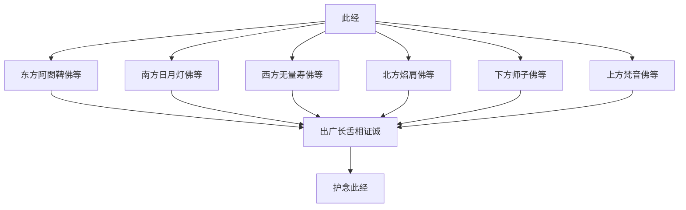
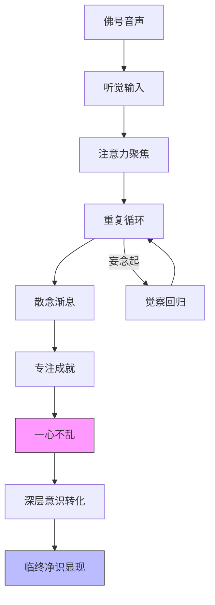

# 佛说阿弥陀经

## 经文概要

| 项目 | 内容 |
|------|------|
| 经名 | 佛说阿弥陀经（小本阿弥陀经） |
| 梵名 | Sukhāvatīvyūha |
| 译者 | 鸠摩罗什 |
| 译年 | 402 CE |
| 卷数 | 一卷 |
| 所属 | 净土三经之一 |
| 宗派 | 净土宗根本经典 |
| 大正藏 | T.366 |

## 核心思想

1. **极乐世界庄严**：详述西方极乐世界依报庄严——七宝池、八功德水、黄金为地、众宝楼阁
2. **阿弥陀佛光明无量**：阿弥陀佛光明无量、寿命无量，故名无量光、无量寿
3. **执持名号**：闻说阿弥陀佛，执持名号，若一日乃至七日一心不乱
4. **临终接引**：临命终时，阿弥陀佛与诸圣众现在其前，心不颠倒即得往生
5. **六方诸佛护念**：东方至上方六方各有无量诸佛出广长舌相证诚护念
6. **不可思议功德**：一切诸佛所护念经，功德不可思议

## 翻译与传入历史

- **译者**：鸠摩罗什（344-413），龟兹人，中国四大译经家之首
- **译出时间**：402年，于长安逍遥园译出
- **译场**：后秦国家译场，姚兴护持
- **版本对比**：玄奘另有译本《称赞净土佛摄受经》（T.367），但流通以罗什本为广
- **梵文原本**：现存梵本为较长版本，罗什所译为节略本
- **藏译**：藏文大藏经中有完整译本
- **影响**：此经与《无量寿经》《观无量寿经》合称"净土三经"，为净土宗修行根本依据

## 注疏传统

| 注疏 | 作者 | 朝代 | 要点 |
|------|------|------|------|
| 阿弥陀经义记 | 智顗 | 隋 | 天台判教立场释经 |
| 阿弥陀经疏 | 窥基 | 唐 | 唯识宗立场注释 |
| 阿弥陀经要解 | 蕅益智旭 | 明 | 最重要注疏，融通性相 |
| 阿弥陀经疏钞 | 莲池祩宏 | 明 | 华严圆融立场疏解 |
| 阿弥陀经圆中钞 | 幽溪传灯 | 明 | 天台圆融释义 |

## 核心经文选录

> **原文**：「若有善男子、善女人，闻说阿弥陀佛，执持名号，若一日、若二日、若三日、若四日、若五日、若六日、若七日，一心不乱，其人临命终时，阿弥陀佛与诸圣众现在其前。是人终时，心不颠倒，即得往生阿弥陀佛极乐国土。」

**白话解释**：如果有人听闻阿弥陀佛名号后，持续持念，从一天到七天达到心念专一不散乱，那么在他临终时，阿弥陀佛会亲自来接引。此时此人神识清明不乱，便能往生到极乐世界。这是全经的核心行法——以信愿行为三资粮的持名念佛。

> **原文**：「从是西方，过十万亿佛土，有世界名曰极乐。其土有佛，号阿弥陀，今现在说法。」

**白话解释**：从我们这个世界向西方，经过十万亿佛国土，有一个世界叫做"极乐"。那里有一尊佛，名号为"阿弥陀"，现在正在那里说法。这是极乐世界的空间定位，非世俗地理概念，而是功德所成的净土。

## 实修关联

- **持名念佛**：此经最直接的实修法门——执持"南无阿弥陀佛"名号
- **念佛三昧**：通过一心不乱达到念佛三昧的定境
- **临终助念**：临终关怀法门的经文依据
- **净土早晚课**：此经为汉传佛教晚课核心经文
- **佛七法会**：依据"若一日……若七日"设立的专修法会
- **十念法门**：简化修行，以十声佛号为一个修行单元

## 认知科学映射

- **信仰认知**：持名念佛是一种以"信"为基础的认知路径，绕过分析性思维直接作用于深层意识
- **称名三昧**：重复念诵佛号的注意力聚焦机制——类似正念冥想中的锚定技术（anchoring）
- **心不颠倒**：临终时的认知清醒状态，对应认知科学中的"元认知控制"（metacognitive control）
- **依报庄严**：极乐世界描述激活大脑中的空间认知与意象建构能力
- **六方护念**：暗示一种分布式认知网络——诸佛互相印证的认知可靠性模型
- 参见：[八识论](../concepts/cognitive-theory/eight-consciousness.md) — 念佛如何影响深层意识结构

## 流变结构图



## 极乐世界庄严图



## 往生条件逻辑图



## 净土三经关系图



## 六方诸佛护念图



## 称名念佛认知机制图



## 教义框架

### 净土判教

本经属净土宗"正依三经"之一，为"易行道"的代表——以信愿持名为要，不假禅定智慧之力。蕅益大师判此经为"圆顿中最极圆顿"之法。

### 他力与自力

| 维度 | 说明 |
|------|------|
| 他力 | 阿弥陀佛四十八愿的本愿力 |
| 自力 | 众生信愿念佛的行持 |
| 合力 | 自他不二，感应道交 |

### 三资粮结构

```
信 ──→ 愿 ──→ 行
 │       │       │
 │       │       └── 执持名号
 │       └── 厌离娑婆·欣求极乐
 └── 信自·信他·信因·信果·信事·信理
```

## 跨经关联

- **[无量寿经](amitayus-sutra.md)**：四十八愿为极乐世界缘起，本经为极乐世界的"现状描述"
- **[观无量寿经](contemplation-sutra.md)**：十六观法为定善门，本经持名为散善门
- **[华严经](avatamsaka-sutra.md)**：普贤十大愿王导归极乐，华严归净土
- **[法华经](lotus-sutra.md)**：同为鸠摩罗什译，法华一乘与净土一乘之呼应
- **[楞严经](surangama-sutra.md)**：大势至菩萨念佛圆通章，与本经同一法门
- **[地藏经](ksitigarbha-sutra.md)**：临终关怀层面与地藏经呼应
- 认知理论关联：[八识论](../concepts/cognitive-theory/eight-consciousness.md)、[起信论](../concepts/cognitive-theory/qichu-zhengxin.md)

## 思想遗产

1. **净土宗根本**：与《无量寿经》《观无量寿经》共为净土三经，奠定了中国净土宗的教理基础
2. **念佛文化**：塑造了汉传佛教"家家弥陀、户户观音"的信仰景观
3. **临终关怀传统**：临终助念制度影响深远，形成东亚特有的临终关怀文化
4. **易行道思想**：龙树菩萨"难行道·易行道"判教思想的经文依据
5. **跨宗影响**：禅宗、天台、华严诸宗皆有归净的趋势，"禅净双修"成为主流
6. **民间信仰**：成为东亚民间佛教信仰的核心经文

---

## Cognitive Architecture

《阿弥陀经》以"执持名号"为核心，构建了最简明的净土认知架构：

- **极乐（sukhāvatī）作为认知场域**：七宝池·八功德水·黄金为地——极乐世界的依报庄严建构了一个纯净的认知环境，远离干扰、专注修道
- **佛号作为注意力锚点（anchoring）**："执持名号"以最简单的方式收摄散乱心——以"南无阿弥陀佛"六字替代杂念流，参见[八识论](../concepts/cognitive-theory/eight-consciousness.md)
- **一心不乱（ekāgratā）的认知统一状态**：从散心念佛到一心不乱——持续专注达到认知统一的临界点，"若一日乃至若七日"
- **信愿行（śraddhā-praṇidhāna-caryā）三资粮**：信（认知基础）·愿（动机驱动）·行（操作实践）——往生净土的认知三条件
- **六方诸佛护念的分布式认知网络**：六方诸佛出广长舌相证诚——暗示一种跨空间的认知可靠性模型

跨域链接：注意力锚定技术（anchoring）在正念冥想与临床心理学中广泛应用，与持名念佛的认知机制一致；信念系统（belief systems）研究中的"信念→行为"链与信愿行三资粮结构高度对应。
