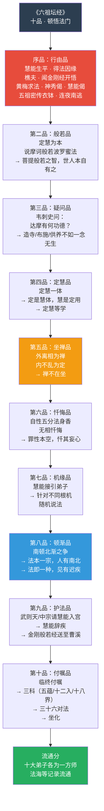
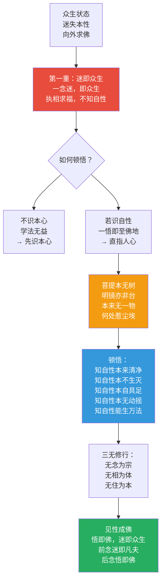
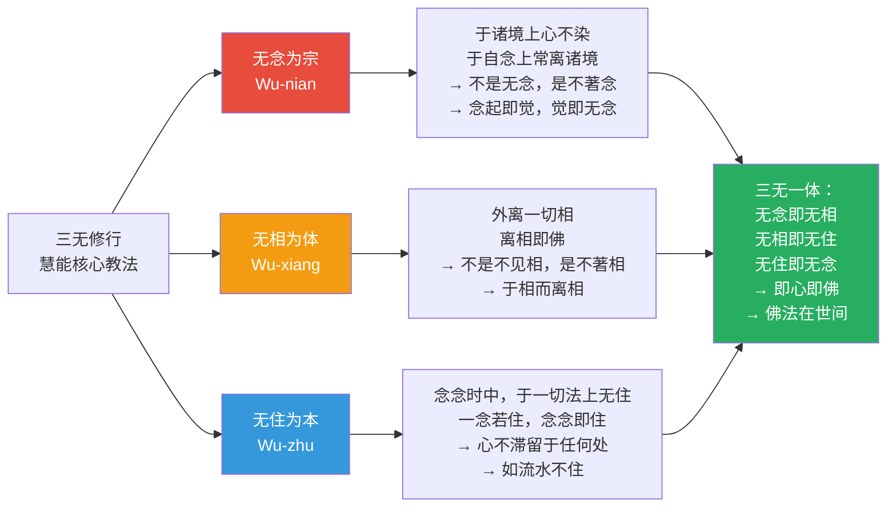
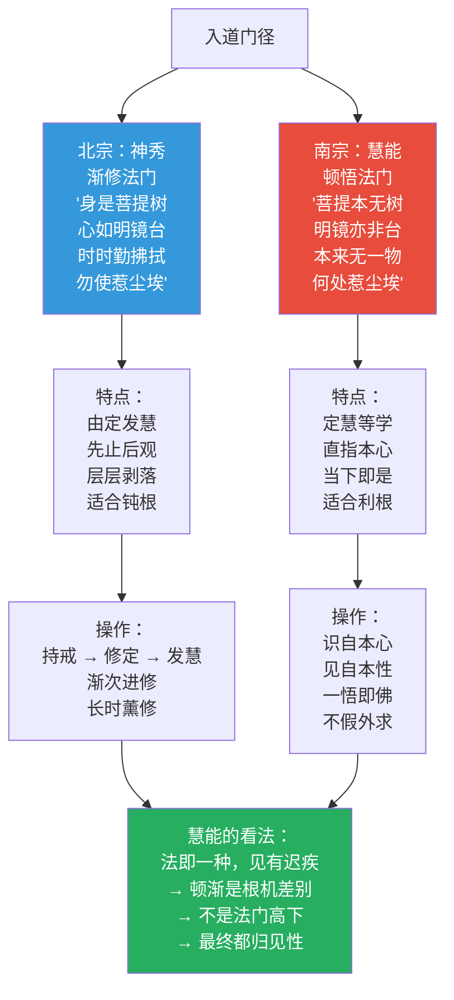
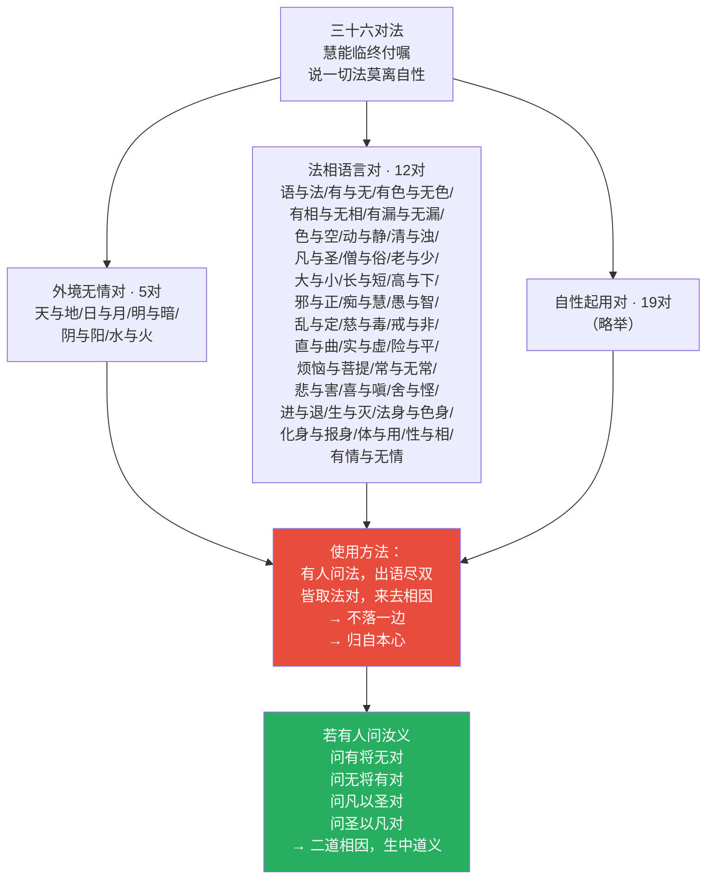
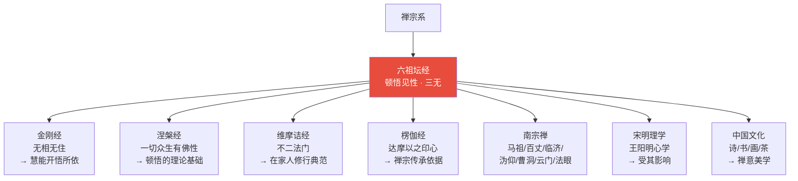
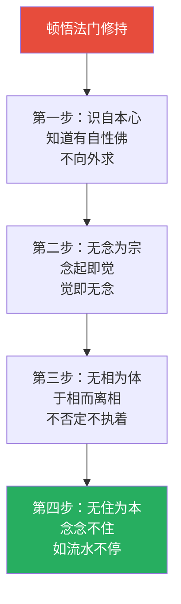
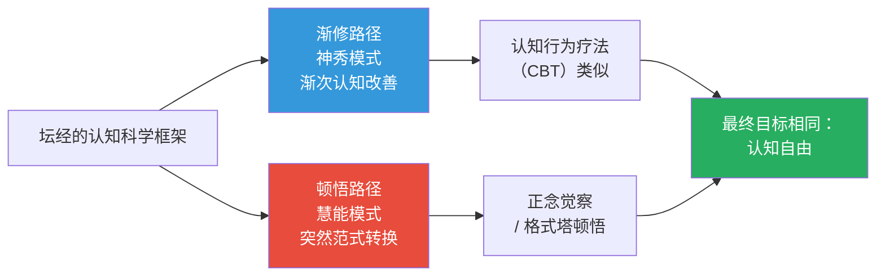

# 六祖坛经 · Platform Sutra of the Sixth Patriarch

## 一句话定义

《六祖坛经》是唯一一部被尊为"经"的中国僧人著作——记录六祖慧能的生平、悟道因缘、对"顿悟见性"的阐述，以及"无念为宗、无相为体、无住为本"的修行纲领，标志着禅宗的真正确立。

## 基本信息

| 项目 | 内容 |
|------|------|
| 全称 | 六祖大师法宝坛经 |
| 记录者 | 法海集记；后世宗宝等改编 |
| 篇幅 | 一卷（宗宝本）；敦煌本较简 |
| 归属 | 禅宗根本经典；唯一中国人说的"经" |
| 核心思想 | 顿悟见性 / 无念无相无住 / 定慧等学 / 佛法在世间 |
| 历史地位 | 中国佛教最具原创性的经典；影响儒道禅三家 |

---

## 一、整体结构：十品纲要

---

## 二、核心教义拆解：顿悟见性的五重操作

---

## 三、三无修行：无念·无相·无住

---

## 四、南顿北渐：两种入道路径

---

## 五、三十六对法：不落两边

---

## 六、慧能悟道因缘图解

---

## 七、核心概念速查表

| 概念 | 含义 | 操作意义 |
|------|------|----------|
| **顿悟** | 一念悟即佛 | 不须要长时间修行累积 |
| **见性** | 见自本性 | 认识自己本来的面目 |
| **无念** | 心不染境，非无念 | 念起即觉，不随念转 |
| **无相** | 于相离相 | 不否定现象，不执著现象 |
| **无住** | 心不滞留 | 如流水不住 |
| **定慧等学** | 定即是慧，慧即是定 | 不一味打坐，不片面求知 |
| **自性五分法身香** | 戒/定/慧/解脱/解脱知见 | 自性本具，不假外求 |
| **无相忏悔** | 忏其妄心 | 罪性本空，心空罪灭 |
| **佛法在世间** | 不离世间觉 | 在日常生活中修行 |
| **随方解缚** | 随机说法 | 针对不同根机，解除执著 |
| **三十六对** | 不离两边 | 说话不落一边 |

---

## 八、在十三经中的位置

- **独特贡献**：唯一中国人说的"经"；最彻底的本土化佛教
- **与《金刚经》关系**：慧能因闻"应无所住而生其心"开悟；三无来自金刚
- **与《涅槃经》关系**：顿悟的理论基础——一切众生有佛性
- **与《维摩诘经》关系**：在家人修行的典范；不二法门的实践

---

## 九、认知应用

### 操作一：顿悟觉察

当突然明白什么时：
1. 不要追求"悟"的感觉
2. 悟后更要保任——前念迷即凡夫，后念悟即佛
3. 悟不是终点，是起点

### 操作二：三无日常操作

- **无念**：念头来了，知道它来了，不跟着跑
- **无相**：看到事物，不贴标签、不下判断
- **无住**：做完一件事，心不停留在那里

### 操作三：定慧等学

工作时：
- 不是分心（乱）
- 不是僵死（定而无慧）
- 是清醒的专注（定慧等）

→ "外离相即禅，内不乱即定"

---

## Cognitive Architecture

《坛经》建立了最具中国特色的顿悟认知架构，以"三无"为核心操作纲领：

- **无念（wu-nian）·无相（wu-xiang）·无住（wu-zhu）认知三位一体**：无念=念起即觉、不染于境，非停止思维；无相=于相离相，去除认知标签；无住=念念不住，心不滞留于任何认知对象——三者互为表里，参见[心境关系](../concepts/cognitive-theory/mind-world.md)
- **顿悟（yù wù）的认知跃迁机制**：非渐进式认知改善，而是整体性认知范式转换——"前念迷即凡夫，后念悟即佛"，一念之间的认知翻转
- **三十六对法作为辩证认知工具**：出语尽双、来去相因，以成对概念消解二元执著，生中道义——超越概念对立的操作方法
- **定慧等学的认知整合**：定是慧体、慧是定用——专注力与洞察力同步训练，非先定后慧

跨域链接：格式塔心理学的"顿悟"（insight）概念与慧能的顿悟认知跃迁直接对应；禅宗对概念化思维的批判与后现代解构主义形成跨文化对话。

---

## 进阶阅读

- 原典：《六祖大师法宝坛经》（宗宝本）；敦煌本
- 注释：荷泽神会《显宗记》；延寿《宗镜录》
- 现代解读：钱穆《六祖坛经》; 圣严法师《六祖坛经讲记》；铃木大拙《禅学入门》

---

## 十、翻译与传入历史

《六祖坛经》不是翻译作品——它是唯一一部由中国人说而被尊为"经"的著作：

| 版本 | 编者 | 时间 | 特点 |
|------|------|------|------|
| **敦煌本** | 法海记录 | 约780 CE | 最早版本，一卷，较简略 |
| **契嵩本** | 契嵩 | 1056 CE（北宋） | 二卷，增补较多 |
| **宗宝本** | 宗宝 | 1291 CE（元） | 最通行，十品结构 |

> 三个版本系统在文字、结构、内容上都有差异——敦煌本的发现（1900年敦煌藏经洞）是20世纪中国佛教研究最重要的事件之一。

---

## 十一、注疏传统

| 注疏家 | 朝代 | 代表作 | 核心立场 |
|--------|------|--------|----------|
| **荷泽神会** | 唐 | 《显宗记》 | 立南宗为正统，传慧能法脉 |
| **延寿** | 五代 | 《宗镜录》 | 禅教合一，整合诸宗 |
| **德异** | 元 | 《坛经序》 | 流通宗宝本 |
| **丁福保** | 民国 | 《六祖坛经笺注》 | 近代学术注释 |

> 由于坛经本身即是中国本土创作，历代"注疏"更多是"解读"而非传统意义上的经疏——这反映了禅宗"不立文字"的精神。

---

## 十二、核心经文选录

### 选录一：菩提本无树

> **原文**：「菩提本无树，明镜亦非台。本来无一物，何处惹尘埃。」
>
> **白话**：觉悟本来就没有什么固定的形态（不是一棵树），心也不是什么镜子台座。本来就什么都没有，哪里会沾上尘埃呢？
>
> **要点**：与神秀的"时时勤拂拭"对比——渐修 vs 顿悟的根本分歧。

### 选录二：风动幡动

> **原文**：「不是风动，不是幡动，仁者心动。」
>
> **白话**：不是风在动，也不是旗幡在动，是你们的心在动。
>
> **要点**：外境的变化不是问题——心的执着才是问题。这是唯识学最简洁的表达。

### 选录三：自性五分法身香

> **原文**：「一戒香，二定香，三慧香，四解脱香，五解脱知见香。」
>
> **白话**：自性中本具五种功德香——持戒的芬芳、禅定的芬芳、智慧的芬芳、解脱的芬芳、解脱后正见的芬芳。
>
> **要点**：戒定慧解脱不是外在的修行积累，而是自性本有的功德。

---

## 十三、实修关联

**核心修法**：
- 顿悟法门：不依赖长期渐修，直指自性——"前念迷即凡夫，后念悟即佛"
- 无念为宗：不是压制念头，而是"于念而无念"——念来不拒、念去不留
- 无住为本：做完即了，心不停留——吃饭时吃饭、睡觉时睡觉
- 佛法在世间：不离日常，在行住坐卧中修——砍柴担水皆是道

---

## 十四、认知科学映射

| 佛学概念 | 认知科学对应 | 说明 |
|----------|-------------|------|
| **顿悟** | 认知范式转换 | 突然的整体性认知重组（insight/aha moment） |
| **无念** | 超越概念认知 | 不是停止思维，而是超越概念标签的直接认知 |
| **无相** | 去标签化认知 | 去除概念化标签，回到现象的直接呈现 |
| **无住** | 认知不执着/非附着 | 心理灵活性——不固着于任何认知框架 |
| **风动幡动** | 认知建构论 | 同一现象因认知框架不同而有不同解读 |
| **定慧等学** | 认知整合 | 专注力与洞察力的同步训练 |

> 交叉参考：[认知范式转换](../../concepts/cognitive-theory/paradigm-shift.md) · [元认知](../../concepts/cognitive-theory/metacognition.md) · [正念觉察](../../../心理学/概念/正念.md)
