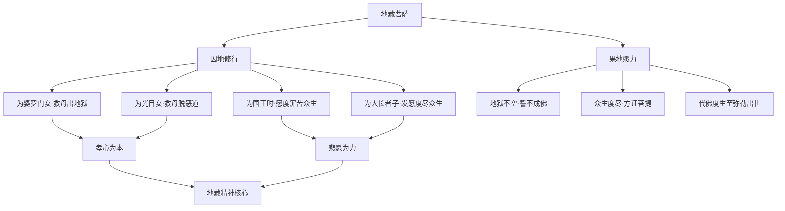
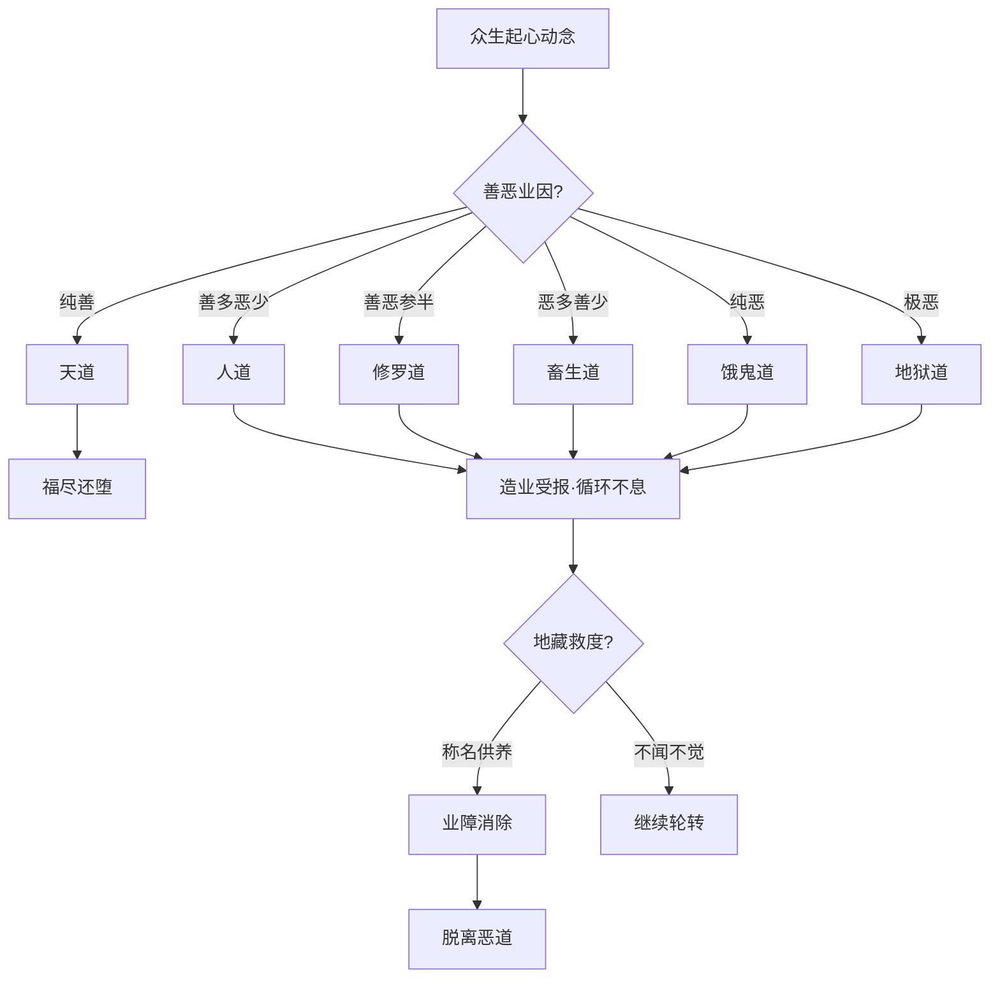
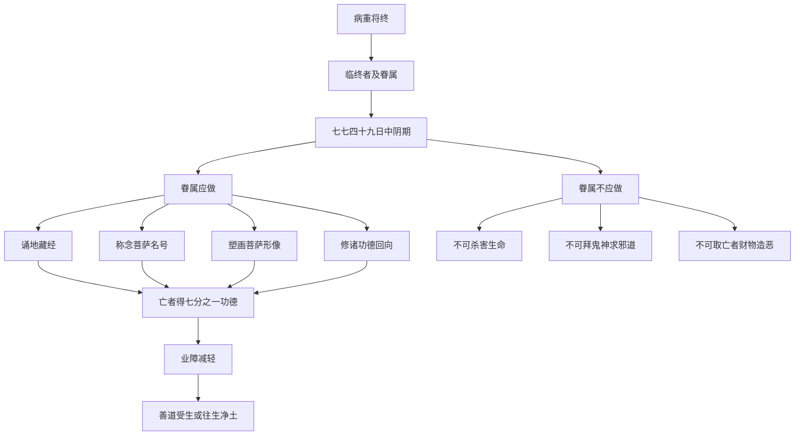
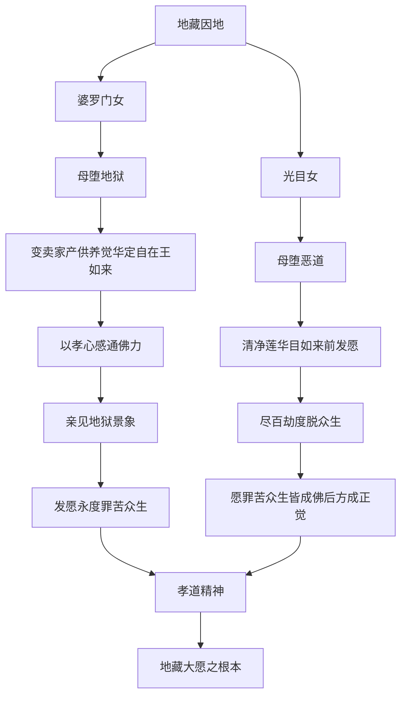
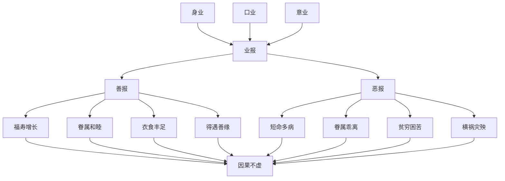
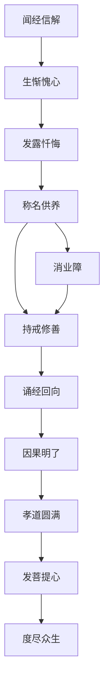

# 地藏菩萨本愿经

## 经文概要

| 项目 | 内容 |
|------|------|
| 经名 | 地藏菩萨本愿经 |
| 梵名 | Kṣitigarbha Praṇidhāna Sūtra |
| 译者 | 实叉难陀 |
| 译年 | 695-704 CE |
| 卷数 | 二卷（十三品） |
| 宗派 | 大乘·地藏信仰 |
| 大正藏 | T.412 |

## 核心思想

1. **地藏大愿**：「地狱不空，誓不成佛；众生度尽，方证菩提」——大乘菩萨道极致精神
2. **因果报应**：详述善恶业报因果，是佛教因果教育的核心文本
3. **孝道为本**：地藏菩萨因地为婆罗门女、光目女时，皆以救母为发心因缘
4. **临终关怀**：临终之际及死后四十九日内的功德利益与救度方法
5. **阎浮提众生**：特别关注南阎浮提（人间）众生的业障深重
6. **地藏神力**：地藏菩萨不可思议的神力、愿力、智力、慈悲力、辩才力
7. **称名供养**：称念地藏菩萨名号、塑画形像、瞻礼赞叹的功德利益

## 翻译与传入历史

- **译者**：实叉难陀（Śikṣānanda，652-710），于阗国高僧
- **译出时间**：695-704年间，于洛阳大遍空寺译出
- **背景**：武则天时期大规模译经工程，实叉难陀应请来华
- **梵文本**：梵文原本未见完整传世
- **其他译本**：法灯译《地藏菩萨本愿经》异本；藏文有相关经典
- **流通**：明清以来流通极广，成为民间佛教最重要的经典之一
- **盂兰盆会**：农历七月地藏法会的核心经文

## 注疏传统

| 注疏 | 作者 | 朝代 | 要点 |
|------|------|------|------|
| 地藏菩萨本愿经科注 | 青莲灵椉 | 明 | 以天台教义释经 |
| 地藏菩萨本愿经纶贯 | 智旭 | 明 | 蕅益大师判教释义 |
| 地藏菩萨本愿经讲记 | 常惺 | 民国 | 近代弘法讲义 |
| 地藏经大意 | 演培 | 近代 | 现代佛学注释 |

## 核心经文选录

> **原文**：「我今又蒙佛付嘱，至阿逸多成佛已来，六道众生，遣令度脱。唯然世尊，愿不有虑。我又观是阎浮提众生，举心动念，无非是罪。脱获善利，多退初心。若遇恶缘，念念增益。是等辈人，如履泥涂，负于重石，渐困渐重，足步深邃。」

**白话释义**：地藏菩萨在佛前发愿，从现在到弥勒佛出世之间，负责救度六道一切众生。他又观察到人间众生的习性——每一个念头几乎都在造罪。偶尔得到善缘修行，却容易退心。这样的人就像背着石头走在泥沼中，越陷越深。这段经文揭示了地藏菩萨对人性的深刻洞察。

> **原文**：「若未来世，有善男子善女人，见地藏形像及闻此经，乃至读诵，香华、饮食、衣服、珍宝，布施供养，赞叹瞻礼，得二十八种利益。」

**白话释义**：如果未来有善心人见到地藏菩萨的形象或听闻此经，能够读诵、以花香饮食供养、赞叹礼拜，将获得二十八种利益。这体现了大乘佛教"供养功德"的核心教义。

## 实修关联

- **地藏忏法**：依据本经制定的忏悔法门，消业障、增福慧
- **诵经超度**：为亡者诵《地藏经》，配合七七四十九日追荐
- **称名祈愿**：日常称念"南无大愿地藏王菩萨"圣号
- **临终助念**：临终关怀的经文依据——不取亡者财物、称名诵经利益
- **因果教育**：以本经为教材进行因果观念的道德教育
- **地藏法会**：农历七月的地藏法会，诵经拜忏、超度先亡
- **孝亲报恩**：以地藏菩萨为孝道楷模，结合儒家孝道伦理实践

## 认知科学映射

- **因果认知模型**：本经详述的因果报应体系是一种"道德因果推理"（moral causal reasoning），与认知科学中的因果推理机制直接对应
- **孝道伦理学**：地藏菩萨因地救母的因缘，涉及情感驱动的道德决策——印证社会情感学习（SEL）理论
- **临终意识状态**：经文描述的临终意识体验，可与濒死体验（NDE）研究对照
- **意念造罪**："举心动念无非是罪"——对应认知行为理论中的自动化思维（automatic thoughts）和认知偏差
- **信仰治疗**：称名消灾的信仰机制，可与安慰剂效应、心理神经免疫学关联
- 参见：[百方便见](../概念/cognitive-theory/八还辨见.md)、[六根六尘](../概念/cognitive-theory/六根六尘六识.md)

## 地藏大愿结构图

## 六道轮回因果图

## 临终关怀流程图

## 孝道发心因缘图

## 因果业报详细图

## 地藏法门修行次第图

## 教义框架

### 地藏法门的三层结构

| 层次 | 内容 | 对应修行 |
|------|------|----------|
| 世间层 | 因果报应、孝道伦理 | 持戒行善 |
| 出世间层 | 脱离六道、解脱生死 | 诵经称名 |
| 菩萨层 | 发大愿、度尽众生 | 菩萨行愿 |

### 判教位置

本经以因果、孝道为核心，接引初机最广。在大乘判教中属"通教"范畴——三根普被，利钝全收。地藏法门被视为"大乘基础"，与《华严》之"圆教"、《法华》之"纯圆"构成不同层次。

## 跨经关联

- **[无量寿经](amitayus-sutra.md)**：临终关怀法门的共同关注
- **[阿弥陀经](amitabha-sutra.md)**：往生净土与地藏法门在临终关怀上的配合
- **[药师经](bhaisajyaguru-sutra.md)**：消灾延寿与消业障的现世关怀层面交叉
- **[法华经](妙法莲华经.md)**：地藏菩萨在法华会中亦有出现
- **[楞严经](surangama-sutra.md)**：因果业力的深层分析
- **[华严经](华严经.md)**：菩萨行愿的圆融展开
- 认知理论关联：[百方便见](../概念/cognitive-theory/八还辨见.md)、[心境关系](../概念/cognitive-theory/心物一元.md)

## 思想遗产

1. **因果伦理的普及**：本经是汉传佛教因果教育的第一经典，影响深远
2. **孝道融合**：将大乘菩萨道精神与中华孝道传统完美结合，实现佛教中国化
3. **临终文化**：塑造了东亚"七七"追荐传统，形成独特的丧葬文化
4. **地藏信仰**：九华山成为地藏菩萨道场，与五台（文殊）、峨眉（普贤）、观音（普陀）并列
5. **民间信仰**：七月地藏法会成为重要的民俗节日
6. **道德教育**：因果教育作为佛教伦理基础，至今仍为汉传佛教教化核心

---

## Cognitive Architecture

《地藏经》以因果报应与大愿精神为核心，构建了佛教最直接的业力认知架构：

- **因果业力（karma-vipāka）作为认知框架**："举心动念，无非是罪"——每一念都在创造认知轨迹，善恶业报不是外在惩罚而是认知的自然因果；参见[百方便见](../概念/cognitive-theory/八还辨见.md)
- **地狱诸道作为心理状态的投射**：六道轮回不是物理空间而是认知状态的投射——贪嗔痴的极端化即地狱，认知偏差的累积决定意识的流向
- **地藏愿力（praṇidhāna）作为认知承诺**："地狱不空，誓不成佛"——最深层的认知承诺产生最持久的认知转化力量，即使在最黑暗处也不放弃
- **临终意识的认知转换机制**：临终时意识状态的转换窗口——"中阴身"期间认知可塑性最高，七七四十九日的认知干预期
- **孝道（filial piety）作为认知发心**：地藏菩萨因地以救母为发心——情感驱动的道德认知是最强大的认知转化动力

跨域链接：道德心理学中Kohlberg道德发展理论与因果业力认知的层次结构形成对照；濒死体验（NDE）研究与临终意识转化的经文描述可互相参照。
