# 大方广佛华严经 · Avataṃsaka Sutra

## 一句话定义

《华严经》展现佛陀证悟的"法界全景"——以"法界缘起"为核心，揭示一切现象相互含摄、事事无碍的终极实相，修行者通过"普贤行愿"层层深入，最终证入"毗卢遮那法界"。

## 基本信息

| 项目 | 内容 |
|------|------|
| 全称 | 大方广佛华严经 |
| 译者 | 实叉难陀（80卷，唐代）；佛驮跋陀罗（60卷，东晋） |
| 归属 | 大乘华严部；称"经中之王" |
| 核心思想 | 法界缘起 / 事事无碍 / 六相圆融 |
| 对中国影响 | 华严宗根本经典；禅宗/净土宗皆尊崇 |
| 著名单元 | 华藏世界品 / 十地品 / 普贤行愿品 / 入法界品 |

---

## 一、整体结构：七处九会

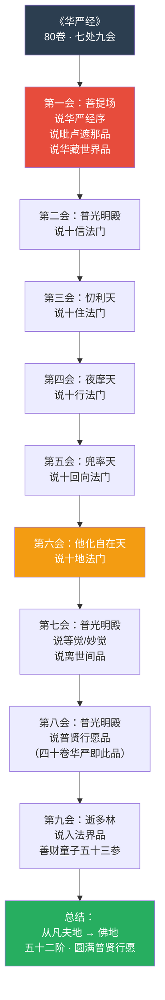

---

## 二、核心教义拆解：法界缘起四重

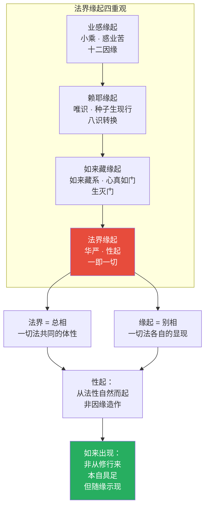

---

## 三、六相圆融：一切法的六个维度

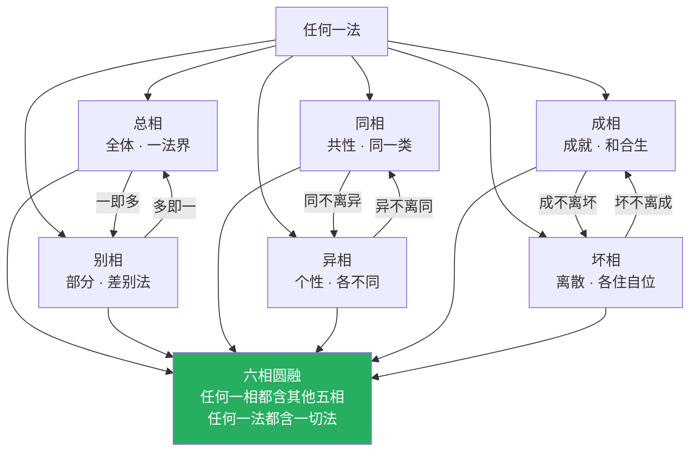

---

## 四、十玄门：事事无碍的十种机制

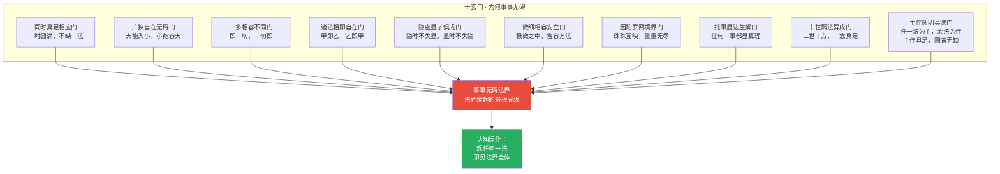

---

## 五、五十二阶：从凡夫到佛

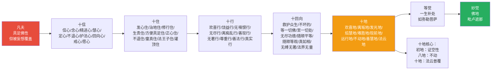

---

## 六、善财童子五十三参：入法界的路径

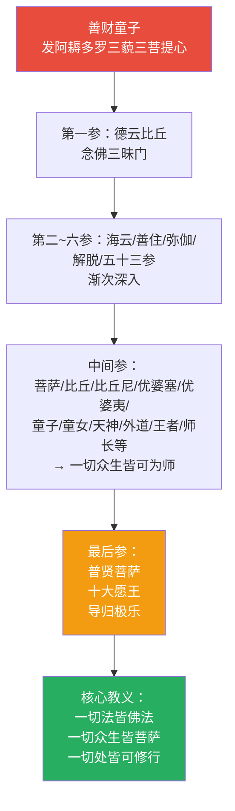

---

## 七、核心概念速查表

| 概念 | 含义 | 操作意义 |
|------|------|----------|
| **法界** | 一切法的总相/全体 | 任何现象都是法界的显现 |
| **法界缘起** | 一切法互相缘起，互不妨碍 | 看到万物互联的实相 |
| **性起** | 从法性自然而起，非因缘造作 | 认识到本来具足 |
| **六相** | 总/别/同/异/成/坏 | 观察任何现象的全面维度 |
| **十玄门** | 事事无碍的十种机制 | 理解为何一即一切 |
| **因陀罗网** | 宝珠互相映现，重重无尽 | 全息宇宙的比喻 |
| **十地** | 菩萨修行的十个主要阶段 | 自我定位与方向 |
| **普贤行愿** | 十大愿王（礼敬/称赞/供养等） | 日常可操作的修行框架 |
| **毗卢遮那** | 法身佛，遍照一切 | 终极境界的象征 |
| **华藏世界** | 莲花藏世界，佛国的总称 | 理想秩序的模型 |

---

## 八、在十三经中的位置

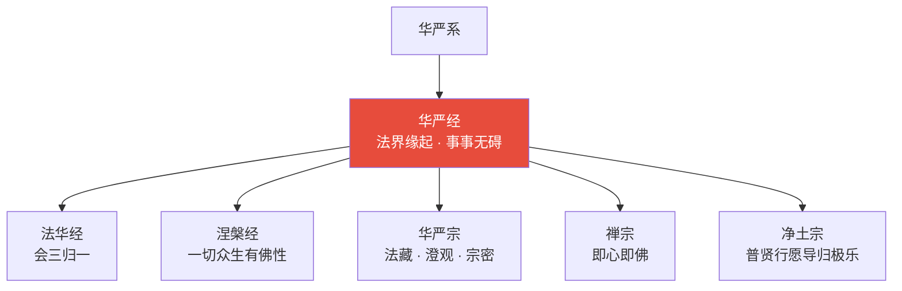

- **独特贡献**：最高远的宇宙观；事事无碍的认知框架
- **与《法华经》关系**：同称经王；《法华》重会三归一，《华严》重法界圆融
- **与《楞伽经》关系**：同讲唯心，但《华严》更偏宇宙论，《楞伽》更偏认识论

---

## 九、认知应用

### 操作一：事事无碍的全息观察

观察任何事物时：
1. **一多相容**：这一事物包含多少因素？这些因素又如何包含其他事物？
2. **广狭自在**：这一事物的局部与整体如何互含？
3. **隐显俱成**：这一事物的显现面与隐藏面如何同时成立？

→ 培养非二元、非排他的认知方式

### 操作二：六相分析

面对复杂问题时：
1. **总相**：这个问题的整体是什么？
2. **别相**：由哪些部分构成？
3. **同相**：与哪些问题同类？
4. **异相**：独特之处在哪里？
5. **成相**：需要什么条件才能成就？
6. **坏相**：什么因素会导致瓦解？

→ 全息思维工具

---

## Cognitive Architecture

《华严经》构建了佛教中最宏大的认知架构——法界缘起的全息网络认知模型：

- **因陀罗网（Indra-jāla）的全息认知隐喻**：每一颗宝珠映照所有其他宝珠，重重无尽——任何一法包含一切法的信息，是现代全息理论和复杂系统网络的古典先驱
- **法界（dharma-dhātu）作为网络认知**：四法界——事法界（现象差异）→理法界（本质空性）→理事无碍法界（现象与本质互融）→事事无碍法界（现象间完全互融），构成认知深化的四层结构
- **初发心即成正觉的认知全息性**：起点包含终点的全部信息——参见[缘起认知](../concepts/cognitive-theory/dependent-origination-cognitive.md)；一念发心即具足成佛的全部条件
- **善财五十三参的开放认知网络**：向一切众生学习——菩萨·比丘·外道·王者·船师皆为善知识，认知资源无边界
- **普贤行愿作为认知行动框架**：十大愿王尽虚空遍法界，提供无穷的修行维度

跨域链接：复杂系统理论中"涌现"（emergence）与法界缘起中"一即一切"的全息互涉高度对应；分布式认知理论与因陀罗网的去中心化结构形成深层对话。

---

## 进阶阅读

- 原典：《大方广佛华严经》（实叉难陀译，80卷）
- 注释：法藏《华严探玄记》《华严五教章》；澄观《华严经疏》
- 现代解读：印顺法师《华严经教与哲学研究》；圣严法师《华严经讲要》

---

## 翻译与传入历史

《华严经》有三个主要汉译本，篇幅宏大：

| 译者 | 年代 | 译本名称 | 卷数 | 特点 |
|------|------|----------|------|------|
| **佛驮跋陀罗** | **420年** | **《大方广佛华严经》（六十华严）** | **60卷** | **最早汉译本，东晋建康译出** |
| **实叉难陀** | **699年** | **《大方广佛华严经》（八十华严）** | **80卷** | **最完整本，唐代洛阳译出** |
| **般若** | **798年** | **《大方广佛华严经》（四十华严）** | **40卷** | **仅译《入法界品》，唐代译出** |

**翻译背景**：
- **六十华严**：佛驮跋陀罗（觉贤）于东晋义熙年间在建康（南京）道场寺译出。此本传入后，中国佛教界首次接触到华严法界的大视野。
- **八十华严**：武则天时期，于阗国僧人实叉难陀奉诏于洛阳大遍空寺译出。武则天亲制序文，即著名的"无上甚深微妙法，百千万劫难遭遇，我今见闻得受持，愿解如来真实义"。
- **四十华严**：唐德宗时，般若三藏译出《入法界品》的完整版本，即善财童子五十三参的详细内容。

**特别说明**：华严经在印度可能并非一次说完的完整经典，而是多个独立经文的汇编。但传入中国后，被华严宗视为最圆满的教法。

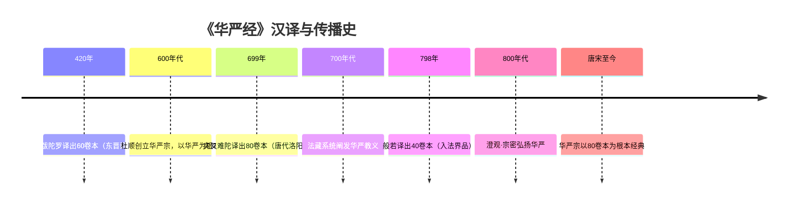

---

## 注疏传统

《华严经》注疏以华严宗为核心，形成了庞大的教义体系：

| 注疏者 | 著作 | 宗派立场 | 核心特色 |
|--------|------|----------|----------|
| **法藏** | 《华严探玄记》 | 华严宗（创始人） | 系统阐发十玄门、六相圆融 |
| **法藏** | 《华严五教章》 | 华严宗 | 判教总纲：小始终顿圆五教 |
| **法藏** | 《华严金师子章》 | 华严宗 | 以金狮子喻法界缘起，最简明 |
| **澄观** | 《华严经疏钞》 | 华严宗 | 最详尽的华严经注疏 |
| **宗密** | 《华严原人论》 | 华严·禅 | 会通教禅，探原人之本 |
| 李通玄 | 《新华严经论》 | 居士·华严 | 以易经释华严，独特视角 |
| 明·德清 | 《华严经纲要》 | 禅宗·华严 | 简明扼要 |

**华严宗核心教义**（由法藏建立）：
- **法界缘起**：一切法互相缘起，一即一切
- **四法界**：事法界、理法界、理事无碍法界、事事无碍法界
- **十玄门**：事事无碍的十种机制
- **六相圆融**：总别同异成坏六相互相含摄
- **五教判释**：小乘教、大乘始教、大乘终教、顿教、圆教

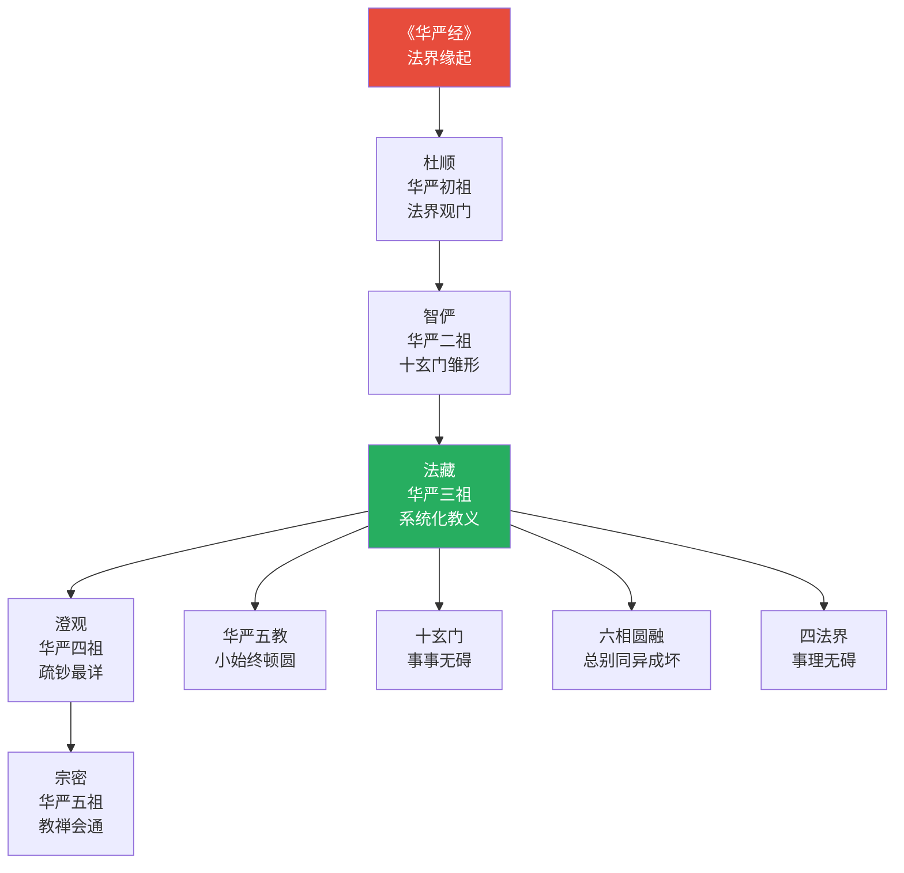

---

## 核心经文选录

### 1. 一即一切（十地品）

> **原文**：一切即一，一即一切。……一切法门无尽海，同会一法道场中。
>
> **现代解读**：任何一法都包含一切法，一切法都归于一法。这不是数学上的等式，而是说任何现象都是整个法界的显现——就像因陀罗网中任何一颗宝珠都映照所有其他宝珠。

### 2. 心佛众生三无差别（夜摩天宫品）

> **原文**：心如工画师，能画诸世间。五蕴悉从生，无法而不造。……若人欲了知，三世一切佛，应观法界性，一切唯心造。
>
> **现代解读**：心就像一位画师，能够描绘出一切世界。五蕴（色受想行识）都从心而生，没有什么不是心所创造的。如果你想了解过去、现在、未来的一切佛，就应当观察法界的本质——一切都是心的显现。

### 3. 毗卢遮那佛（世主妙严品）

> **原文**：毗卢遮那佛，愿力周法界。一切国土中，恒转无上轮。
>
> **现代解读**：毗卢遮那（Vairocana，遍照）佛的愿力遍满整个法界，在一切世界中恒常转动法轮。毗卢遮那佛是法身佛，代表真理本身——不是某一个佛，而是宇宙真理的人格化表达。

### 4. 善财童子五十三参·参德云比丘

> **原文**：善男子，我唯得此忆念一切诸佛境界智慧光明普见法门，岂能了知诸大菩萨无边智慧清净行门？……如诸菩萨摩诃萨，无量智慧，无量神通，我当云何能知能说？
>
> **现代解读**：善财童子参访的第一位善知识德云比丘说："我只知道念佛三昧这一种法门，怎能了解菩萨的无量智慧呢？"这揭示了华严经的核心：每一法门都是无穷的，但又与其他所有法门互相含摄。

### 5. 普贤行愿（普贤行愿品）

> **原文**：一者礼敬诸佛，二者称赞如来，三者广修供养，四者忏悔业障，五者随喜功德，六者请转法轮，七者请佛住世，八者常随佛学，九者恒顺众生，十者普皆回向。
>
> **现代解读**：普贤菩萨的十大愿王是华严经的修行总纲。从礼敬、赞叹、供养、忏悔、随喜、请法、请佛、随学、顺众生到回向——涵盖了菩萨道的全部面向。每一愿都是"尽虚空遍法界"的，不是有限的修行。

---

## 实修关联

### 华严观（法界观）

杜顺禅师依华严经建立的三种观法：

1. **真空观**：观一切法缘起性空——理法界
2. **理事无碍观**：观理（空性）与事（现象）互不相碍——理事无碍法界
3. **周遍含容观**：观任何一法遍含一切法——事事无碍法界

**操作要点**：第三观是华严宗独创——不是先空后有，而是直接在现象中看到无穷含摄。

### 海印三昧

华严经描述的佛的禅定状态：
- 如大海印现万象——佛于一念中照见一切法
- 一切法同时显现，互不相碍
- 非次第观照，而是顿然全体呈现

### 普贤行愿

华严经最具操作性的修行框架：
1. **礼敬诸佛**：培养谦卑与敬意
2. **称赞如来**：培养善巧的语言
3. **广修供养**：培养慷慨与布施
4. **忏悔业障**：净化过去的恶业
5. **随喜功德**：对治嫉妒
6. **请转法轮**：求法之心
7. **请佛住世**：珍惜善知识
8. **常随佛学**：以佛为榜样
9. **恒顺众生**：慈悲与随顺
10. **普皆回向**：不执著功德

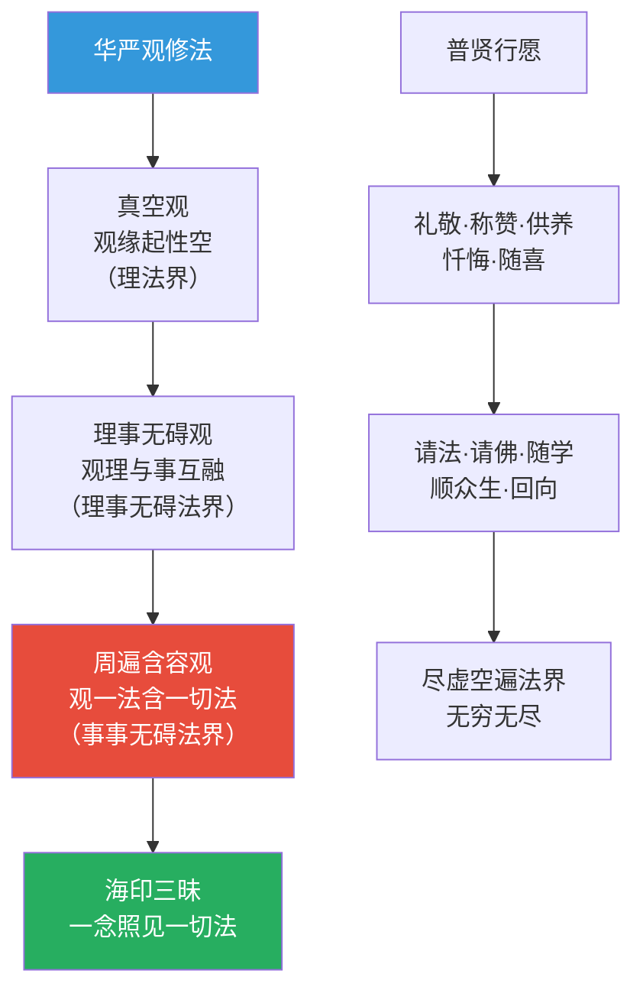

---

## 认知科学映射 ⭐

### 法界缘起 ↔ 系统认知论

| 华严经概念 | 认知科学对应 | 说明 |
|-----------|-------------|------|
| 一即一切 | 全息理论 | 任何局部都包含整体的信息 |
| 因陀罗网 | 复杂系统理论 | 系统中每个节点都与其他节点相互影响 |
| 六相圆融 | 系统论 | 整体与部分、共性与个性、生成与消散的统一 |
| 十玄门 | 认知框架的多维度 | 理解现象的十种互补视角 |
| 心如工画师 | 认知建构论 | 心主动建构经验世界 |
| 海印三昧 | 并行处理/联结主义 | 同时处理所有信息，非线性序列 |

### 事事无碍 ↔ 全息认知

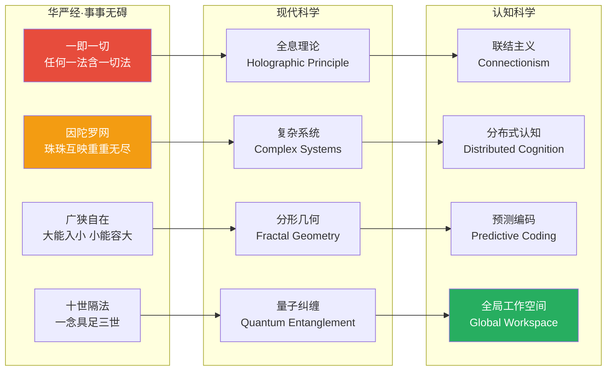

### 认知理论交叉引用

- [八识论](../concepts/cognitive-theory/eight-consciousness.md)："心如工画师"涉及第八阿赖耶识的种子变现功能
- [中观](../concepts/cognitive-theory/madhyamaka.md)：法界缘起超越了中观的空性论，从"空"到"有"的圆融
- [转识成智](../concepts/cognitive-theory/consciousness-transformation.md)：华严的"转法界"是从染污认知转为清净法界智
- [心境关系](../concepts/cognitive-theory/mind-world.md)："一切唯心造"是心境关系的最极端表达
- [六根六尘](../concepts/cognitive-theory/six-constituents.md)：十玄门中的"微细相容安立门"揭示了根尘互含的关系
- [起信论](../concepts/cognitive-theory/qichu-zhengxin.md)：法界缘起与起信论的"真如缘起"一脉相承
