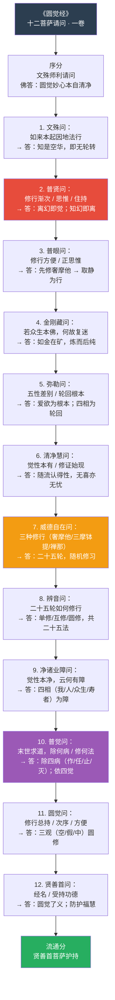
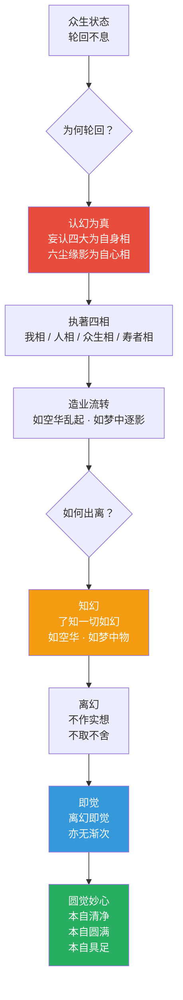
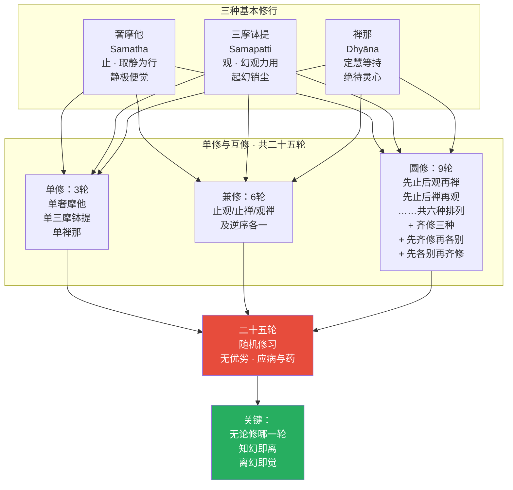
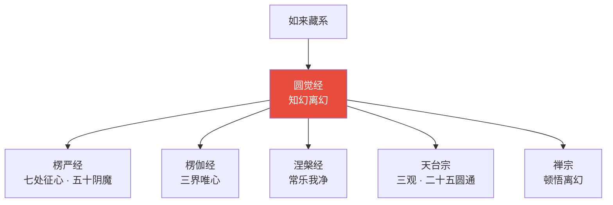
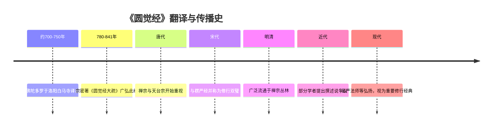
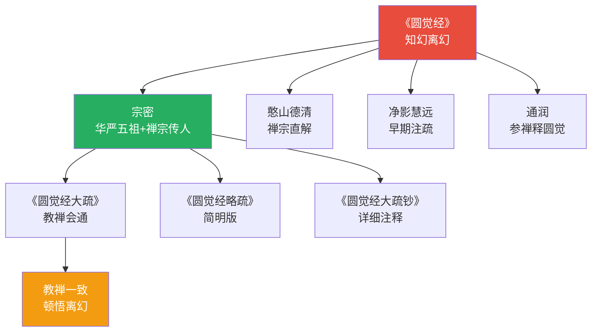
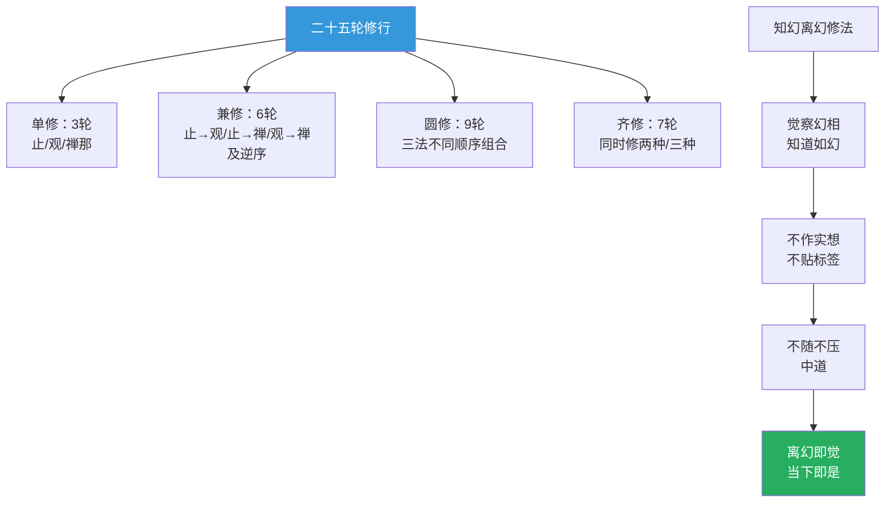
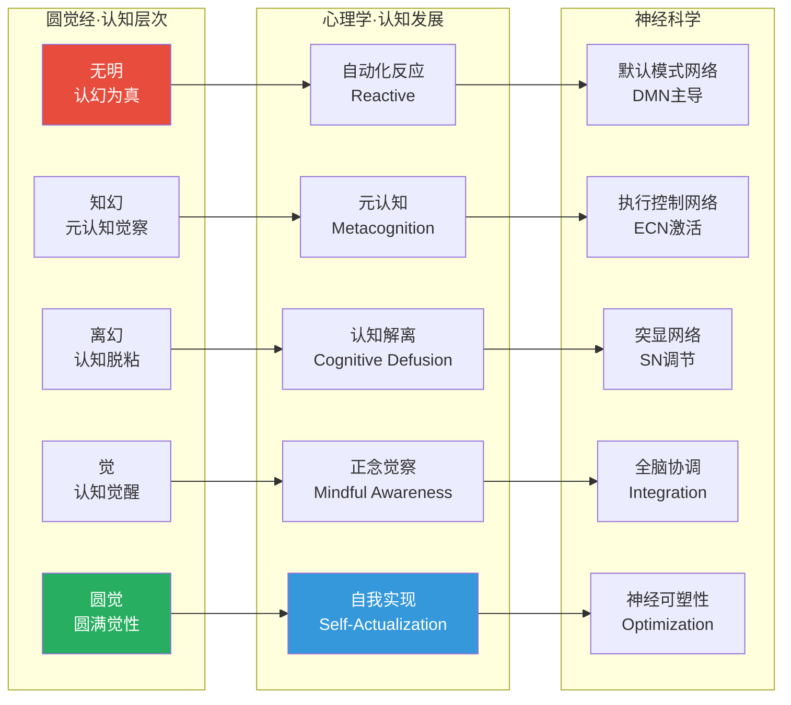

# 大方广圆觉修多罗了义经 · Sutra of Perfect Enlightenment

## 一句话定义

《圆觉经》是如来藏系的"操作手册"——以"知幻即离，离幻即觉"为核心，为不同根器的修行者提供从"奢摩他"（止）到"禅那"（定慧等持）的三套修法，直达圆觉妙心。

## 基本信息

| 项目 | 内容 |
|------|------|
| 全称 | 大方广圆觉修多罗了义经 |
| 译者 | 佛陀多罗（唐代于洛阳白马寺译出） |
| 篇幅 | 一卷，约一万三千字 |
| 归属 | 大乘如来藏系；唐宋禅宗与天台宗皆重视 |
| 核心思想 | 圆觉妙心 / 知幻离幻 / 三种修行 |
| 结构特色 | 十二位菩萨次第请问，佛逐一作答 |

---

## 一、整体结构：十二菩萨请问



---

## 二、核心教义拆解：知幻离幻



---

## 三、二十五轮：三种修行的组合



---

## 四、四相与四病：修行障碍地图

```mermaid
graph TD
    subgraph 四相["四相 · 轮回根本"]
        S1["我相<br/>自爱心 · 执著自身"]
        S2["人相<br/>他爱心 · 分别他人"]
        S3["众生相<br/>续爱心 · 执著群体"]
        S4["寿者相<br/>相续心 · 执著时间"]
    end

    subgraph 四病["四病 · 修行歧途"]
        D1["作病<br/>故意造作<br/>如持满水求无波<br/>→ 越作越乱"]
        D2["任病<br">"放任自然<br/>如纵马不加缰<br/>→ 流浪生死"]
        D3["止病<br">"强行压制<br/>如石压草<br/>→ 压久更发"]
        D4["灭病<br">"追求断灭<br">"如灰身灭智<br/>→ 堕断见坑"]
    end

    S1 & S2 & S3 & S4 --> A["轮回不息<br/>不得解脱"]
    D1 & D2 & D3 & D4 --> B["修行歧途<br">"离圆觉远"]
    
    A & B --> C["对治：<br/>知幻即离<br/>不作意 · 不随逐<br/>不压制 · 不追求"]
    C --> D["圆照清净觉相<br/>常住寂静"]
    
    style A fill:#e74c3c,color:#fff
    style B fill:#e74c3c,color:#fff
    style D fill:#27ae60,color:#fff
```

---

## 五、圆觉三观：空·假·中


---

## 六、核心概念速查表

| 概念 | 含义 | 操作意义 |
|------|------|----------|
| **圆觉** | 圆满遍照的觉性 | 本自具足，不假外求 |
| **了义** | 究竟真实的教法 | 非方便说，是最终说 |
| **知幻即离** | 知道是幻，当下即离 | 不须要慢慢修 |
| **离幻即觉** | 离幻的当下就是觉 | 无渐次，当下是 |
| **奢摩他** | 止，取静为行 | 适合散乱心重者 |
| **三摩钵提** | 观，起幻销尘 | 适合昏沉心重者 |
| **禅那** | 定慧等持 | 适合定慧均衡者 |
| **二十五轮** | 三种修行的二十五种组合 | 无优劣，应机而修 |
| **四相** | 我/人/众生/寿者 | 轮回的根本执著 |
| **四病** | 作/任/止/灭 | 修行的四种歧途 |
| **三观** | 空/假/中 | 天台宗核心，圆觉经亦用 |

---

## 七、在十三经中的位置



- **独特贡献**：最简洁的如来藏修行手册；"知幻即离，离幻即觉"的顿悟路径
- **与《楞严经》关系**：同讲破幻，《楞严》重次第，《圆觉》重顿悟
- **与《华严经》关系**：同讲圆顿，《华严》重法界，《圆觉》重觉心

---

## 八、认知应用

### 操作一：知幻离幻的日常版

当产生强烈情绪/念头时：
1. **知幻**：这是如幻的——它会来，也会去
2. **不作实想**：不给它贴"真实的"标签
3. **不随逐**：不跟着它跑
4. **不压制**：也不强行压它
5. **观它自灭**：如幻的空华，自生自灭

→ 离幻的当下，觉性自现

### 操作二：四病自检

修行/深度工作时检查：
- **作病**：是否过于用力、刻意造作？
- **任病**：是否放任自流、不加觉察？
- **止病**：是否在强行压制念头？
- **灭病**：是否在追求"什么都没有"？

→ 中道：不造作、不放任、不压制、不追求

---

## Cognitive Architecture

《圆觉经》以"知幻即离，离幻即觉"为核心，构建了从幻到觉的认知转化完整架构：

- **知幻（māyā-jñāna）即离的认知操作**：知道是幻的当下即已离幻——元认知觉察本身即是解脱，不需额外操作；参见[心境关系](../concepts/cognitive-theory/mind-world.md)
- **二十五清净定轮（pañcaviṃśati-śuddha-cakra）的认知组合**：奢摩他（止）·三摩钵提（观）·禅那三种基本法门的25种排列组合，为不同认知类型提供个性化修行路径
- **圆觉（paripūrṇa-bodhi）作为认知完成态**：圆满觉性本自清净、本自具足——不是新建认知结构，而是去除遮蔽、显现本有
- **四病（作·任·止·灭）认知偏差**：造作·放任·压制·断灭四种修行误区，对应现代认知偏差分类

跨域链接：积极心理学"心流"状态与禅那（定慧等持）的认知特征高度吻合；认知行为疗法的"认知重构"与"知幻即离"在操作层面形成对应。

---

## 进阶阅读

- 原典：《大方广圆觉修多罗了义经》
- 注释：宗密《圆觉经大疏》《圆觉经略疏》；延寿《宗镜录》多引此经
- 现代解读：圣严法师《圆觉经讲记》；星云大师《圆觉经》

---

## 翻译与传入历史

《圆觉经》的翻译史和真伪问题与《楞严经》类似，存在学术争议：

| 事件 | 年代 | 详情 |
|------|------|------|
| **佛陀多罗译出** | **约700-750年** | **于洛阳白马寺译出** |
| 译者身份 | 唐代 | 佛陀多罗，北印度罽宾国人 |
| 早期流通 | 中唐 | 禅宗与天台宗开始重视 |
| 真伪争议 | 始于近代 | 部分学者疑为中国撰述 |

**翻译背景**：佛陀多罗（Buddhatrāta）是北印度罽宾国僧人，于唐代来华，在洛阳白马寺译出此经。关于翻译的确切年代，史料记载不一，大约在700-750年之间。

**真伪争议**：
- 此经梵文原本在印度从未发现
- 经文风格与结构更像中国人的著述
- 日本学者望月信亨等疑为伪经
- 但宗密等唐代大师从未质疑其真实性
- 现代学者多视之为"可能是中国撰述，但具有高度佛学价值"

**历代重视**：
- 宗密禅师（780-841）为此经作大疏，使之广泛流通
- 宋代以后成为禅宗与天台宗的重要参考经典
- 明代以后与《楞严经》并称，为修行者必读



---

## 注疏传统

《圆觉经》注疏以宗密禅师最为核心：

| 注疏者 | 著作 | 宗派立场 | 核心特色 |
|--------|------|----------|----------|
| **宗密** | 《圆觉经大疏》 | 华严·禅 | 最权威的注疏，会通教禅 |
| **宗密** | 《圆觉经略疏》 | 华严·禅 | 大疏的简明版 |
| **宗密** | 《圆觉经大疏钞》 | 华严·禅 | 大疏的详细注释 |
| 净影慧远 | 《圆觉经疏》 | 地论宗 | 早期注疏 |
| 宋·清远 | 《圆觉经疏钞随文要解》 | 综合 | 随文释义 |
| 明·憨山德清 | 《圆觉经直解》 | 禅宗 | 简明直解 |
| 明·通润 | 《圆觉经近释》 | 禅宗 | 以参禅释圆觉 |
| 清·弘丽 | 《圆觉经句释正白》 | 综合 | 逐句释义 |

**宗密的独特贡献**：
- 宗密既是华严宗五祖，又是禅宗荷泽宗传人
- 他的注疏会通了华严的教理与禅宗的修行
- 提出"教禅一致"的判教思想
- 以《圆觉经》为"顿教"的核心经典



---

## 核心经文选录

### 1. 知幻即离（普贤菩萨章）

> **原文**：知幻即离，不作方便。离幻即觉，亦无渐次。
>
> **现代解读**：当你知道一切如幻时，你已经离开了幻——不需要额外的修行方法。离开幻的当下就是觉——没有渐进的过程。这是《圆觉经》最核心的四句话，揭示了顿悟的可能性。

### 2. 圆觉妙心（文殊菩萨章）

> **原文**：无上法王有大陀罗尼门，名为圆觉，流出一切清净真如、菩提、涅槃及波罗蜜，教授菩萨。一切如来本起因地，皆依圆照清净觉相，永断无明，方成佛道。
>
> **现代解读**：佛说有一种最高的法门叫"圆觉"——圆满的觉性。一切清净、真理、觉悟、解脱都从它流出。所有佛的修行起点，都是照见这个清净的觉性，永远断除无明。

### 3. 如金在矿（金刚藏菩萨章）

> **原文**：譬如销金矿，金非销故有。虽复本来金，终以销成就。一成真金体，不复重为矿。
>
> **现代解读**：就像从矿石中提炼金子——金子不是因为冶炼才有的，它本来就在矿石里；但虽然本来就有，还是需要冶炼才能显现。一旦成为纯金，就不再是矿石了。佛性也是如此——众生本具佛性，但需要修行才能显现。

### 4. 四病（普觉菩萨章）

> **原文**：一者作病，若复有人作如是言：我于本心作种种行，欲求圆觉。……二者任病，若复有人作如是言：我等今者不断生死，不求涅槃。……三者止病，若复有人作如是言：我今自心永息诸念。……四者灭病，若复有人作如是言：我今永断一切烦恼。
>
> **现代解读**：修行有四种常见错误：1）作病——刻意造作求圆觉；2）任病——放任自流不修行；3）止病——强行压制念头；4）灭病——追求断灭一切。四种都是偏执，圆觉超越造作与放任、压制与断灭。

### 5. 三种净观（圆觉菩萨章）

> **原文**：若诸菩萨唯取极静，由静力故，永断烦恼，究竟成就，不起于座，便入涅槃。此菩萨者，名单修奢摩他。若诸菩萨唯观如幻，以佛力故，变化世界，种种作用。此菩萨者，名单修三摩钵提。若诸菩萨唯灭诸幻，不取作用，独断烦恼。此菩萨者，名单修禅那。
>
> **现代解读**：三种修行路径：奢摩他（止）——以寂静力断烦恼；三摩钵提（观）——以幻观力变化世界；禅那（定慧等持）——以灭幻力断烦恼。三种无优劣，应机而修。

---

## 实修关联

### 二十五清净定轮

《圆觉经》最独特的修行体系——三种基本法门的二十五种组合：

**三种基本法门**：
1. **奢摩他**（止）：取静为行，适合散乱心重者
2. **三摩钵提**（观）：起幻销尘，适合昏沉心重者
3. **禅那**（定慧等持）：绝待灵心，适合定慧均衡者

**二十五轮组合**：
- 单修3种：各修一种
- 兼修6种：先修一种后修另一种（含逆序）
- 圆修9种：三法以不同顺序组合
- 齐修3种：同时修两种或三种
- 其他4种：先齐修后各别等

### 知幻离幻修法

日常可操作的修行方法：
1. **觉察幻相**：当情绪/念头升起时，知道它是如幻的
2. **不作实想**：不给它贴"真实"的标签
3. **不随逐**：不跟着它跑
4. **不压制**：也不强行压它
5. **离幻即觉**：当下觉性自现

### 四病自检

修行时的自我检查：
- 是否过于用力？（作病）
- 是否放任自流？（任病）
- 是否在压制念头？（止病）
- 是否在追求断灭？（灭病）



---

## 认知科学映射 ⭐

### 幻 ↔ 认知假相

| 圆觉经概念 | 认知科学对应 | 说明 |
|-----------|-------------|------|
| 知幻即离 | 元认知觉察 | 觉知认知过程本身即可解脱 |
| 离幻即觉 | 认知去自动化 | 从自动反应中解脱出来即是觉醒 |
| 奢摩他 | 注意力聚焦 | 专注力训练，减少分心 |
| 三摩钵提 | 认知重构 | 以新的认知框架替代旧的 |
| 禅那 | 认知灵活性 | 在专注与开放之间自由切换 |
| 四病 | 认知偏差 | 作=过度补偿；任=习得性无助；止=压制；灭=逃避 |
| 如金在矿 | 本具潜能 | 认知能力本来具足，需要开发 |

### 觉 ↔ 认知觉醒



### 认知理论交叉引用

- [八识论](../concepts/cognitive-theory/eight-consciousness.md)："幻"对应八识中第七末那识的执著，"觉"对应转识成智
- [中观](../concepts/cognitive-theory/madhyamaka.md)："知幻即离"与中观"一切法空"的直接体验相应
- [转识成智](../concepts/cognitive-theory/consciousness-transformation.md)：二十五轮的三种修法对应三种转识路径
- [心境关系](../concepts/cognitive-theory/mind-world.md)："认幻为真"是心境粘着的根源，"离幻"是心境脱粘
- [起信论](../concepts/cognitive-theory/qichu-zhengxin.md)："圆觉妙心本自清净"与起信论"本觉"完全一致
- [六根六尘](../concepts/cognitive-theory/six-constituents.md)：奢摩他修法从六根门头入手，止息六尘攀缘
