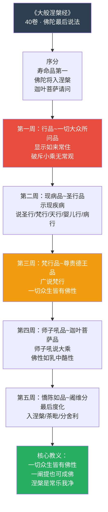
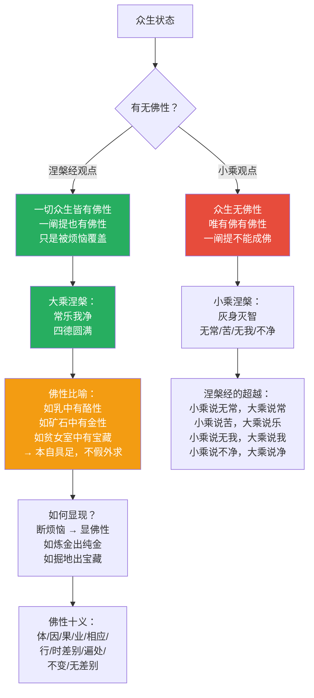
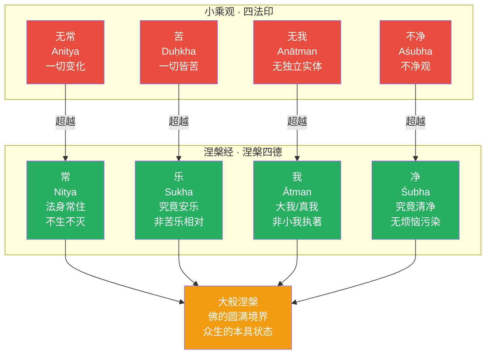
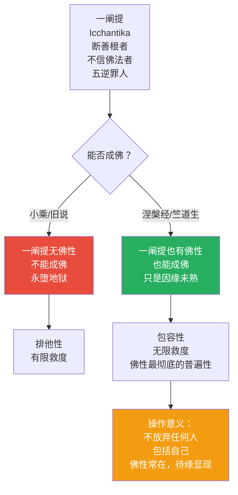
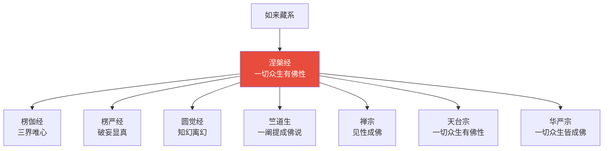
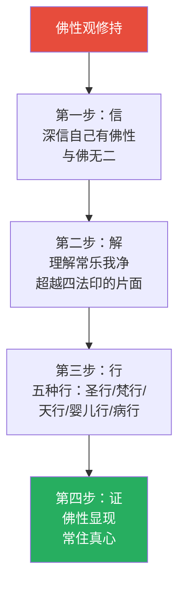

# 大般涅槃经 · Mahāparinirvāṇa Sutra

## 一句话定义

《涅槃经》是佛陀临灭度前的"最终遗嘱"——以"一切众生皆有佛性"为核心，重新定义涅槃为"常乐我净"的圆满境界，破斥小乘对"无常/苦/无我/不净"的片面理解，确立大乘佛性的终极教义。

## 基本信息

| 项目 | 内容 |
|------|------|
| 全称 | 大般涅槃经 |
| 译者 | 昙无谶（北凉，40卷，最通行）；法显（东晋，6卷） |
| 篇幅 | 40卷（北本）/ 36卷（南本，慧严等改治） |
| 归属 | 大乘涅槃部；如来藏系核心经典 |
| 核心思想 | 一切众生皆有佛性 / 常乐我净 / 涅槃四德 |
| 历史影响 | 竺道生"一阐提也可成佛"即据此经；禅宗"见性成佛"的理论基础 |

---

## 一、整体结构：五周说法

---

## 二、核心教义拆解：佛性论

---

## 三、涅槃四德：常乐我净

---

## 四、五种行的修行路径

---

## 五、一阐提成佛：最彻底的包容

---

## 六、核心概念速查表

| 概念 | 含义 | 操作意义 |
|------|------|----------|
| **佛性** | 成佛的可能性/种子/体性 | 本自具足，不须要外求 |
| **如来藏** | 如来的宝藏，即佛性 | 烦恼覆盖下仍有 |
| **常乐我净** | 涅槃的四德 | 超越无常苦无我不净 |
| **一阐提** | 断善根者 | 也能成佛——不放弃任何人 |
| **五种行** | 圣/梵/天/婴儿/病行 | 修行的五个层次 |
| **乳中酪性** | 佛性比喻 | 本有而非新生 |
| **掘地出宝** | 佛性比喻 | 本有而非外得 |
| **众生佛性** | 一切众生皆有 | 尊重一切生命 |
| **大般涅槃** | 佛的圆满境界 | 终极归宿 |
| **常住** | 法身常住不灭 | 佛的法身超越生死 |

---

## 七、在十三经中的位置

- **独特贡献**：佛性论最彻底的表达；"一阐提也可成佛"的包容性
- **与《法华经》关系**：同讲一切众生成佛，《法华》重会三归一，《涅槃》重佛性常住
- **与《楞伽经》关系**：同讲如来藏，《楞伽》重识转，《涅槃》重性显

---

## 八、认知应用

### 操作一：佛性确认

当自我怀疑/自卑时：
1. 知道：我也有佛性，与佛无二
2. 只是：被烦恼暂时覆盖
3. 操作：不断烦恼，而认识烦恼本空
4. 结果：佛性自显

### 操作二：常乐我净的日常观照

面对变化时：
- **无常中见常**：变化背后有不变的觉性
- **苦中见乐**：超越苦乐的究竟安乐
- **无我中见我**：破除小我，显大我
- **不净中见净**：烦恼即菩提，污染本清净

---

## 进阶阅读

- 原典：《大般涅槃经》（昙无谶译，40卷）
- 注释：竺道生《涅槃经集解》；吉藏《涅槃经游意》
- 现代解读：印顺法师《如来藏之研究》；圣严法师《涅槃经讲要》

---

## 九、翻译与传入历史

《涅槃经》的汉译历程体现了中国佛教对佛性论的逐步接受：

| 版本 | 译者 | 时间 | 篇幅 | 特点 |
|------|------|------|------|------|
| **北本** | 昙无谶 | 421 CE（北凉） | 40卷 | 最完整，最通行 |
| **法显本** | 法显 | 417 CE（东晋） | 6卷 | 仅前分，较简略 |
| **南本** | 慧严/慧观/谢灵运 | 430 CE（刘宋） | 36卷 | 改治润色，文字优美 |

---

## 十、注疏传统

| 注疏家 | 朝代 | 代表作 | 核心立场 |
|--------|------|--------|----------|
| **竺道生** | 东晋 | 《涅槃经集解》 | 首倡"一阐提也能成佛" |
| **吉藏** | 隋 | 《涅槃经游意》 | 三论宗视角释佛性 |
| **灌顶** | 唐 | 《涅槃经疏》 | 天台宗系统注释 |
| **法宝** | 唐 | 《涅槃经疏》 | 唯识宗视角解读 |

> 竺道生因主张"一阐提亦有佛性"被逐出僧团，后北本传入证实其说——中国佛教史上最著名的"先知"事件。

---

## 十一、核心经文选录

### 选录一：一切众生悉有佛性

> **原文**：「一切众生悉有佛性，如来常住无有变易。」
>
> **白话**：每一个生命都具备成佛的可能性，佛的法身永恒常住、不会改变。
>
> **要点**：佛性不是少数人的特权，而是一切生命的本质属性。

### 选录二：常乐我净

> **原文**：「涅槃名为解脱……常乐我净。」
>
> **白话**：真正的解脱境界具有四种品质——永恒、安乐、真我、清净。
>
> **要点**：不是推翻四法印，而是超越对四法印的片面理解。

### 选录三：佛性如金刚

> **原文**：「佛性如金刚，不可沮坏。」
>
> **白话**：佛性像金刚石一样，任何力量都无法摧毁。
>
> **要点**：烦恼再重也不能消灭佛性，只能暂时遮蔽。

---

## 十二、实修关联

**日常修持**：
- 晨起念诵"一切众生皆有佛性"三遍，建立当日正念基础
- 遇逆境时观"烦恼覆盖佛性，非佛性有损"
- 常住真心修持：于一切时处安住于觉性，不随外境起落

---

## 十三、认知科学映射

| 佛学概念 | 认知科学对应 | 说明 |
|----------|-------------|------|
| **佛性** | 先验认知潜能 | 佛性如先天认知能力——本自具足，待缘显现 |
| **常乐我净** | 认知完满性 | 超越二元对立后的整体认知状态 |
| **一阐提成佛** | 认知可塑性极限 | 任何大脑都有学习与改变的潜能 |
| **五种行** | 认知发展的多维路径 | 感知/伦理/直觉/纯真/同理——五种认知训练维度 |

> 交叉参考：[八识论](../概念/cognitive-theory/八识体系.md) · [认知建构论](../../../心理学/概念/建构主义.md)

---

## Cognitive Architecture

《涅槃经》以"一切众生皆有佛性"为核心，构建了佛教最彻底的认知潜能架构：

- **佛性（buddha-dhātu）作为认知潜能**：一切众生悉有佛性——认知觉醒的可能性本自具足，非从外得；如乳中酪性、如贫女宝藏，是认知的先天潜能，参见[八识论](../概念/cognitive-theory/八识体系.md)
- **常乐我净（nitya-sukha-ātman-śubha）作为转化后认知**：涅槃四德超越了小乘"无常·苦·无我·不净"的片面认知——常=认知的永恒性，乐=认知的究竟安乐，我=认知的真我，净=认知的本来清净
- **一阐提（icchantika）成佛的认知可塑性极限**：即使断善根者也有佛性——认知可塑性没有下限，任何认知状态都有转化的可能
- **烦恼即菩提的认知转化操作**：烦恼覆盖佛性，非佛性有损——在无常中直观常住，在苦中直观安乐，在无我中直观真我，在不净中直观清净

跨域链接：人本主义心理学"自我实现"（Maslow）理论与佛性本具、待缘显现的思想高度一致；神经可塑性（neuroplasticity）研究证实了"一阐提也能成佛"的认知可塑性极限假说。
