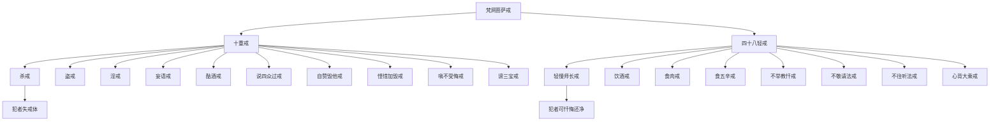
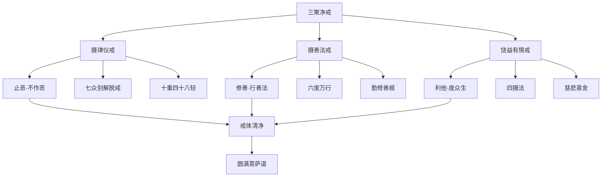
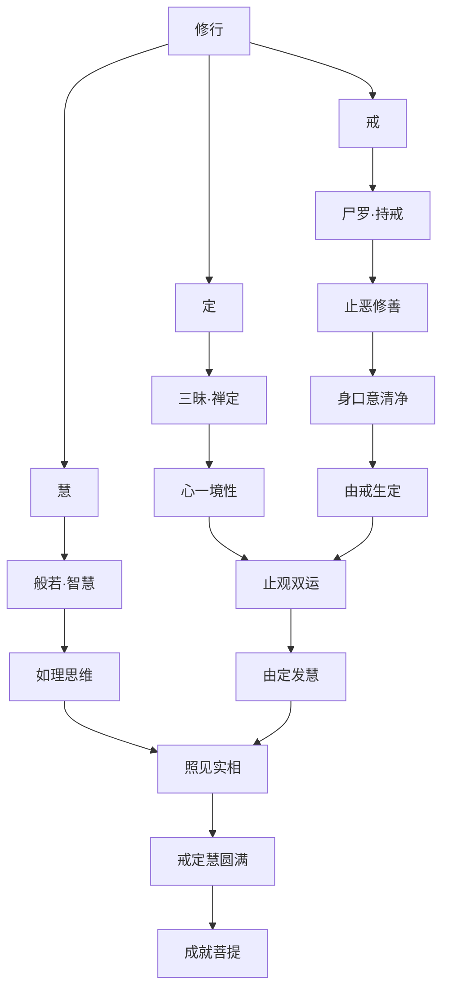
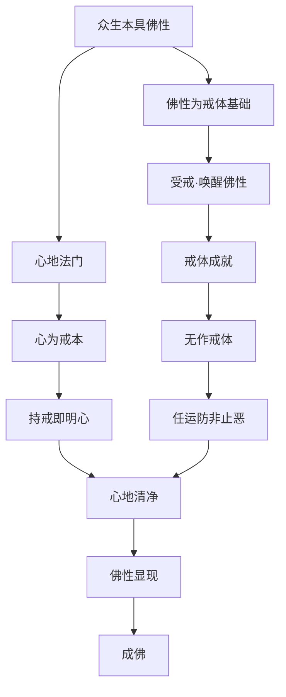
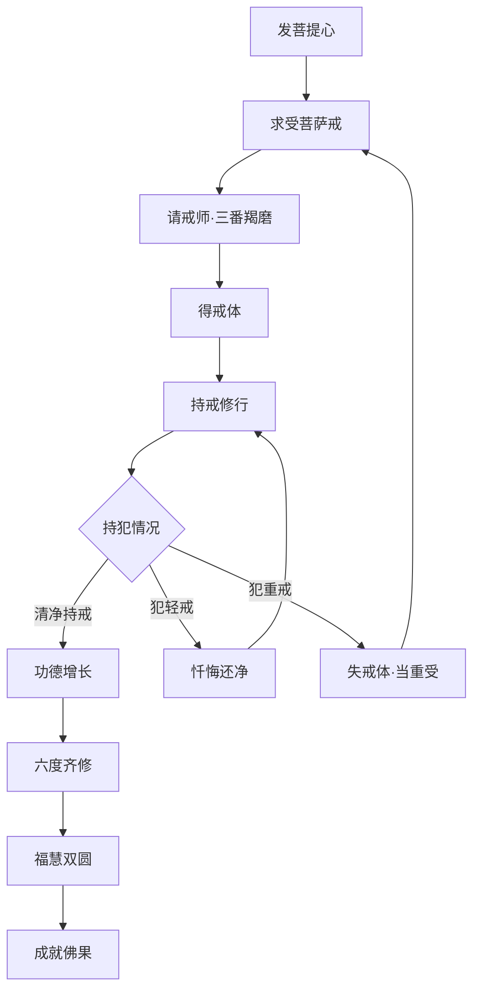
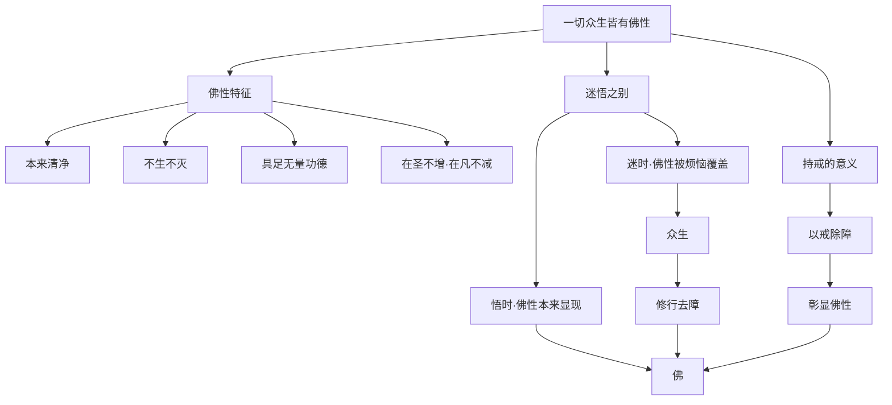
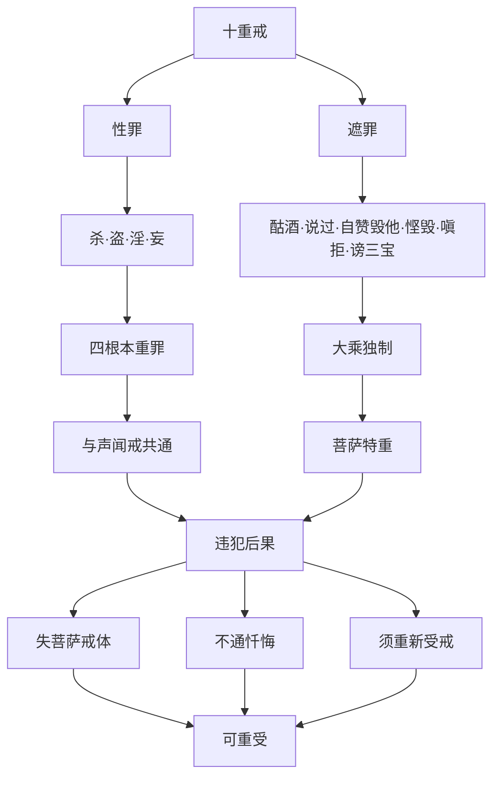

# 梵网经菩萨戒本

## 经文概要

| 项目 | 内容 |
|------|------|
| 经名 | 梵网经卢舍那佛说菩萨心地戒品 |
| 梵名 | Brahmajāla Sūtra |
| 译者 | 鸠摩罗什 |
| 译年 | 406 CE |
| 卷数 | 二卷（菩萨戒本为下卷） |
| 宗派 | 大乘菩萨戒 |
| 大正藏 | T.1484 |

## 核心思想

1. **十重戒**：杀、盗、淫、妄语、酤酒、说四众过、自赞毁他、悭惜加毁、嗔不受悔、谤三宝——犯者失菩萨戒体
2. **四十八轻戒**：较轻的戒条，犯者可忏悔还净
3. **三聚净戒**：摄律仪戒、摄善法戒、饶益有情戒——菩萨戒的三大类别
4. **佛性本有**：一切众生皆有佛性，是受菩萨戒的根本基础
5. **戒为菩提本**：戒律是一切修行的基础，无戒则无定慧
6. **卢舍那佛**：报身佛为菩萨说戒，体现法身、报身、化身三身佛义
7. **心地法门**：戒律的根本在于心地——"心地"即佛性本心

## 翻译与传入历史

- **译者**：鸠摩罗什（344-413），中国四大译经家之首
- **译出时间**：406年，于长安逍遥园译出
- **译场**：后秦国家译场，姚兴护持
- **真伪争论**：此经真伪在学术界有争议——传统视为佛说，近代学者认为可能是中国撰述或印度晚期撰述
- **梵文本**：无梵文原本传世，仅有藏译片断
- **其他戒本**：与《璎珞经》菩萨戒并为汉传两大菩萨戒传承
- **授戒传统**：自南朝以来，菩萨戒成为汉传佛教僧俗共同受持的大乘戒
- **天台传承**：智顗大师特别弘扬此经菩萨戒，成为天台宗特色
- **日本传播**：鉴真东渡将菩萨戒传入日本，唐招提寺即以此戒为本

## 注疏传统

| 注疏 | 作者 | 朝代 | 要点 |
|------|------|------|------|
| 梵网菩萨戒经义疏 | 智顗 | 隋 | 天台释戒，最为重要 |
| 梵网经菩萨戒本疏 | 法藏 | 唐 | 华严宗释戒 |
| 梵网戒本疏 | 太贤 | 新罗 | 新罗唯识释戒 |
| 菩萨戒本笺要 | 蕅益智旭 | 明 | 融通诸宗释戒 |
| 梵网经合注 | 德玉 | 清 | 综合诸家注释 |
| 梵网经古迹记 | 善珠 | 日本 | 日本古传注释 |

## 核心经文选录

> **原文**：「尔时卢舍那佛为此大众，略开百千恒河沙不可说法门中心地如毛头许。是过去一切佛已说，未来佛当说，现在佛今说。三世菩萨已学、当学、今学。我亦如是，是卢舍那佛本源心地法门。」

**白话释义**：卢舍那佛为大众开示的这个心地法门，虽然只是恒河沙数法门中的一点点，却是过去、现在、未来一切佛都在说、三世菩萨都在学的根本法门。"心地"指众生本具的佛性，一切戒律皆从此本源心地流出。

> **原文**（十重戒第一）：「佛言：佛子！若自杀，教人杀，方便杀，赞叹杀，见作随喜，乃至咒杀。杀因、杀缘、杀法、杀业，乃至一切有命者，不得故杀。是菩萨应起常住慈悲心、孝顺心，方便救护一切众生。」

**白话释义**：佛对菩萨弟子说：不能自己杀生，不能教别人杀生，不能用方便法门杀害，不能赞叹杀生，不能见杀随喜，乃至不能用咒术杀。杀的因、缘、法、业都不能沾染。菩萨应当常怀慈悲心、孝顺心，想方设法救护一切众生。这是菩萨戒第一条重戒的根本精神。

## 实修关联

- **受菩萨戒**：汉传佛教僧尼受具足戒后必受菩萨戒，在家信众亦可受
- **三聚净戒修持**：日常持戒以三聚净戒为框架——止恶、修善、利他
- **诵戒布萨**：半月半月诵戒文，检视自身持犯
- **忏悔法门**：犯轻戒可通过忏悔还净——对首忏、作法忏
- **菩萨行实践**：以戒律为基础的六度万行——布施、持戒、忍辱、精进、禅定、般若
- **戒定慧三学**：戒为定慧之基，由戒生定，由定发慧
- **慈悲行**：十重戒皆以慈悲心为根本，修菩萨行者应以慈悲为核心

## 认知科学映射

- **道德认知框架**：十重戒+四十八轻戒构成一个层次分明的道德认知框架——对应道德发展理论（Kohlberg）中的层次结构
- **自律 vs 他律**：菩萨戒以"自性清净心"（佛性）为持戒基础——这是自律（autonomy）而非他律（heteronomy），与康德道德哲学和认知科学中的内化机制呼应
- **伦理决策模型**：三聚净戒提供了一个平衡"止恶-修善-利他"的决策框架，对应现代伦理决策中的多元价值权衡
- **道德直觉**：经文强调"心地"——道德行为的根源在心地，对应当代道德心理学中的道德直觉理论（moral intuitionism）
- **行为规范认知**：戒律作为行为规范如何内化为认知结构——对应社会学习理论和规范内化机制
- 参见：[六根六尘](../concepts/cognitive-theory/six-constituents.md)、[心境关系](../concepts/cognitive-theory/mind-world.md)

## 菩萨戒结构图

## 三聚净戒关系图

## 戒定慧三学图

## 佛性与戒体图

## 菩萨发心与受戒流程图

## 佛性本有思想图

## 十重戒罪相图

## 教义框架

### 菩萨戒的三重结构

| 层次 | 内容 | 功能 |
|------|------|------|
| 摄律仪戒 | 止恶——七众别解脱戒+十重四十八轻 | 建立道德底线 |
| 摄善法戒 | 修善——六度四摄万行 | 积累功德智慧 |
| 饶益有情戒 | 利他——四摄法度众生 | 成就菩萨事业 |

### 判教位置

本经在汉传佛教中地位特殊——它既是一部经典，又是大乘戒律的核心文本。天台宗以梵网菩萨戒为僧俗共受的大乘戒，与声闻戒（具足戒）形成戒律体系的完整结构。

### 戒体论

| 学派 | 戒体观 |
|------|--------|
| 天台 | 无作假色（以色法为戒体） |
| 华严 | 性起（以法界为戒体） |
| 唯识 | 思种子（以心所为戒体） |

## 跨经关联

- **[华严经](avatamsaka-sutra.md)**：卢舍那佛为华严教主，梵网经以卢舍那佛为说法主
- **[法华经](lotus-sutra.md)**：佛性思想与法华一乘会通
- **[楞严经](surangama-sutra.md)**：持戒与禅定的关系——楞严经以持戒为修楞严定的基础
- **[地藏经](ksitigarbha-sutra.md)**：因果持戒与地藏法门的呼应
- **[无量寿经](amitayus-sutra.md)**：三福净业中"持戒"为重要内容
- **[阿弥陀经](amitabha-sutra.md)**：善男子善女人的"善"以持戒为基础
- 认知理论关联：[六根六尘](../concepts/cognitive-theory/six-constituents.md)、[心境关系](../concepts/cognitive-theory/mind-world.md)

## 思想遗产

1. **菩萨戒传统**：梵网菩萨戒成为汉传佛教最核心的大乘戒律，几乎所有中国佛教宗派都受持此戒
2. **佛性思想**：以佛性为基础的戒律观，区别于小乘以"厌离心"为基础的戒律观
3. **居士佛教**：菩萨戒为在家居士提供了完整的修行框架——不必出家即可修菩萨行
4. **伦理哲学**：三聚净戒的思想为中国佛教伦理学的核心框架
5. **跨文化传播**：经鉴真传入日本，成为日本佛教戒律的核心
6. **当代价值**：在当代社会中，菩萨戒的"止恶修善利他"三原则仍具有普遍的伦理指导意义

---

## Cognitive Architecture

《梵网经》以菩萨戒为核心，构建了以佛性为基础的伦理认知架构：

- **三聚净戒（tri-vidhāni-śīlāni）的认知纪律框架**：摄律仪戒=止恶（认知底线），摄善法戒=修善（认知提升），饶益有情戒=利他（认知扩展）——三层认知纪律构成完整的道德认知体系
- **佛性为基础的自律认知**：不以恐惧（惩罚）而以佛性（潜能）为持戒基础——戒体是内化的认知结构而非外在约束；参见[心境关系](../concepts/cognitive-theory/mind-world.md)
- **梵网（brahmajāla）作为互依伦理认知**：因陀罗网（梵网）隐喻一切法互相关联——伦理行为不是孤立的，每一行为都在影响整个法界网络，参见[六根六尘](../concepts/cognitive-theory/six-constituents.md)
- **十重戒的身口意全维度覆盖**：杀·盗·淫·妄（身口）+酤酒·说过·自赞毁他·悭毁·嗔拒·谤三宝（意）——认知行为的全方位纪律
- **心地法门的认知根源**："心地"即佛性本心——持戒的终极是明心见性，戒律从心地流出

跨域链接：康德义务论伦理学（categorical imperative）与菩萨戒"以自性清净心为戒体"的自律精神高度一致；Kohlberg道德发展理论的后习俗水平与三聚净戒的利他维度形成对照。
