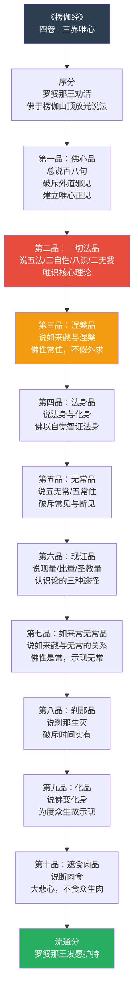
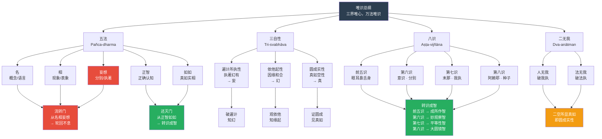
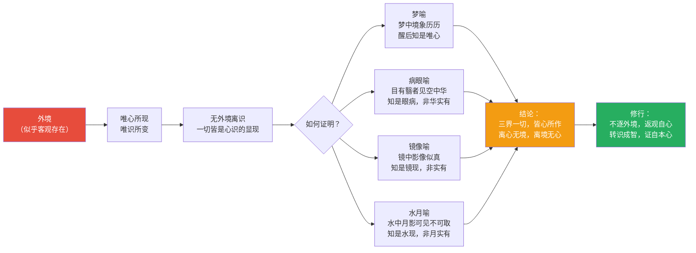
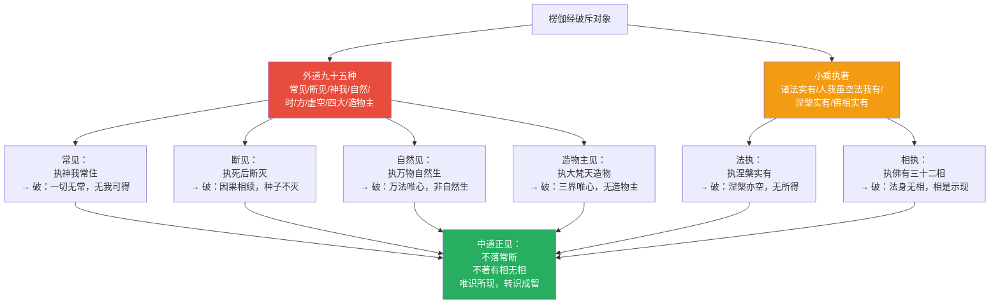
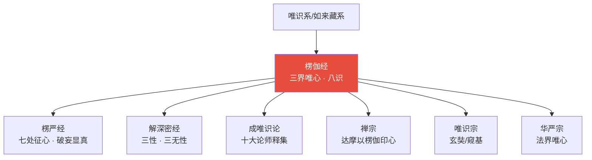
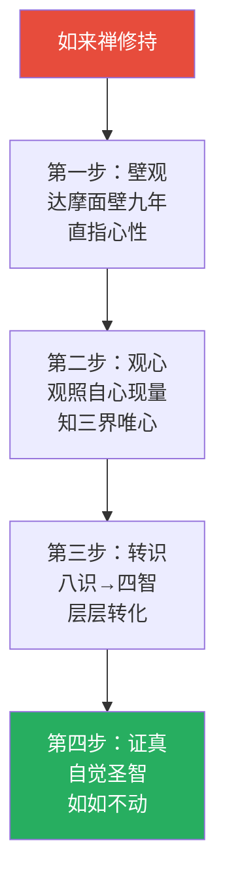

# 楞伽阿跋多罗宝经 · Laṅkāvatāra Sutra

## 一句话定义

《楞伽经》是唯识宗与禅宗的共同源头——以"三界唯心，万法唯识"为核心，系统建立八识体系，破斥外道邪见与小乘执著，为"转识成智"提供完整的认识论与修行论框架。

## 基本信息

| 项目 | 内容 |
|------|------|
| 全称 | 楞伽阿跋多罗宝经 |
| 译者 | 求那跋陀罗（四卷本，禅宗所依）；实叉难陀（七卷本） |
| 篇幅 | 四卷（南朝宋译）/ 七卷（唐译）/ 十卷（北魏译） |
| 归属 | 大乘唯识系/如来藏系；禅宗以四卷楞伽印心 |
| 核心思想 | 三界唯心 / 万法唯识 / 转识成智 / 五法/三自性/八识/二无我 |
| 对中国影响 | 禅宗初祖达摩以四卷《楞伽》授慧可；唯识宗重要依据 |

---

## 一、整体结构：四卷纲要



---

## 二、核心教义拆解：五法·三自性·八识·二无我



---

## 三、八识体系详解

```mermaid
graph TD
    subgraph 前五识["前五识 · 感知层"]
        V1["眼识<br/>见色"]
        V2["耳识<br/>闻声"]
        V3["鼻识<br/>嗅香"]
        V4["舌识<br/>尝味"]
        V5["身识<br/>触触"]
    end

    V1 & V2 & V3 & V4 & V5 --> M1["第六识 · 意识<br/>Manovijñāna<br/>分别/思维/判断<br/>了别法尘"]
    
    M1 --> M2["第七识 · 末那<br/>Manas<br/>恒审思量<br/>执第八识为自我"]
    
    M2 --> M3["第八识 · 阿赖耶<br/>Ālayavijñāna<br/>含藏种子<br/>受熏持种<br/>去后来先作主公"]
    
    M3 --> N1["转识成智：<br/>八识 → 四智"]
    
    V1 & V2 & V3 & V4 & V5 --> N2["成所作智<br/>Krtyānuṣṭhāna-jñāna"]
    M1 --> N3["妙观察智<br/>Pra-vicaya-jñāna"]
    M2 --> N4["平等性智<br">"Samatā-jñāna"]
    M3 --> N5["大圆镜智<br/>Mahādarśa-jñāna"]
    
    N2 & N3 & N4 & N5 --> O["四智圆明<br/>佛地圆满"]
    
    style M2 fill:#e74c3c,color:#fff
    style M3 fill:#f39c12,color:#fff
    style O fill:#27ae60,color:#fff
```

---

## 四、三界唯心的认识论



---

## 五、破斥外道与小乘



---

## 六、核心概念速查表

| 概念 | 梵文 | 含义 | 操作意义 |
|------|------|------|----------|
| **三界唯心** | cittamātra | 欲界/色界/无色界皆心所作 | 返观自心，不逐外境 |
| **万法唯识** | vijñaptimātra | 一切现象皆识所变现 | 认识是识的运作 |
| **五法** | pañca-dharma | 名/相/妄想/正智/如如 | 认知的五层结构 |
| **三自性** | tri-svabhāva | 遍计/依他/圆成 | 认识的三个层次 |
| **八识** | aṣṭa-vijñāna | 眼耳鼻舌身意末那阿赖耶 | 心理的完整架构 |
| **转识成智** | āśraya-parivṛtti | 八识转为四智 | 修行的核心操作 |
| **二无我** | dva-anātman | 人无我/法无我 | 破除两种执著 |
| **阿赖耶** | ālaya | 藏识，含藏一切种子 | 轮回与解脱的根本 |
| **末那** | manas | 恒审思量，执阿赖耶为我 | 我执的根源 |
| **如来藏** | tathāgata-garbha | 佛性内在含藏 | 本自具足 |
| **自觉圣智** | pratyātmārya-jñāna | 自己证得的圣智 | 不可言说，唯证方知 |

---

## 七、在十三经中的位置



- **独特贡献**：八识体系最系统的经典来源；唯识与如来藏的结合
- **与《楞严经》关系**：同讲唯心，《楞伽》重体系，《楞严》重破妄
- **与《涅槃经》关系**：同讲如来藏，《楞伽》重识转，《涅槃》重性显

---

## 八、认知应用

### 操作一：唯识觉察

当产生情绪/判断时：
1. **这是哪个识在作用？**
   - 前五识：纯感知？
   - 第六识：概念/分别？
   - 第七识：我执/防卫？
   - 第八识：习气的自动反应？
2. **这是遍计所执还是依他起？**
   - 执著幻有？还是知道是缘起？
3. **返观**：知道这个分别的，是什么？

### 操作二：转识成智的日常版

| 状态 | 识的作用 | 转智操作 |
|------|----------|----------|
| 感官欲望 | 前五识贪著 | 成所作智：欣赏而不占有 |
| 分析判断 | 第六识分别 | 妙观察智：善分别而不执著 |
| 自我防卫 | 第七识我执 | 平等性智：自他不二 |
| 习气反应 | 第八识种子 | 大圆镜智：如实映照 |

---

## 进阶阅读

- 原典：《楞伽阿跋多罗宝经》（求那跋陀罗译，四卷）
- 注释：达摩《略辨大乘入道四行》；僧肇未注此经，后世有《楞伽经注》多种
- 现代解读：印顺法师《楞伽经讲记》；吴信如《楞伽经导读》

---

## 九、翻译与传入历史

《楞伽经》有三个重要汉译版本，各具特色：

| 版本 | 译者 | 时间 | 篇幅 | 特点 |
|------|------|------|------|------|
| **四卷本** | 求那跋陀罗 | 443 CE（刘宋） | 四卷 | 达摩以此印心，禅宗所依 |
| **十卷本** | 菩提流支 | 513 CE（北魏） | 十卷 | 较详细，结构更清晰 |
| **七卷本** | 实叉难陀 | 700 CE（唐） | 七卷 | 最后出，文字最流畅 |


---

## 十、注疏传统

| 注疏家 | 朝代 | 代表作 | 核心立场 |
|--------|------|--------|----------|
| **达摩** | 南北朝 | 以此经印心（口传） | 禅宗初祖，以楞伽为心要 |
| **法藏** | 唐 | 《入楞伽经玄义》 | 华严宗视角，法界唯心 |
| **智俨** | 唐 | 楞伽相关疏释 | 华严教学体系融入 |
| **净影慧远** | 隋 | 楞伽经义疏 | 地论宗/涅槃学派视角 |

> 达摩以四卷《楞伽》授慧可，传至五祖弘忍时渐转向《金刚经》——禅宗思想史的重大转折。

---

## 十一、核心经文选录

### 选录一：三界唯心

> **原文**：「三界上下法，唯是一心作。」
>
> **白话**：欲界、色界、无色界的一切现象，都是心识所变现的。
>
> **要点**：外境并非独立于认知主体而存在——这是唯识学的根本立场。

### 选录二：自心现量

> **原文**：「一切诸法，自心所现。」
>
> **白话**：所有现象都是自心显现出来的，离开自心没有独立存在的外境。
>
> **要点**：认知对象与认知主体不可分离——类似现象学的意向性理论。

### 选录三：如来藏与阿赖耶识

> **原文**：「如来藏名阿赖耶识，而与无明七识共俱。」
>
> **白话**：如来藏就是阿赖耶识，它与无明和七种意识共存。
>
> **要点**：佛性（如来藏）与深层心理结构（阿赖耶识）的统一，是唯识与如来藏的交汇点。

---

## 十二、实修关联



**核心修法**：
- 如来禅：不依文字、不依形象，直证心源
- 壁观：外息诸缘、内心无喘、心如墙壁、可以入道
- 唯识观：于日常中观察"八识"的运作，训练"转识成智"

---

## 十三、认知科学映射

| 佛学概念 | 认知科学对应 | 说明 |
|----------|-------------|------|
| **自心现量** | 认知建构论 | 世界不是被动接收，而是主动生成的建构 |
| **阿赖耶识** | 深层认知结构 | 类似无意识/深层图式——储藏一切经验种子 |
| **末那识** | 自我参照系统 | 默认模式网络（DMN）——持续的自我叙事 |
| **转识成智** | 认知重组/元认知 | 从自动反应到觉知选择的认知升级 |
| **五法** | 认知的五层结构 | 名→相→妄想→正智→如如 = 标签→表征→偏见→正见→如实 |

> 交叉参考：[八识论](../concepts/cognitive-theory/eight-consciousness.md) · [认知建构论](../../../心理学/概念/建构主义.md) · [元认知](../../concepts/cognitive-theory/metacognition.md)

---

## Cognitive Architecture

《楞伽经》以"三界唯心"为核心，构建了唯识学最完整的认知架构体系：

- **唯心（citta-mātra）认知论**："三界上下法，唯是一心作"——一切认知对象皆为心识所现，非离心别有外境；参见[心境关系](../concepts/cognitive-theory/mind-world.md)
- **八识（aṣṭa-vijñāna）完整认知架构**：前五识（感知层）→第六识（分别层）→第七识（我执层·末那）→第八识（存储层·阿赖耶），构成从感知到深层存储的完整认知链条；参见[八识论](../concepts/cognitive-theory/eight-consciousness.md)
- **四法门认知框架**：五法（名·相·妄想·正智·如如）·三自性·八识·二无我——统摄一切法于认知分析中
- **如来藏（tathāgatagarbha）作为认知潜能**：佛性内在于众生——"如来藏名阿赖耶识"，将认知潜能与深层心理结构统一
- **自觉圣智（pratyātmārya-jñāna）**：超越语言的自证认知——不可言说，唯证方知

跨域链接：现象学的意向性理论（胡塞尔）与"自心现量"的认知建构论高度相似；认知科学中的"默认模式网络"（DMN）与末那识的持续自我参照功能形成对应。
