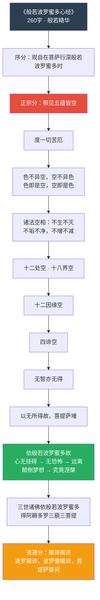
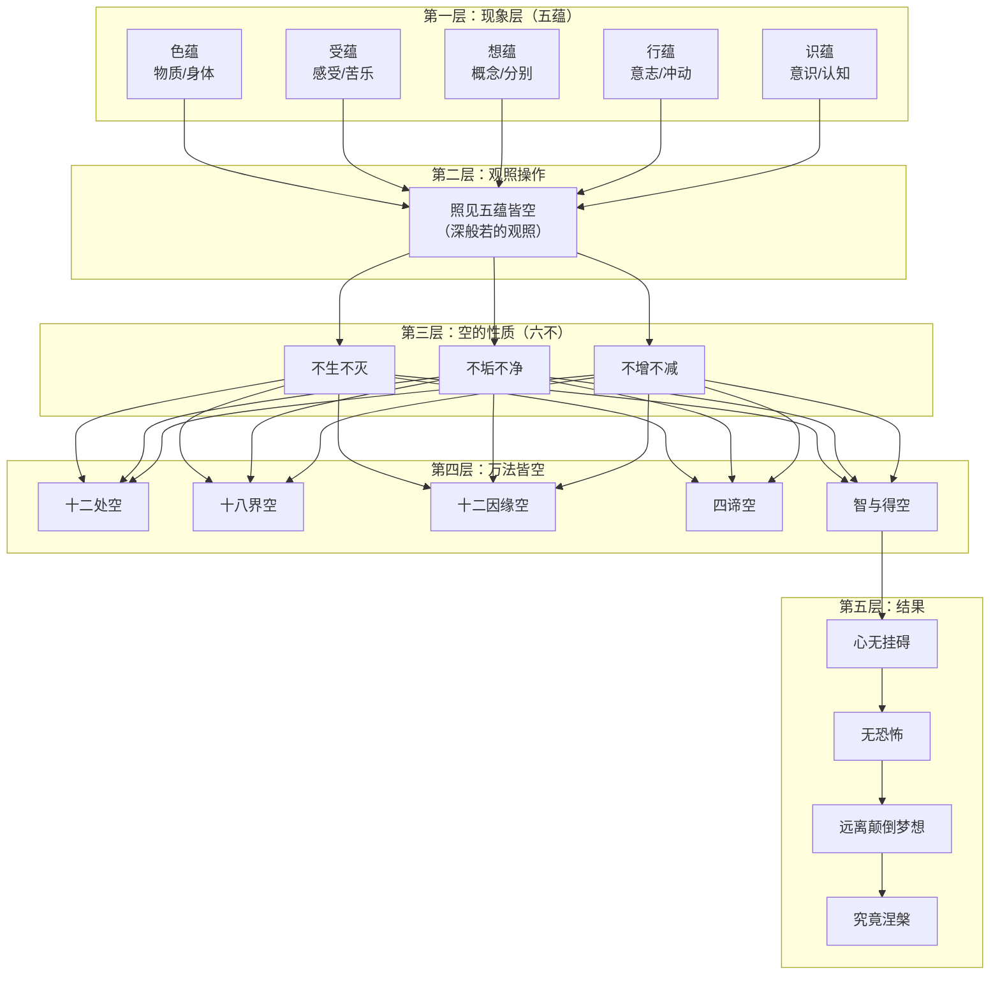
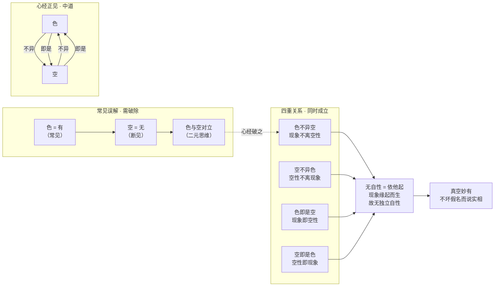
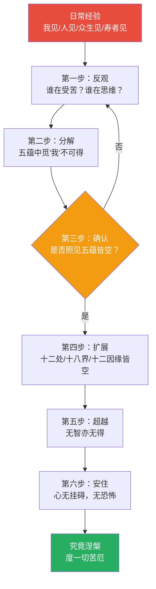
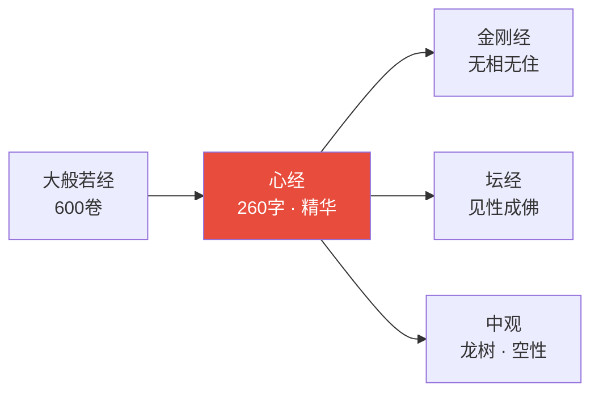
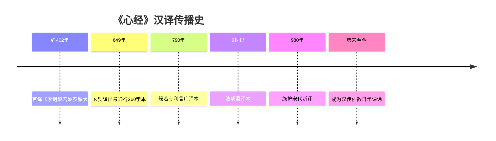
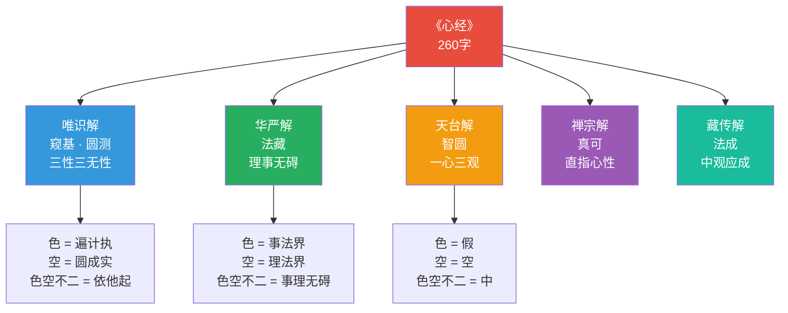
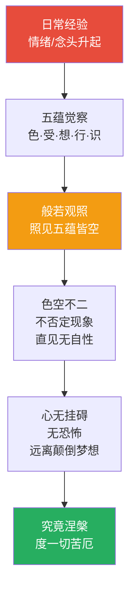
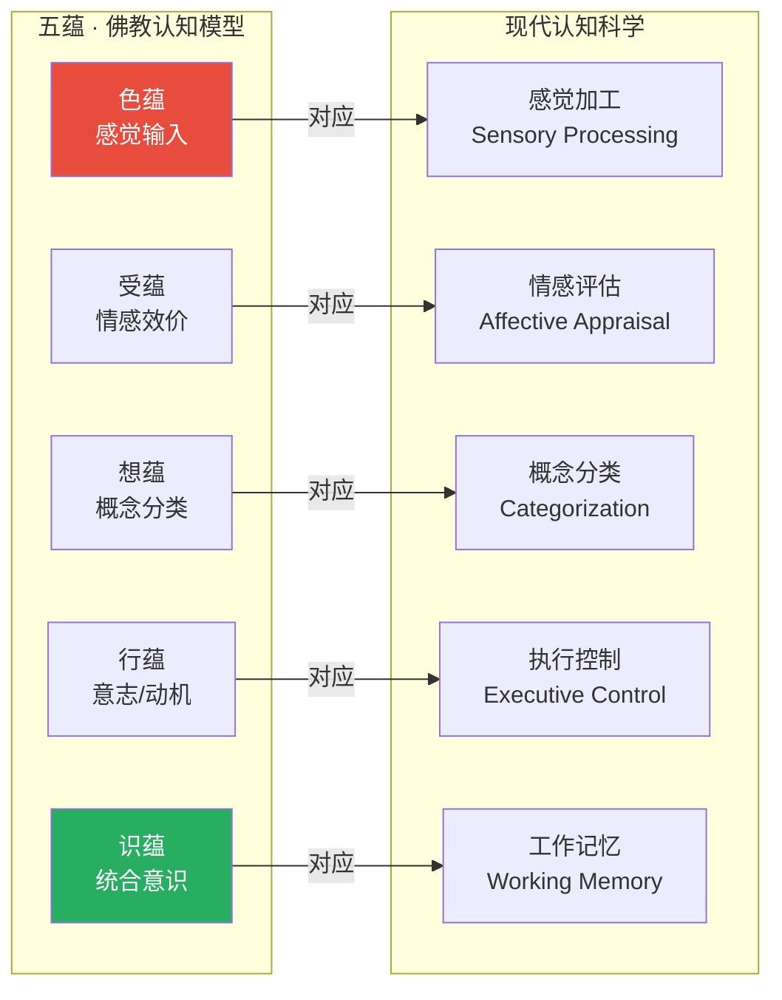

# 般若波罗蜜多心经 · Heart Sutra

## 一句话定义

《心经》是六百卷《大般若经》的核心浓缩——以"照见五蕴皆空"为操作起点，通过层层否定（色即是空，空即是色，无眼耳鼻舌身意……），最终到达"度一切苦厄"的认知解脱。

## 基本信息

| 项目 | 内容 |
|------|------|
| 全称 | 般若波罗蜜多心经 |
| 译者 | 玄奘（602–664），另有鸠摩罗什、法成等译本 |
| 篇幅 | 260字（玄奘译本），佛教最短的般若经典 |
| 归属 | 大乘般若系，六百卷《大般若经》第十四会之精华 |
| 核心人物 | 观世音菩萨（观自在菩萨）为说法者 |
| 受众 | 舍利弗（智慧第一）为当机者 |

---

## 一、整体结构图

---

## 二、核心教义拆解：五蕴皆空的五层推演

---

## 三、"色即是空，空即是色"的双向拆解

---

## 四、般若观照的操作路径

---

## 五、核心概念速查表

| 概念 | 含义 | 操作意义 |
|------|------|----------|
| **五蕴** | 色/受/想/行/识——构成经验的五个聚合 | 分解"自我"的五个维度 |
| **照见** | 以般若智慧直观，非推理 | 直接观照，非概念分析 |
| **空** | 无自性——非断灭，是缘起 | 看到现象依条件而生，无独立实体 |
| **不异** | 不离、不分离 | 色与空不是两个东西 |
| **即是** | 完全同一 | 色就是空，不是色变成空 |
| **十二处** | 六根（感官）+ 六尘（对象） | 感官接触点皆空 |
| **十八界** | 六根 + 六尘 + 六识 | 认知全链条皆空 |
| **十二因缘** | 从无明到老死的因果链 | 因果链本身也空 |
| **无智亦无得** | 能观之智与所得之果皆空 | 不执著于开悟本身 |
| **心无挂碍** | 心不粘着任何相 | 自在的根本状态 |
| **颠倒梦想** | 将无常执为常，无我执为我 | 苦的根源 |
| **究竟涅槃** | 圆满寂静，非死亡 | 烦恼熄灭后的状态 |

---

## 六、在十三经中的位置

- **上游**：六百卷《大般若经》第十四会
- **下游**：《金刚经》以"无相"展开般若操作；《六祖坛经》以"见性"直通般若
- **平行**：《中论》以逻辑论证"空性"，《心经》以观照操作"照见空"

---

## 七、认知应用

### 日常操作：五蕴觉察法

当情绪升起时，依次追问：
1. **这是色吗？** —— 身体的哪个部位有反应？
2. **这是受吗？** —— 是苦受、乐受还是舍受？
3. **这是想吗？** —— 哪个概念/标签被贴上了？
4. **这是行吗？** —— 哪个冲动/意志在推动？
5. **这是识吗？** —— 哪个认知框架在判断？

→ 层层分解后，"我"在何处？

### 决策应用：挂碍检测

做重大决策前，检查：
- 心是否挂碍于某个结果？（若有，则未真正自由）
- 是否因恐惧而行动？（无恐怖才是真决策）
- 是否将假设计为永恒？（颠倒梦想的标志）

---

## Cognitive Architecture

《心经》以260字构建了般若认知架构的最精简模型：

- **色空不二（rūpa-śūnyatā-abheda）的认知操作**：色不异空→空不异色→色即是空→空即是色，四步递进彻底消解现象与空性的二元对立；参见[五蕴认知](../concepts/cognitive-theory/five-aggregates-cognitive.md)
- **照见五蕴皆空作为核心认知操作**：不是推理而是直观——以般若（prajñā）直接观照色·受·想·行·识五蕴的无自性，参见[五蕴认知](../concepts/cognitive-theory/five-aggregates-cognitive.md)
- **般若作为非概念性认知**：超越推理与语言的直接认知——"无智亦无得"连般若本身也被解构，防止认知工具的实体化
- **否定链的认知解构**：十二处空→十八界空→十二因缘空→四谛空→无智亦无得，层层否定整个认知链条的实有性
- **心无挂碍的认知自由**：认知解构的终极效果——不粘着于任何认知对象，远离颠倒梦想

跨域链接：康德"物自体不可知"与"空相六不"（不生不灭不垢不净不增不减）的认识论界限形成呼应；现象学还原与般若观照的操作方法高度相似。

---

## 进阶阅读

- 原典：《般若波罗蜜多心经》（玄奘译）
- 注释：窥基《般若心经幽赞》；法藏《般若心经略疏》
- 现代解读：一行禅师《般若之心》；圣严法师《心经的智慧》

---

## 翻译与传入历史

《般若波罗蜜多心经》的汉译史跨越数百年，有多个重要译本：

| 译者 | 年代 | 译本特点 |
|------|------|----------|
| 鸠摩罗什 | 约402年 | 最早汉译本，名《摩诃般若波罗蜜大明咒经》，262字 |
| **玄奘** | **649年** | **最通行本，260字，文辞精炼，为《大般若经》第600卷精华** |
| 法成（藏族译师） | 9世纪 | 藏译本，兼采梵本与汉本，对藏传佛教影响深远 |
| 般若与利言 | 790年 | 广译本，含序分与流通分，篇幅较长 |
| 施护 | 980年 | 宋代新译，参照新传入梵本 |

**关键史实**：玄奘于贞观二十三年（649年）在长安大慈恩寺译出此经，时值翻译《大般若经》之际。传说玄奘西行取经途中，得观世音菩萨授此经而逢凶化吉，故译出后广为流通。

**现存梵本**：日本法隆寺藏有较完整梵文写本，尼泊尔亦有多种梵文抄本传世。学术界认为玄奘译本可能参照了更精简的梵文略本。

---

## 注疏传统

《心经》篇幅虽短，注疏却极为丰富，各家从不同宗派立场诠释空义：

| 注疏者 | 著作 | 宗派立场 | 核心特色 |
|--------|------|----------|----------|
| **窥基** | 《般若心经幽赞》 | 唯识宗 | 以唯识三性解空，强调遍计所执性即空 |
| **圆测** | 《般若心经赞》 | 新罗·唯识 | 与窥基并列，兼采中观与唯识 |
| **法藏** | 《般若心经略疏》 | 华严宗 | 以华严法界观解色空不二 |
| **慧净** | 《般若心经疏》 | 初唐 | 最早的系统注疏之一 |
| **靖迈** | 《般若心经疏》 | 唐代 | 侧重文字训诂 |
| **宋·智圆** | 《心经疏》 | 天台宗 | 以空假中三观释色空 |
| **明·真可** | 《心经说》 | 禅宗 | 以禅悟立场直解 |
| **清·溥畹** | 《心经说义》 | 综合 | 会通诸家 |

**各宗解读差异**：
- **唯识宗**（窥基）：色即遍计所执性，空即圆成实性，色空不二即依他起性
- **华严宗**（法藏）：色空不二即理事无碍法界观
- **天台宗**：色即空即假即中，一心三观
- **禅宗**：直下照见，不立文字，以心印心

---

## 核心经文选录

### 1. 色空四句（最核心）

> **原文**：色不异空，空不异色；色即是空，空即是色。受想行识，亦复如是。
>
> **梵文**：rūpaṃ śūnyatā śūnyataiva rūpam, rūpān na pṛthak śūnyatā śūnyatāyā na pṛthag rūpam
>
> **现代解读**：物质现象与空性不是两个分离的东西——现象本身就是空性，空性本身就是现象。这不是说"物质消失了变成空"，而是说物质本来就没有独立、永恒、不变的自性，这就是空性。感受、思维、意志、意识也是如此。

### 2. 空相六不

> **原文**：是诸法空相，不生不灭，不垢不净，不增不减。
>
> **现代解读**：一切现象的真实相状（空相），超越了生灭、垢净、增减这三对概念。这不是说事物"没有"生灭，而是说"生灭"本身是缘起的假名，空性层面无所谓生灭。

### 3. 究竟否定链

> **原文**：无眼耳鼻舌身意，无色声香味触法。无眼界，乃至无意识界。无无明，亦无无明尽，乃至无老死，亦无老死尽。无苦集灭道，无智亦无得。
>
> **现代解读**：连修行的核心概念（十二因缘、四谛、智慧、证得）都被否定——这不是虚无主义，而是破除对"法"的执著。连"我在修行""我证得空性"都是执著。

### 4. 心无挂碍

> **原文**：以无所得故，菩提萨埵依般若波罗蜜多故，心无挂碍。无挂碍故，无有恐怖，远离颠倒梦想，究竟涅槃。
>
> **现代解读**：因为没有一个"我"在得到什么，所以心不粘着任何东西；不粘着，就没有恐惧；没有恐惧，就能远离将无常当作永恒、将无我当作有我的颠倒认知，最终到达彻底的解脱。

### 5. 大明咒（揭谛咒）

> **原文**：揭谛揭谛，波罗揭谛，波罗僧揭谛，菩提萨婆诃。
>
> **梵文**：Gate gate pāragate pārasaṃgate bodhi svāhā
>
> **现代解读**：去吧，去吧，到彼岸去吧，大家都到彼岸去吧，觉悟啊！这不是祈愿，而是般若智慧的直接表达——当照见五蕴皆空时，当下就是彼岸。

---

## 实修关联

### 般若观照法

《心经》的核心修法是"照见五蕴皆空"——般若观照：

1. **五蕴分解观**：当情绪/念头升起时，依次观照它是色（身体反应）、受（感受）、想（概念标记）、行（意志冲动）、识（认知判断），发现"我"在五蕴中不可得
2. **色空不二观**：不否定现象，但直观现象的缘起无自性——看到桌子时，知道它是木材、工匠、设计等因缘的聚合，没有一个独立的"桌子性"
3. **十八界空观**：观六根（眼耳鼻舌身意）接触六尘（色声香味触法）产生六识的过程，发现整个认知链条中没有一个"主体"

### 般若心咒持诵

"揭谛揭谛波罗揭谛波罗僧揭谛菩提萨婆诃"是汉传佛教最常持诵的咒语之一：
- 日常课诵中必念
- 念诵时配合般若观照，非单纯口念
- 禅修时以咒摄心，由定发慧

### 与禅宗的关系

六祖慧能虽因《金刚经》开悟，但般若空观是禅宗的核心见地。《心经》的"照见"二字，与禅宗的"观心""看话头"一脉相承——不是思维分析，而是直接观照。

---

## 认知科学映射 ⭐

### 空性 ↔ 认知解构

《心经》的核心操作"照见五蕴皆空"与现代认知科学的"认知解构"高度相似：

| 心经概念 | 认知科学对应 | 说明 |
|----------|-------------|------|
| 五蕴皆空 | 模块化认知理论 | 认知不是单一主体，而是多模块协同 |
| 色不异空 | 具身认知 | 物质（身体）与认知不可分离 |
| 无眼耳鼻舌身意 | 感觉通道的建构性 | 感官不是被动接收，而是主动建构 |
| 心无挂碍 | 去自动化认知 | 认知脱粘，减少自动化反应 |
| 颠倒梦想 | 认知偏差 | 将无常执为常、无我执为我 = 确认偏误/锚定效应 |

### 五蕴 ↔ 认知模块论

### 认知理论交叉引用

- [八识论](../concepts/cognitive-theory/eight-consciousness.md)：心经的"识蕴"对应八识中的前六识，而"照见"则涉及第七识末那识的执著与第八识阿赖耶识的深层运作
- [中观](../concepts/cognitive-theory/madhyamaka.md)：心经的空性思想直接源于龙树中观学派，"色即是空"是中道思想的最简表达
- [六根六尘](../concepts/cognitive-theory/six-constituents.md)："无眼耳鼻舌身意，无色声香味触法"直接解构六根六尘的认知框架
- [心境关系](../concepts/cognitive-theory/mind-world.md)："心无挂碍"揭示了心与境的非粘着关系
- [转识成智](../concepts/cognitive-theory/consciousness-transformation.md)：般若观照即是转第六意识为妙观察智的操作
- [起信论](../concepts/cognitive-theory/qichu-zhengxin.md)：心经的"不生不灭"与起信论的"心真如门"相通
