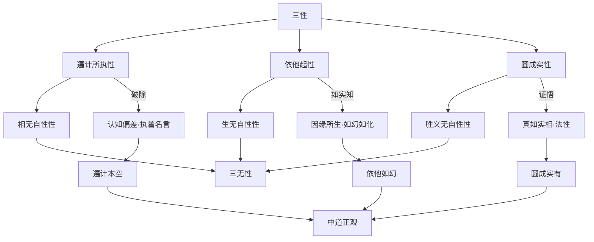
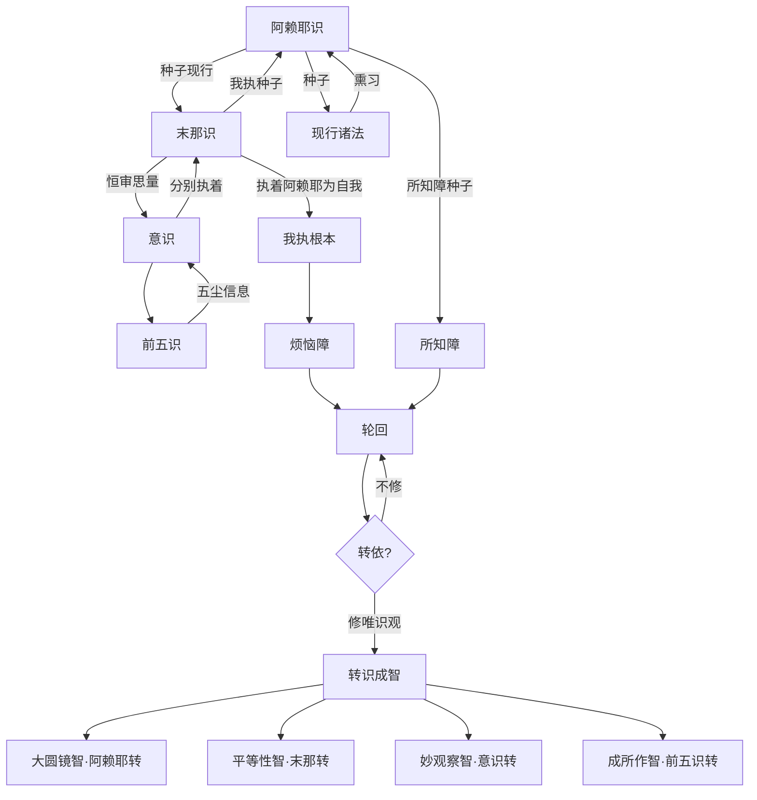
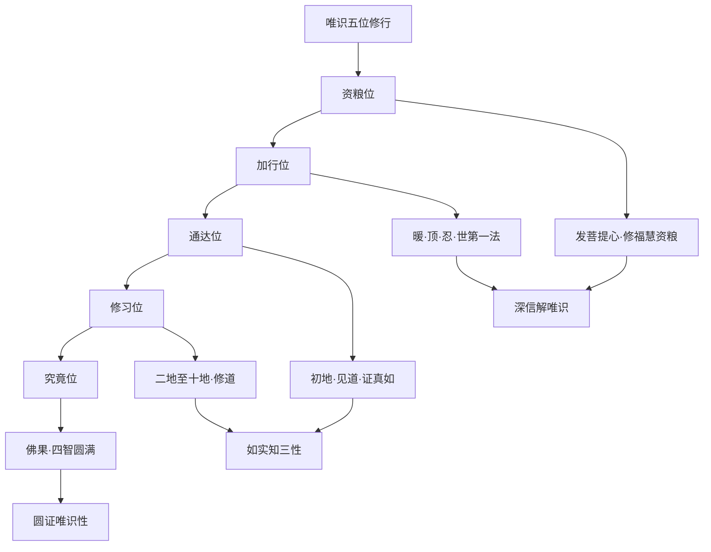
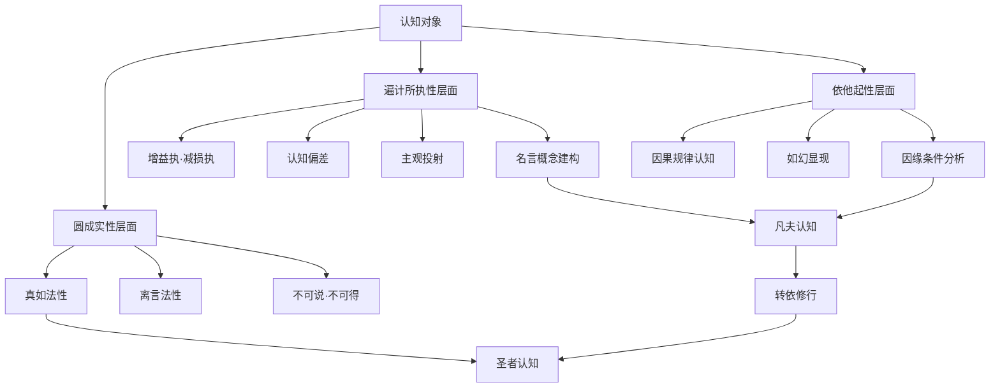
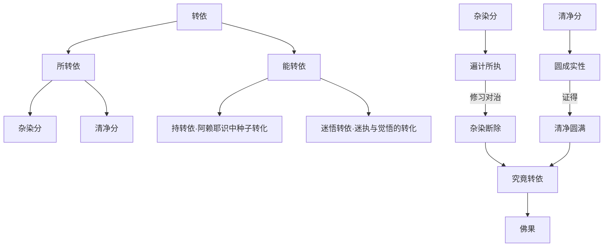
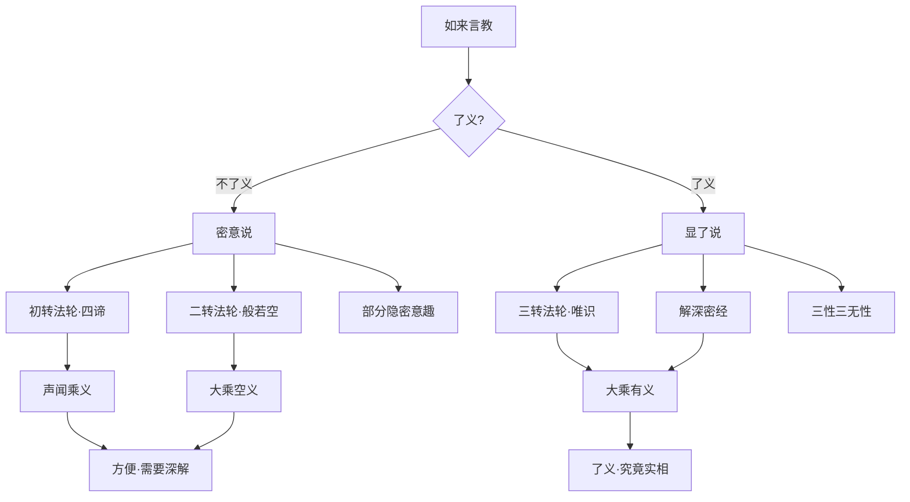

# 解深密经

## 经文概要

| 项目 | 内容 |
|------|------|
| 经名 | 解深密经 |
| 梵名 | Saṃdhinirmocana Sūtra |
| 译者 | 玄奘 |
| 译年 | 647 CE |
| 卷数 | 五卷（八品） |
| 宗派 | 唯识宗根本经典 |
| 大正藏 | T.676 |

## 核心思想

1. **三性三无性**：遍计所执性（认知偏差）、依他起性（因缘生法）、圆成实性（究竟实相）——三性各有其无性面
2. **阿赖耶识**：一切种识作为轮回与解脱的底层存储结构
3. **转依**：从染污的依他起转向清净的圆成实——认知结构的根本转化
4. **法相分析**：对万法的精密分类——五法、三自性、八识、二无我
5. **了义与不了义**：判释如来言教的了义（究竟）与不了义（方便）
6. **唯识无境**：外境非实有，一切皆是识的变现
7. **瑜伽行**：止观双运的修行体系——以三性为核心认知框架

## 翻译与传入历史

- **译者**：玄奘（602-664），中国最伟大的佛经翻译家
- **译出时间**：647年，于长安大慈恩寺译出
- **译场**：唐太宗资助的国家译场，玄奘主导"新译"标准
- **前译**：菩提流支译《深密解脱经》（T.675，514 CE）、真谛译《佛说解节经》（T.677）
- **梵文原本**：部分梵文残本存世，藏文译本完整
- **学术价值**：玄奘译本最为精审，为唯识宗立宗之本
- **印度源流**：无著、世亲瑜伽行派（Yogācāra）的根本经典，约4-5世纪在印度集成
- **影响**：与《瑜伽师地论》《成唯识论》构成唯识宗三大支柱

## 注疏传统

| 注疏 | 作者 | 朝代 | 要点 |
|------|------|------|------|
| 解深密经疏 | 圆测 | 唐 | 新罗僧，唯识宗释义 |
| 解深密经疏 | 令因 | 唐 | 天台释经立场 |
| 解深密经义钞 | 遁伦 | 唐 | 唯识学释义 |
| 解深密经圆测疏 | 观理 | 宋 | 整理圆测疏 |
| 解深密经讲录 | 太虚 | 民国 | 以唯识释经 |

## 核心经文选录

> **原文**（胜义谛相品）：「一切法无二。一切法无二者，何等为一切法？云何为无二？谓一切法者，略有二种：一者有为，二者无为。是中有为非有为非无为，无为亦非无为非有为。」

**白话释义**：一切法没有真正的"二"（对立）。什么是一切法？什么是无二？一切法大致分为有为法和无为法两类。但在究竟意义上，有为法既不是有为也不是无为，无为法也既不是无为也不是有为。这破除了概念的二元对立，指向超越名言的胜义实相。

> **原文**（一切法相品）：「谓诸法相略有三种。何等为三？一者遍计所执自性，二者依他起自性，三者圆成实自性。云何诸法遍计所执自性？谓诸法名假安立自性差别。云何诸法依他起自性？谓诸法依他缘而起。云何诸法圆成实自性？谓诸法真如。」

**白话释义**：一切法的相状可以归纳为三种：遍计所执性——我们给事物贴标签、建构概念后执着为实有的认知偏差；依他起性——事物依各种因缘条件而生起的因果关系；圆成实性——事物的真如实相、究竟本性。这是唯识宗最核心的认知模型。

## 实修关联

- **唯识观**：以三性为核心认知框架进行观察——知遍计本空、依他如幻、圆成实有
- **转识成智**：通过修习转八识为四智——转阿赖耶识为大圆镜智
- **止观双修**：以唯识义理为基础的禅修方法
- **五重唯识观**：遣虚存实、舍滥留纯、摄末归本、隐劣胜劣、遣相证性
- **阿赖耶识观**：深层意识结构的观察与转化
- **瑜伽行**：与《瑜伽师地论》配合的系统禅修训练

## 认知科学映射

- **三性 ←→ 认知偏差/客观实在/究竟实相**：遍计所执性对应认知科学中的认知偏差（cognitive bias）和建构主义；依他起性对应因果关系的客观认知；圆成实性对应超越建构的"究竟认知"
- **阿赖耶识 ←→ 深层认知结构**：阿赖耶识的"种子-现行"机制与联结主义神经网络（connectionism）、程序性记忆高度呼应
- **转依 ←→ 认知重构**：从染污转向清净的认知转化，对应认知行为疗法（CBT）中的核心信念改变
- **唯识无境 ←→ 预测编码**：唯识学"内识变现外境"的理论与当代预测编码理论（predictive coding）高度相似——大脑建构对外部世界的"模型"
- **了义不了义 ←→ 元认知层次**：对自身言教的层次分析，对应元认知的自我反思机制
- 深度关联：[八识论](../concepts/cognitive-theory/eight-consciousness.md)、[转识成智](../concepts/cognitive-theory/consciousness-transformation.md)、[中观](../concepts/cognitive-theory/madhyamaka.md)

## 三性三无性关系图

## 八识流转图

## 唯识五位修行图

## 三性认知模型图

## 转依结构图

## 了义与不了义判释图

## 教义框架

### 唯识宗核心体系

| 概念 | 含义 | 认知对应 |
|------|------|----------|
| 阿赖耶识 | 一切种识 | 深层认知结构 |
| 末那识 | 我执根源 | 自我意识 |
| 意识 | 分别思维 | 分析性认知 |
| 前五识 | 感知 | 感觉输入 |
| 三性 | 认知三层框架 | 认知层级模型 |
| 转依 | 认知转化 | 认知重构 |

### 判教地位

本经属唯识宗"六经十一论"之一，为唯识学的根本经典。在玄奘的判教体系中，本经代表了佛陀三转法轮中第三转——"转法轮"的了义教，高于初转（四谛）和二转（般若空），是最究竟的法义。

## 跨经关联

- **[楞伽经](lankavatara-sutra.md)**：同属唯识体系，阿赖耶识与如来藏的交涉
- **[华严经](avatamsaka-sutra.md)**：唯识与法界的融通
- **[般若经/金刚经](diamond-sutra.md)**：二转法轮空宗与三转法轮有宗的张力与互补
- **[法华经](lotus-sutra.md)**：一乘思想与唯识三性的会通
- **[维摩经](vimalakirti-sutra.md)**：不二法门与三无性的呼应
- **[楞严经](surangama-sutra.md)**：七处征心与唯识心识分析的对照
- 深度认知理论关联：[八识论](../concepts/cognitive-theory/eight-consciousness.md)、[转识成智](../concepts/cognitive-theory/consciousness-transformation.md)、[中观](../concepts/cognitive-theory/madhyamaka.md)、[心境关系](../concepts/cognitive-theory/mind-world.md)

## 思想遗产

1. **唯识宗根本**：与《瑜伽师地论》《成唯识论》共为唯识学三大支柱
2. **精密分析传统**：建立了佛教哲学中最精密的认知分析体系
3. **东西哲学对话**：唯识学与康德先验哲学、现象学的深度对照，成为哲学对话的重要桥梁
4. **认知科学先驱**：八识理论被视为古代认知科学的先驱性贡献
5. **印度佛学正统**：玄奘译传的唯识学代表了印度瑜伽行派的正统传承
6. **现代佛学**：当代"唯识与认知科学"研究成为佛教学术的前沿领域

---

## Cognitive Architecture

《解深密经》以"解了深密义"为旨，构建了唯识学最精密的认知分析架构：

- **三性（tri-svabhāva）认知三层模型**：遍计所执性=认知偏差（主观投射），依他起性=因果认知（缘起如幻），圆成实性=究竟认知（真如实相）——认知的三个层次同时存在于每一经验中，参见[三性](../concepts/cognitive-theory/three-natures.md)
- **阿赖耶识（ālayavijñāna）作为深层认知存储**：一切种子识——经验以种子（bīja）形式储存在深层意识中，种子生现行、现行熏种子，构成认知的持续循环，参见[种子习气](../concepts/cognitive-theory/bija-vasana.md)
- **转依（āśraya-parāvṛtti）的认知根本转化**：不是局部修正，而是认知结构的整体翻转——从染污的依他起转向清净的圆成实，八识转为四智，参见[转识成智](../concepts/cognitive-theory/consciousness-transformation.md)
- **了义与不了义的元认知层次**：三转法轮代表佛陀教法的三个认知层次——对自身言教的层次分析，是佛教中最精密的"元认知"操作

跨域链接：康德先验哲学中"先验范畴"与唯识学"种子-现行"机制在认知结构层面形成深度对话；当代预测编码理论（predictive coding）与"唯识无境"的认知建构模型高度相似。
